# DATABASE DESIGN DOCUMENT
## MikoMart Point of Sale (POS) System — Fase 3B

---

| Field | Detail |
|---|---|
| **Nama Sistem** | MikoMart Point of Sale (POS) System |
| **Nomor Dokumen** | MikoMart-DB-2026-001 |
| **Versi** | 1.0 |
| **Tanggal** | 16 April 2026 |
| **Database Engine** | SQLite 3.x (lokal kasir, WAL mode) + MySQL 8.x (server pusat) |
| **ORM** | Laravel Eloquent |
| **Klasifikasi** | INTERNAL — CONFIDENTIAL |

---

## 1. ENTITY RELATIONSHIP DIAGRAM (ERD)

> **Keterangan Penanda:**
> - `// 🔐 PII` — Kolom mengandung Personally Identifiable Information, **WAJIB dienkripsi** (SQLCipher di lokal)
> - `// 🔒 SENSITIVE` — Data bisnis sensitif, akses hanya melalui role tertentu

```mermaid
erDiagram

    %% ============ USER & RBAC ============
    roles {
        int id PK
        varchar name "admin|supervisor|cashier|owner"
        text permissions "JSON array of permissions"
        timestamp created_at
        timestamp updated_at
    }

    users {
        int id PK
        int role_id FK
        varchar full_name "// 🔐 PII"
        varchar username "// 🔐 PII - unique"
        varchar password_hash "// bcrypt Argon2id - NEVER expose"
        varchar device_id "tablet identifier"
        boolean is_active
        int failed_login_attempts
        timestamp locked_until
        timestamp last_login_at
        timestamp created_at
        timestamp updated_at
        timestamp deleted_at "soft delete"
    }

    %% ============ PRODUCT & INVENTORY ============
    categories {
        int id PK
        varchar name
        varchar slug "unique"
        text description
        boolean is_active
        timestamp created_at
        timestamp updated_at
    }

    products {
        int id PK
        int category_id FK
        varchar name
        varchar sku "unique // 🔒 SENSITIVE"
        decimal price_sell "// 🔒 SENSITIVE - 15 digit, 2 decimal"
        decimal price_buy "// 🔒 SENSITIVE - floor price"
        int stock_current
        int stock_minimum "notification threshold"
        varchar unit "pcs|kg|liter|box"
        boolean is_active
        boolean allow_backorder
        timestamp created_at
        timestamp updated_at
        timestamp deleted_at "soft delete"
    }

    %% ============ SUPPLIER & PURCHASE ORDER ============
    suppliers {
        int id PK
        varchar name
        varchar contact_phone
        varchar contact_email
        text address
        boolean is_active
        timestamp created_at
        timestamp updated_at
    }

    purchase_orders {
        int id PK
        int supplier_id FK
        int created_by FK "users.id"
        int confirmed_by FK "users.id nullable"
        varchar po_number "unique"
        enum status "draft|sent|received|cancelled"
        decimal total_amount "// 🔒 SENSITIVE"
        text notes
        timestamp sent_at
        timestamp received_at
        timestamp created_at
        timestamp updated_at
    }

    purchase_order_items {
        int id PK
        int purchase_order_id FK
        int product_id FK
        int quantity_ordered
        int quantity_received
        decimal unit_price "// 🔒 SENSITIVE"
        decimal subtotal "// 🔒 SENSITIVE"
    }

    %% ============ TRANSACTION ============
    transactions {
        int id PK
        int cashier_id FK "users.id // 🔐 PII"
        varchar transaction_number "unique - e.g. TRX-20260416-0001"
        enum status "pending|completed|void_pending|voided|return_pending|returned"
        decimal subtotal "// 🔒 SENSITIVE"
        decimal discount_amount "// 🔒 SENSITIVE"
        decimal tax_amount "PPN // 🔒 SENSITIVE"
        decimal grand_total "// 🔒 SENSITIVE"
        enum payment_method "cash|qris|transfer|split"
        decimal cash_received
        decimal change_amount
        boolean is_offline_transaction
        varchar sync_status "synced|pending|conflict"
        text notes
        int void_requested_by FK "users.id nullable // 🔐 PII"
        int void_approved_by FK "users.id nullable // 🔐 PII"
        text void_reason
        timestamp voided_at
        timestamp created_at
        timestamp updated_at
    }

    transaction_items {
        int id PK
        int transaction_id FK
        int product_id FK
        varchar product_name "snapshot at time of sale"
        decimal price_original "// 🔒 SENSITIVE"
        decimal price_override "nullable // 🔒 SENSITIVE"
        int discount_percent "0-30"
        decimal discount_amount "// 🔒 SENSITIVE"
        decimal price_final "// 🔒 SENSITIVE"
        int quantity
        decimal subtotal "// 🔒 SENSITIVE"
    }

    payment_records {
        int id PK
        int transaction_id FK
        enum method "cash|qris|transfer"
        decimal amount "// 🔒 SENSITIVE"
        varchar gateway_order_id "Midtrans/Xendit order ID"
        varchar gateway_transaction_id
        enum gateway_status "pending|success|failed|expired"
        text gateway_response "JSON"
        varchar webhook_signature "HMAC for verification"
        timestamp paid_at
        timestamp created_at
        timestamp updated_at
    }

    %% ============ AUDIT & SYNC ============
    audit_logs {
        int id PK
        int user_id FK "// 🔐 PII"
        varchar username "snapshot // 🔐 PII"
        varchar role "snapshot"
        varchar action "SCREAMING_SNAKE_CASE"
        varchar resource_type
        varchar resource_id
        json value_before
        json value_after
        text reason
        varchar ip_address
        varchar device_id
        timestamp created_at "immutable - no updated_at"
    }

    sync_queues {
        int id PK
        varchar device_id
        int cashier_id FK
        varchar resource_type "transaction|stock_adjustment"
        int resource_id
        json payload
        enum status "pending|syncing|synced|failed|conflict"
        int retry_count
        text error_message
        timestamp synced_at
        timestamp created_at
        timestamp updated_at
    }

    conflict_logs {
        int id PK
        int sync_queue_id FK
        varchar resource_type
        int resource_id
        json value_local "data from offline device"
        json value_server "data from server"
        json value_resolved "merged result"
        int resolved_by FK "users.id"
        varchar resolved_by_name "// 🔐 PII snapshot"
        enum resolution "local_wins|server_wins|manual_merge"
        timestamp resolved_at
        timestamp created_at
    }

    store_settings {
        int id PK
        varchar key "unique"
        text value "encrypted for sensitive keys"
        varchar description
        boolean is_sensitive "flag for encryption"
        timestamp created_at
        timestamp updated_at
    }

    %% ============ RELATIONSHIPS ============
    users }o--|| roles : "belongs to"
    products }o--|| categories : "belongs to"
    purchase_orders }o--|| suppliers : "associated with"
    purchase_orders }o--|| users : "created_by"
    purchase_order_items }o--|| purchase_orders : "belongs to"
    purchase_order_items }o--|| products : "references"
    transactions }o--|| users : "cashier_id"
    transaction_items }o--|| transactions : "belongs to"
    transaction_items }o--|| products : "references"
    payment_records }o--|| transactions : "belongs to"
    audit_logs }o--|| users : "recorded for"
    sync_queues }o--|| users : "cashier_id"
    conflict_logs }o--|| sync_queues : "belongs to"
    conflict_logs }o--|| users : "resolved_by"
```



---

## 2. KAMUS DATA (DATA DICTIONARY)

### 2.1 Tabel: `roles`

| Kolom | Tipe | Constraint | Default | Keterangan |
|---|---|---|---|---|
| `id` | INT UNSIGNED | PK, AUTO_INCREMENT | — | Identifier unik role |
| `name` | VARCHAR(50) | NOT NULL, UNIQUE | — | Nama role: `admin`, `supervisor`, `cashier`, `owner` |
| `permissions` | JSON | NOT NULL | `[]` | Array string permission yang dimiliki role |
| `created_at` | TIMESTAMP | NOT NULL | NOW() | Waktu pembuatan |
| `updated_at` | TIMESTAMP | NOT NULL | NOW() | Waktu pembaruan terakhir |

### 2.2 Tabel: `users`

| Kolom | Tipe | Constraint | Default | Keterangan |
|---|---|---|---|---|
| `id` | INT UNSIGNED | PK, AUTO_INCREMENT | — | Identifier unik pengguna |
| `role_id` | INT UNSIGNED | FK → roles.id, NOT NULL | — | Role pengguna |
| `full_name` | VARCHAR(100) | NOT NULL | — | 🔐 **PII** — Nama lengkap, dienkripsi di SQLite lokal |
| `username` | VARCHAR(50) | NOT NULL, UNIQUE | — | 🔐 **PII** — Username login, lowercase, alphanumeric |
| `password_hash` | VARCHAR(255) | NOT NULL | — | Hash bcrypt (cost≥12) atau Argon2id |
| `device_id` | VARCHAR(100) | NULLABLE | NULL | Identifier tablet kasir |
| `is_active` | BOOLEAN | NOT NULL | TRUE | Status akun aktif |
| `failed_login_attempts` | TINYINT UNSIGNED | NOT NULL | 0 | Counter gagal login, reset saat berhasil |
| `locked_until` | TIMESTAMP | NULLABLE | NULL | Waktu kunci berakhir (NULL = tidak terkunci) |
| `last_login_at` | TIMESTAMP | NULLABLE | NULL | Timestamp login terakhir berhasil |
| `created_at` | TIMESTAMP | NOT NULL | NOW() | — |
| `updated_at` | TIMESTAMP | NOT NULL | NOW() | — |
| `deleted_at` | TIMESTAMP | NULLABLE | NULL | Soft delete timestamp |

**Index:** `idx_users_username` ON (`username`), `idx_users_role_id` ON (`role_id`)

### 2.3 Tabel: `categories`

| Kolom | Tipe | Constraint | Default | Keterangan |
|---|---|---|---|---|
| `id` | INT UNSIGNED | PK, AUTO_INCREMENT | — | — |
| `name` | VARCHAR(100) | NOT NULL | — | Nama kategori produk |
| `slug` | VARCHAR(120) | NOT NULL, UNIQUE | — | URL-friendly identifier |
| `description` | TEXT | NULLABLE | NULL | Deskripsi opsional |
| `is_active` | BOOLEAN | NOT NULL | TRUE | — |
| `created_at` | TIMESTAMP | NOT NULL | NOW() | — |
| `updated_at` | TIMESTAMP | NOT NULL | NOW() | — |

### 2.4 Tabel: `products`

| Kolom | Tipe | Constraint | Default | Keterangan |
|---|---|---|---|---|
| `id` | INT UNSIGNED | PK, AUTO_INCREMENT | — | — |
| `category_id` | INT UNSIGNED | FK → categories.id, NOT NULL | — | Kategori produk |
| `name` | VARCHAR(200) | NOT NULL | — | Nama produk (terindeks untuk pencarian) |
| `sku` | VARCHAR(50) | NOT NULL, UNIQUE | — | 🔒 **SENSITIVE** — Stock Keeping Unit / barcode |
| `price_sell` | DECIMAL(15,2) | NOT NULL, CHECK > 0 | — | 🔒 Harga jual, harus > harga beli |
| `price_buy` | DECIMAL(15,2) | NOT NULL, CHECK ≥ 0 | — | 🔒 Harga beli / floor price |
| `stock_current` | INT | NOT NULL | 0 | Stok saat ini |
| `stock_minimum` | INT | NOT NULL | 5 | Threshold notifikasi stok minimum |
| `unit` | VARCHAR(20) | NOT NULL | 'pcs' | Satuan: pcs, kg, liter, box, dll |
| `is_active` | BOOLEAN | NOT NULL | TRUE | — |
| `allow_backorder` | BOOLEAN | NOT NULL | FALSE | Izinkan transaksi saat stok = 0 |
| `created_at` | TIMESTAMP | NOT NULL | NOW() | — |
| `updated_at` | TIMESTAMP | NOT NULL | NOW() | — |
| `deleted_at` | TIMESTAMP | NULLABLE | NULL | Soft delete |

**Index:** `idx_products_sku` ON (`sku`), `FULLTEXT idx_products_name` ON (`name`), `idx_products_stock` ON (`stock_current`)

### 2.5 Tabel: `transactions`

| Kolom | Tipe | Constraint | Default | Keterangan |
|---|---|---|---|---|
| `id` | INT UNSIGNED | PK, AUTO_INCREMENT | — | — |
| `cashier_id` | INT UNSIGNED | FK → users.id, NOT NULL | — | 🔐 **PII** — ID kasir yang memproses |
| `transaction_number` | VARCHAR(30) | NOT NULL, UNIQUE | — | Format: `TRX-YYYYMMDD-XXXX` |
| `status` | ENUM | NOT NULL | 'completed' | `pending`, `completed`, `void_pending`, `voided`, `return_pending`, `returned` |
| `subtotal` | DECIMAL(15,2) | NOT NULL | — | 🔒 Total sebelum diskon dan pajak |
| `discount_amount` | DECIMAL(15,2) | NOT NULL | 0.00 | 🔒 Total diskon |
| `tax_amount` | DECIMAL(15,2) | NOT NULL | 0.00 | 🔒 Nilai PPN |
| `grand_total` | DECIMAL(15,2) | NOT NULL | — | 🔒 Total yang harus dibayar |
| `payment_method` | ENUM | NOT NULL | — | `cash`, `qris`, `transfer`, `split` |
| `cash_received` | DECIMAL(15,2) | NULLABLE | NULL | Nominal uang diterima (jika tunai) |
| `change_amount` | DECIMAL(15,2) | NULLABLE | NULL | Kembalian |
| `is_offline_transaction` | BOOLEAN | NOT NULL | FALSE | Flag transaksi saat offline |
| `sync_status` | VARCHAR(20) | NOT NULL | 'synced' | `synced`, `pending`, `conflict` |
| `void_requested_by` | INT UNSIGNED | FK → users.id, NULLABLE | NULL | 🔐 **PII** — Kasir yang mengajukan void |
| `void_approved_by` | INT UNSIGNED | FK → users.id, NULLABLE | NULL | 🔐 **PII** — Admin/Supervisor yang approve |
| `void_reason` | TEXT | NULLABLE | NULL | Alasan void/retur |
| `voided_at` | TIMESTAMP | NULLABLE | NULL | — |
| `created_at` | TIMESTAMP | NOT NULL | NOW() | Waktu transaksi |
| `updated_at` | TIMESTAMP | NOT NULL | NOW() | — |

**Index:** `idx_transactions_number` ON (`transaction_number`), `idx_transactions_cashier_date` ON (`cashier_id`, `created_at`), `idx_transactions_status` ON (`status`)

### 2.6 Tabel: `transaction_items`

| Kolom | Tipe | Constraint | Default | Keterangan |
|---|---|---|---|---|
| `id` | INT UNSIGNED | PK | — | — |
| `transaction_id` | INT UNSIGNED | FK → transactions.id, NOT NULL | — | — |
| `product_id` | INT UNSIGNED | FK → products.id, NOT NULL | — | — |
| `product_name` | VARCHAR(200) | NOT NULL | — | Snapshot nama produk saat transaksi |
| `price_original` | DECIMAL(15,2) | NOT NULL | — | 🔒 Harga normal saat transaksi |
| `price_override` | DECIMAL(15,2) | NULLABLE | NULL | 🔒 Harga setelah override (jika ada) |
| `discount_percent` | TINYINT | NOT NULL, CHECK 0-30 | 0 | Persen diskon 0–30% |
| `discount_amount` | DECIMAL(15,2) | NOT NULL | 0.00 | 🔒 Nilai diskon dalam Rupiah |
| `price_final` | DECIMAL(15,2) | NOT NULL | — | 🔒 Harga akhir per satuan |
| `quantity` | INT | NOT NULL, CHECK > 0 | — | Jumlah item |
| `subtotal` | DECIMAL(15,2) | NOT NULL | — | 🔒 price_final × quantity |

### 2.7 Tabel: `payment_records`

| Kolom | Tipe | Constraint | Default | Keterangan |
|---|---|---|---|---|
| `id` | INT UNSIGNED | PK | — | — |
| `transaction_id` | INT UNSIGNED | FK → transactions.id, NOT NULL | — | — |
| `method` | ENUM | NOT NULL | — | `cash`, `qris`, `transfer` |
| `amount` | DECIMAL(15,2) | NOT NULL | — | 🔒 Nominal pembayaran ini |
| `gateway_order_id` | VARCHAR(100) | NULLABLE, UNIQUE | NULL | ID order dari Midtrans/Xendit |
| `gateway_transaction_id` | VARCHAR(100) | NULLABLE | NULL | ID transaksi dari gateway |
| `gateway_status` | ENUM | NOT NULL | 'pending' | `pending`, `success`, `failed`, `expired` |
| `gateway_response` | JSON | NULLABLE | NULL | Response lengkap dari gateway |
| `webhook_signature` | VARCHAR(255) | NULLABLE | NULL | HMAC signature untuk verifikasi idempotency |
| `paid_at` | TIMESTAMP | NULLABLE | NULL | Waktu konfirmasi pembayaran |
| `created_at` | TIMESTAMP | NOT NULL | NOW() | — |
| `updated_at` | TIMESTAMP | NOT NULL | NOW() | — |

**Index:** `idx_payment_gateway_order` UNIQUE ON (`gateway_order_id`), `idx_payment_gateway_txn` ON (`gateway_transaction_id`)

### 2.8 Tabel: `audit_logs`

| Kolom | Tipe | Constraint | Default | Keterangan |
|---|---|---|---|---|
| `id` | BIGINT UNSIGNED | PK, AUTO_INCREMENT | — | — |
| `user_id` | INT UNSIGNED | FK → users.id, NOT NULL | — | 🔐 **PII** |
| `username` | VARCHAR(50) | NOT NULL | — | 🔐 **PII** Snapshot username |
| `role` | VARCHAR(20) | NOT NULL | — | Snapshot role saat aksi |
| `action` | VARCHAR(100) | NOT NULL | — | Konstanta SCREAMING_SNAKE_CASE |
| `resource_type` | VARCHAR(50) | NOT NULL | — | Nama tabel/entitas yang diubah |
| `resource_id` | VARCHAR(50) | NULLABLE | NULL | ID resource yang diubah |
| `value_before` | JSON | NULLABLE | NULL | Nilai sebelum perubahan |
| `value_after` | JSON | NULLABLE | NULL | Nilai setelah perubahan |
| `reason` | TEXT | NULLABLE | NULL | Alasan aksi (untuk void, diskon, dll) |
| `ip_address` | VARCHAR(45) | NOT NULL | — | IPv4 atau IPv6 |
| `device_id` | VARCHAR(100) | NULLABLE | NULL | Identifier perangkat kasir |
| `created_at` | TIMESTAMP | NOT NULL | NOW() | **IMMUTABLE** — tidak ada updated_at |

> ⚠️ **Keamanan Audit Log:** Tabel ini **TIDAK BOLEH** memiliki operasi UPDATE atau DELETE. Gunakan MySQL `REVOKE UPDATE, DELETE ON audit_logs FROM app_user;`. Purge otomatis dilakukan via scheduled job, bukan manual.

**Index:** `idx_audit_user_date` ON (`user_id`, `created_at`), `idx_audit_action` ON (`action`), `idx_audit_resource` ON (`resource_type`, `resource_id`)

### 2.9 Tabel: `sync_queues`

| Kolom | Tipe | Constraint | Default | Keterangan |
|---|---|---|---|---|
| `id` | INT UNSIGNED | PK | — | — |
| `device_id` | VARCHAR(100) | NOT NULL | — | Identifier tablet kasir asal |
| `cashier_id` | INT UNSIGNED | FK → users.id, NOT NULL | — | Kasir pemilik data |
| `resource_type` | VARCHAR(50) | NOT NULL | — | `transaction`, `stock_adjustment` |
| `resource_id` | INT UNSIGNED | NOT NULL | — | ID resource di database lokal |
| `payload` | JSON | NOT NULL | — | Data lengkap untuk disinkronkan |
| `status` | ENUM | NOT NULL | 'pending' | `pending`, `syncing`, `synced`, `failed`, `conflict` |
| `retry_count` | TINYINT | NOT NULL | 0 | Jumlah percobaan ulang, max 3 |
| `error_message` | TEXT | NULLABLE | NULL | Pesan error jika gagal |
| `synced_at` | TIMESTAMP | NULLABLE | NULL | Waktu sync berhasil |
| `created_at` | TIMESTAMP | NOT NULL | NOW() | — |
| `updated_at` | TIMESTAMP | NOT NULL | NOW() | — |

### 2.10 Tabel: `conflict_logs`

| Kolom | Tipe | Constraint | Default | Keterangan |
|---|---|---|---|---|
| `id` | INT UNSIGNED | PK | — | — |
| `sync_queue_id` | INT UNSIGNED | FK → sync_queues.id | — | Referensi antrian yang berkonflik |
| `resource_type` | VARCHAR(50) | NOT NULL | — | Tipe resource |
| `resource_id` | INT UNSIGNED | NOT NULL | — | ID resource yang berkonflik |
| `value_local` | JSON | NOT NULL | — | Data dari perangkat offline |
| `value_server` | JSON | NOT NULL | — | Data dari server pusat |
| `value_resolved` | JSON | NULLABLE | NULL | Hasil akhir setelah merge |
| `resolved_by` | INT UNSIGNED | FK → users.id, NULLABLE | NULL | Kasir yang melakukan merge |
| `resolved_by_name` | VARCHAR(100) | NULLABLE | NULL | 🔐 **PII** Snapshot nama kasir |
| `resolution` | ENUM | NULLABLE | NULL | `local_wins`, `server_wins`, `manual_merge` |
| `resolved_at` | TIMESTAMP | NULLABLE | NULL | — |
| `created_at` | TIMESTAMP | NOT NULL | NOW() | — |

### 2.11 Tabel: `store_settings`

| Kolom | Tipe | Constraint | Default | Keterangan |
|---|---|---|---|---|
| `id` | INT UNSIGNED | PK | — | — |
| `key` | VARCHAR(100) | NOT NULL, UNIQUE | — | Kunci konfigurasi, e.g. `store.npwp` |
| `value` | TEXT | NOT NULL | — | Nilai konfigurasi (enkripsi jika `is_sensitive=true`) |
| `description` | VARCHAR(255) | NULLABLE | NULL | Deskripsi penggunaan |
| `is_sensitive` | BOOLEAN | NOT NULL | FALSE | Jika TRUE, nilai dienkripsi AES-256 |
| `created_at` | TIMESTAMP | NOT NULL | NOW() | — |
| `updated_at` | TIMESTAMP | NOT NULL | NOW() | — |

**Data awal yang kritikal:** `store.npwp` (🔒 SENSITIVE, dienkripsi), `store.name`, `store.address`, `store.tax_rate` (default: 11%), `store.max_discount_percent` (default: 30)

---

## 3. MIGRATION & ROLLBACK STRATEGY

### 3.1 Prinsip Zero-Downtime Migration

Sistem wajib menerapkan pola **Expand-Contract** agar deployment tidak menyebabkan downtime:

```
Fase Expand:   Tambah kolom baru (nullable) → Deploy kode baru yang menulis ke kedua kolom
Fase Migrate:  Jalankan data migration job untuk isi kolom baru dari data lama
Fase Contract: Deploy kode yang hanya baca kolom baru → Hapus kolom lama (boleh down() di sini)
```

> ⚠️ **LARANGAN:** Jangan pernah `DROP COLUMN` atau `RENAME COLUMN` dalam satu migration tanpa fase Expand-Contract, kecuali kolom tersebut belum pernah digunakan di produksi.

---

### 3.2 Urutan Eksekusi Migration

```
001_create_roles_table.php
002_create_users_table.php            ← depends on: roles
003_create_categories_table.php
004_create_suppliers_table.php
005_create_products_table.php         ← depends on: categories
006_create_purchase_orders_table.php  ← depends on: suppliers, users
007_create_purchase_order_items.php   ← depends on: purchase_orders, products
008_create_transactions_table.php     ← depends on: users
009_create_transaction_items_table.php← depends on: transactions, products
010_create_payment_records_table.php  ← depends on: transactions
011_create_audit_logs_table.php       ← depends on: users
012_create_sync_queues_table.php      ← depends on: users
013_create_conflict_logs_table.php    ← depends on: sync_queues, users
014_create_store_settings_table.php
015_seed_roles_and_admin.php          ← Seeder wajib — bukan migration DDL
```

---

### 3.3 Contoh Migration: `002_create_users_table.php`

```php
<?php

use Illuminate\Database\Migrations\Migration;
use Illuminate\Database\Schema\Blueprint;
use Illuminate\Support\Facades\Schema;

/**
 * Migration: Create users table
 *
 * Security:
 * - full_name dan username dienkripsi di SQLite lokal via SQLCipher
 * - password_hash menggunakan Argon2id (cost factor dikonfigurasi di AppServiceProvider)
 * - Soft delete diaktifkan untuk mencegah data loss
 *
 * @return void
 */
return new class extends Migration
{
    /**
     * Run the migrations.
     * Buat tabel users dengan semua kolom keamanan.
     */
    public function up(): void
    {
        Schema::create('users', function (Blueprint $table) {
            $table->id();
            $table->foreignId('role_id')
                  ->constrained('roles')
                  ->restrictOnDelete(); // Jangan hapus role jika masih ada user

            // PII — dienkripsi di storage lokal (SQLCipher)
            $table->string('full_name', 100);
            $table->string('username', 50)->unique();

            // Password — WAJIB Argon2id, minimal cost 12
            $table->string('password_hash', 255);

            $table->string('device_id', 100)->nullable();
            $table->boolean('is_active')->default(true);
            $table->unsignedTinyInteger('failed_login_attempts')->default(0);
            $table->timestamp('locked_until')->nullable();
            $table->timestamp('last_login_at')->nullable();

            $table->timestamps();
            $table->softDeletes(); // deleted_at column

            // Indexes untuk performa
            $table->index('role_id', 'idx_users_role_id');
            $table->index('is_active', 'idx_users_active');
        });
    }

    /**
     * Reverse the migrations.
     * WAJIB: down() harus ada untuk rollback support.
     */
    public function down(): void
    {
        Schema::dropIfExists('users');
    }
};
```

---

### 3.4 Contoh Migration: `008_create_transactions_table.php`

```php
<?php

use Illuminate\Database\Migrations\Migration;
use Illuminate\Database\Schema\Blueprint;
use Illuminate\Support\Facades\Schema;

/**
 * Migration: Create transactions table
 *
 * Catatan desain:
 * - Menyimpan snapshot data (cashier name di audit log, bukan FK saja)
 * - sync_status diperlukan untuk arsitektur offline-first
 * - void_requested_by dan void_approved_by untuk two-step approval
 */
return new class extends Migration
{
    public function up(): void
    {
        Schema::create('transactions', function (Blueprint $table) {
            $table->id();

            // PII — kasir yang memproses transaksi
            $table->foreignId('cashier_id')
                  ->constrained('users')
                  ->restrictOnDelete();

            $table->string('transaction_number', 30)->unique();

            $table->enum('status', [
                'pending',
                'completed',
                'void_pending',
                'voided',
                'return_pending',
                'returned'
            ])->default('completed');

            // Finansial — semua DECIMAL(15,2) untuk akurasi Rupiah
            $table->decimal('subtotal', 15, 2);
            $table->decimal('discount_amount', 15, 2)->default(0.00);
            $table->decimal('tax_amount', 15, 2)->default(0.00); // PPN
            $table->decimal('grand_total', 15, 2);

            $table->enum('payment_method', ['cash', 'qris', 'transfer', 'split']);
            $table->decimal('cash_received', 15, 2)->nullable();
            $table->decimal('change_amount', 15, 2)->nullable();

            // Offline-first fields
            $table->boolean('is_offline_transaction')->default(false);
            $table->string('sync_status', 20)->default('synced');

            $table->text('notes')->nullable();

            // Two-step void/return approval
            $table->foreignId('void_requested_by')
                  ->nullable()
                  ->constrained('users')
                  ->nullOnDelete();

            $table->foreignId('void_approved_by')
                  ->nullable()
                  ->constrained('users')
                  ->nullOnDelete();

            $table->text('void_reason')->nullable();
            $table->timestamp('voided_at')->nullable();

            $table->timestamps();

            // Indexes untuk performa laporan dan filter
            $table->index(['cashier_id', 'created_at'], 'idx_transactions_cashier_date');
            $table->index('status', 'idx_transactions_status');
            $table->index('sync_status', 'idx_transactions_sync');
            $table->index('created_at', 'idx_transactions_date');
        });
    }

    public function down(): void
    {
        Schema::dropIfExists('transactions');
    }
};
```

---

### 3.5 Contoh Migration: `011_create_audit_logs_table.php`

```php
<?php

use Illuminate\Database\Migrations\Migration;
use Illuminate\Database\Schema\Blueprint;
use Illuminate\Support\Facades\Schema;
use Illuminate\Support\Facades\DB;

/**
 * Migration: Create audit_logs table
 *
 * Security Design:
 * - Tidak ada kolom updated_at (immutable by design)
 * - Setelah migration, revoke privilege UPDATE dan DELETE dari app_user
 * - Hanya scheduled system job yang boleh purge (via DB transaction terpisah)
 */
return new class extends Migration
{
    public function up(): void
    {
        Schema::create('audit_logs', function (Blueprint $table) {
            $table->bigIncrements('id'); // BIGINT untuk volume tinggi

            // PII — snapshot untuk mencegah data loss jika user dihapus
            $table->unsignedInteger('user_id');
            $table->string('username', 50);
            $table->string('role', 20);

            $table->string('action', 100); // SCREAMING_SNAKE_CASE
            $table->string('resource_type', 50);
            $table->string('resource_id', 50)->nullable();

            // JSON untuk fleksibilitas perubahan skema di masa depan
            $table->json('value_before')->nullable();
            $table->json('value_after')->nullable();

            $table->text('reason')->nullable();
            $table->string('ip_address', 45);
            $table->string('device_id', 100)->nullable();

            // IMMUTABLE: hanya created_at, tidak ada updated_at
            $table->timestamp('created_at')->useCurrent();

            $table->index(['user_id', 'created_at'], 'idx_audit_user_date');
            $table->index('action', 'idx_audit_action');
            $table->index(['resource_type', 'resource_id'], 'idx_audit_resource');
        });

        // Revoke UPDATE dan DELETE dari application database user
        // (Hanya di MySQL/MariaDB — skip untuk SQLite lokal)
        if (config('database.default') === 'mysql') {
            $appUser = config('database.connections.mysql.username');
            DB::statement("REVOKE UPDATE, DELETE ON audit_logs FROM '{$appUser}'@'%'");
        }
    }

    public function down(): void
    {
        // Restore privileges sebelum drop (untuk rollback yang bersih)
        if (config('database.default') === 'mysql') {
            $appUser = config('database.connections.mysql.username');
            DB::statement("GRANT UPDATE, DELETE ON audit_logs TO '{$appUser}'@'%'");
        }

        Schema::dropIfExists('audit_logs');
    }
};
```

---

### 3.6 Rollback Playbook

| Skenario | Langkah Rollback | Risiko |
|---|---|---|
| **Migration gagal di tengah jalan** | Jalankan `php artisan migrate:rollback --step=1`; periksa log error; perbaiki migration | Rendah — atomik per file |
| **Bug ditemukan setelah deploy ke staging** | `php artisan migrate:rollback` → fix kode → `php artisan migrate` | Rendah — tidak ada data produksi |
| **Bug kritis di produksi (data belum banyak)** | 1. Matikan maintenance mode sementara; 2. Rollback migration via CLI; 3. Deploy versi sebelumnya | Sedang — ada risiko kehilangan data baru |
| **DROP COLUMN yang sudah dipakai** | Tidak bisa di-rollback otomatis; restore dari backup yang dibuat SEBELUM migration | Tinggi — **WAJIB backup dulu** |
| **Data migration salah (populate data)** | Jalankan rollback migration data, bukan skema; kembalikan dari backup | Tinggi — perlu verifikasi manual |

### 3.7 Aturan Wajib Migration

```
✅ Setiap file migration WAJIB memiliki fungsi down() yang berfungsi penuh
✅ Test down() di environment lokal sebelum push ke repository
✅ Backup database produksi WAJIB dilakukan SEBELUM menjalankan migration apapun
✅ Migration yang melibatkan DROP harus melalui proses Expand-Contract (minimal 2 deployment)
✅ Setiap migration file hanya berisi SATU perubahan logis
✅ Gunakan nama file yang deskriptif: {timestamp}_{action}_{table}_table.php
✅ Jalankan migration di jam non-peak (22.00–06.00 WIB)
```

---

## 4. STRATEGI INDEKS & PERFORMA QUERY

### 4.1 Query Kritis yang Dioptimalkan

| Query | Tabel | Indeks yang Digunakan | Estimasi Performa |
|---|---|---|---|
| Cari produk by SKU/barcode | products | `idx_products_sku` | < 1ms (exact match) |
| Cari produk by nama | products | FULLTEXT `idx_products_name` | < 50ms |
| Cek stok sebelum transaksi | products | PK lookup | < 1ms |
| Laporan penjualan per hari | transactions | `idx_transactions_date` | < 100ms (300 trx/hari) |
| Riwayat transaksi kasir | transactions | `idx_transactions_cashier_date` | < 50ms |
| Audit log per pengguna | audit_logs | `idx_audit_user_date` | < 100ms (30 hari) |
| Sync queue pending | sync_queues | `status` index | < 10ms |

### 4.2 Pertimbangan Pagination

Semua query list WAJIB menggunakan **cursor-based pagination** (bukan offset) untuk tabel besar:
- `audit_logs`: cursor by `id` (bukan `OFFSET`)
- `transactions`: cursor by `created_at, id`
- Maksimum 50 record per halaman

---

*Dokumen ini adalah bagian dari Fase 3B — Perancangan Database MikoMart POS.*

**Nomor Dokumen:** MikoMart-DB-2026-001 | **Versi:** 1.0 | **Klasifikasi:** INTERNAL — CONFIDENTIAL
