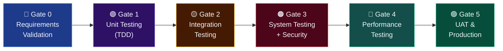

# MASTER TEST PLAN (MTP)
## MikoMart Point of Sale (POS) System — Fase 3D
### Berdasarkan Standar IEEE 829-2008

---

| Field | Detail |
|---|---|
| **Nama Sistem** | MikoMart Point of Sale (POS) System |
| **Nomor Dokumen** | MikoMart-MTP-2026-001 |
| **Standar** | IEEE Std 829-2008 (Test Documentation) |
| **Versi** | 1.0 |
| **Tanggal** | 16 April 2026 |
| **Klasifikasi** | INTERNAL — CONFIDENTIAL |

---

## 1. PENDAHULUAN

### 1.1 Tujuan

Master Test Plan ini mendefinisikan strategi, ruang lingkup, sumber daya, jadwal, dan deliverable pengujian sistem MikoMart POS. Dokumen ini menerapkan prinsip **Shift-Left Testing** — pengujian dimulai sejak fase requirements dan berlanjut hingga produksi.

### 1.2 Referensi

- MikoMart-SRS-2026-001 v1.1 (SRS)
- MikoMart-SLA-2026-001 (SLA/SLO Baseline)
- MikoMart-UC-2026-001 (Use Case)
- MikoMart-DB-2026-001 (Database Design)
- MikoMart-SAD-2026-001 (SAD)
- OWASP Testing Guide v4.2
- IEEE Std 829-2008

### 1.3 Strategi Shift-Left Testing



| Gate | Fase | Penanggung Jawab | Artefak |
|---|---|---|---|
| Gate 0 | Requirements Validation | QA Lead + Business Analyst | SRS Review Checklist |
| Gate 1 | Unit Testing (TDD) | Developer | PHPUnit/Pest test reports |
| Gate 2 | Integration Testing | Developer + QA | API test results (Postman/Pest) |
| Gate 3 | System + Security Testing | QA Lead | System test report + OWASP scan |
| Gate 4 | Performance Testing | QA + DevOps | k6 performance report |
| Gate 5 | UAT + Production Ready | Stakeholder + QA Lead | UAT sign-off document |

---

## 2. RUANG LINGKUP PENGUJIAN

### 2.1 Yang Diuji (In-Scope)

| Modul | Level Testing | Prioritas |
|---|---|---|
| Autentikasi & Sesi | Unit, Integration, Security | P1 |
| RBAC & Otorisasi | Unit, Integration, Security | P1 |
| Manajemen Produk | Unit, Integration | P1 |
| Inventori Real-time | Unit, Integration, System | P1 |
| Transaksi POS + Split Bill | Unit, Integration, System, Performance | P1 |
| Void & Retur (2-step) | Unit, Integration, System | P1 |
| Payment Gateway (QRIS) | Integration, System | P1 |
| Audit Log | Unit, Integration | P1 |
| Struk Thermal + PDF | Integration, System | P1 |
| Laporan & Ekspor Pajak | Integration, System | P1 |
| Sinkronisasi Offline-Online | Integration, System | P1 |
| Conflict Resolution | System | P1 |
| Security (OWASP + STRIDE) | Security Testing | P1 |
| Performance (SLA/SLO) | Load, Stress, Spike, Soak | P1 |

### 2.2 Yang Tidak Diuji (Out-of-Scope untuk v1.0)

- Integrasi e-commerce / penjualan online
- Pengujian hardware fisik printer (dilakukan manual oleh tim operasional)
- Pengujian di luar environment yang didefinisikan (misal: browser lama IE11)

---

## 3. TEST SUITE & TEST CASES

### 3.1 TC-AUTH: Autentikasi & Sesi

> **FR Terkait:** FR-01.1 – FR-01.8 | **Alat:** PHPUnit/Pest, Postman

| ID | Nama Test Case | Tipe | Input | Expected Output | Prioritas |
|---|---|---|---|---|---|
| TC-AUTH-01 | Login berhasil kasir | Unit/Integration | username: `kasir01`, password: `ValidPass123!` | HTTP 200, token JWT dikembalikan, `role: cashier` | P1 |
| TC-AUTH-02 | Login dengan password salah | Unit | username: `kasir01`, password: `wrong` | HTTP 401, pesan generik | P1 |
| TC-AUTH-03 | Login dengan username tidak ada | Unit | username: `ghost`, password: `any` | HTTP 401, pesan generik (tidak ungkap username tidak ada) | P1 |
| TC-AUTH-04 | Account lockout setelah 5x gagal | Integration | 5x login gagal berturut-turut | HTTP 423 / 401 dengan pesan terkunci di percobaan ke-5 | P1 |
| TC-AUTH-05 | Token expired setelah 60 menit | Unit | JWT token dengan expiry 1 menit lalu | HTTP 401, `error: Token expired` | P1 |
| TC-AUTH-06 | Logout menginvalidasi token di server | Integration | Token valid → POST /logout → gunakan token lagi | HTTP 401 setelah logout | P1 |
| TC-AUTH-07 | Session timeout 30 menit inaktif | System | Token aktif; tidak ada request selama 30 menit | Auto-logout; refresh gagal | P2 |
| TC-AUTH-08 | Reset password oleh Admin | Integration | Admin POST reset-password untuk user lain | HTTP 200; password baru di-hash; audit log tercatat | P2 |

**Contoh Unit Test (AAA Pattern — PHPUnit/Pest):**
```php
it('locks account after 5 failed login attempts', function () {
    // === ARRANGE ===
    $kasir = User::factory()->create([
        'username' => 'kasir01',
        'password_hash' => Hash::make('CorrectPass!'),
        'failed_login_attempts' => 0,
        'is_active' => true,
    ]);

    // === ACT ===
    for ($i = 0; $i < 5; $i++) {
        $this->postJson('/api/v1/auth/login', [
            'username' => 'kasir01',
            'password' => 'WrongPassword',
        ]);
    }
    $response = $this->postJson('/api/v1/auth/login', [
        'username' => 'kasir01',
        'password' => 'WrongPassword',
    ]);

    // === ASSERT ===
    $response->assertStatus(401);
    $this->assertDatabaseHas('users', [
        'username' => 'kasir01',
        'failed_login_attempts' => 5,
    ]);
    $this->assertNotNull($kasir->fresh()->locked_until);
    $this->assertAuditLogContains('AUTH_ACCOUNT_LOCKED', $kasir->id);
});
```

---

### 3.2 TC-RBAC: Manajemen Peran

> **FR Terkait:** FR-02.1 – FR-02.4 | **Alat:** PHPUnit/Pest

| ID | Nama Test Case | Tipe | Skenario | Expected Output | Prioritas |
|---|---|---|---|---|---|
| TC-RBAC-01 | Kasir akses endpoint transaksi | Integration | `role: cashier` GET /transactions | HTTP 200 | P1 |
| TC-RBAC-02 | Kasir akses endpoint admin (manajemen user) | Integration | `role: cashier` GET /users | HTTP 403 | P1 |
| TC-RBAC-03 | Owner akses laporan | Integration | `role: owner` GET /reports/daily | HTTP 200 | P1 |
| TC-RBAC-04 | Owner akses manajemen produk | Integration | `role: owner` POST /products | HTTP 403 | P1 |
| TC-RBAC-05 | Supervisor tidak bisa ubah harga | Integration | `role: supervisor` PATCH /products/1 (harga) | HTTP 403 | P1 |
| TC-RBAC-06 | Admin ubah harga produk | Integration | `role: admin` PATCH /products/1 (harga) | HTTP 200, audit log tercatat | P1 |
| TC-RBAC-07 | Kasir ajukan void (bukan setujui) | Integration | `role: cashier` POST /voids → POST /voids/1/approve | Ajukan: 201; Approve: HTTP 403 | P1 |
| TC-RBAC-08 | Supervisor setujui void | Integration | `role: supervisor` POST /voids/1/approve | HTTP 200; stok dikembalikan | P1 |
| TC-RBAC-09 | Request tanpa token | Integration | GET /transactions tanpa Authorization header | HTTP 401 | P1 |
| TC-RBAC-10 | JWT dengan role di-forge manual | Security | JWT payload `role: admin` di-sign ulang tanpa secret | HTTP 401 signature invalid | P1 |

**Contoh Unit Test (AAA — Boundary + Authorization):**
```php
it('prevents cashier from approving void requests', function () {
    // === ARRANGE ===
    $kasir = User::factory()->cashier()->create();
    $transaction = Transaction::factory()->completed()->create();
    $voidRequest = VoidRequest::factory()->pending()->create([
        'transaction_id' => $transaction->id,
        'requested_by' => $kasir->id,
    ]);

    // === ACT ===
    $response = $this->actingAs($kasir, 'sanctum')
        ->postJson("/api/v1/voids/{$voidRequest->id}/approve", [
            'decision' => 'approved',
            'notes' => 'Approved by cashier — should fail',
        ]);

    // === ASSERT ===
    $response->assertStatus(403);
    $this->assertDatabaseHas('void_requests', [
        'id' => $voidRequest->id,
        'status' => 'pending', // Status tidak berubah
    ]);
});
```

---

### 3.3 TC-PROD: Manajemen Produk

> **FR Terkait:** FR-03.1 – FR-03.5

| ID | Nama Test Case | Tipe | Input | Expected Output | Prioritas |
|---|---|---|---|---|---|
| TC-PROD-01 | Create produk valid oleh Admin | Unit | POST /products: semua field valid | HTTP 201; produk ada di DB; audit log | P1 |
| TC-PROD-02 | Create produk: SKU duplikat | Unit | POST /products: SKU sama dengan yang ada | HTTP 422, `sku: already taken` | P1 |
| TC-PROD-03 | Create produk: harga jual < harga beli | Unit | price_sell: 10000, price_buy: 15000 | HTTP 422, validasi harga | P1 |
| TC-PROD-04 | Update harga oleh Admin — audit log | Integration | PATCH /products/1: `price_sell: 25000` | HTTP 200; audit log `value_before`, `value_after` | P1 |
| TC-PROD-05 | Supervisor tidak bisa update harga | Integration | PATCH /products/1 sebagai Supervisor | HTTP 403 | P1 |
| TC-PROD-06 | Soft delete produk | Unit | DELETE /products/1 | HTTP 200; `deleted_at` terisi; tidak muncul di listing | P2 |

---

### 3.4 TC-INV: Inventori Real-Time

> **FR Terkait:** FR-04.1 – FR-04.5

| ID | Nama Test Case | Tipe | Skenario | Expected Output | Prioritas |
|---|---|---|---|---|---|
| TC-INV-01 | Stok berkurang setelah transaksi | Integration | Transaksi 3 item; stok awal 10 | Stok = 7 setelah transaksi selesai | P1 |
| TC-INV-02 | Notifikasi stok minimum | Integration | Stok = stock_minimum | Event `StockMinimumReached` dikirim; notifikasi in-app | P1 |
| TC-INV-03 | Transaksi ditolak saat stok = 0 | Unit | Tambah produk stok 0 ke keranjang | HTTP 422, `stok habis` | P1 |
| TC-INV-04 | Konfirmasi PO menambah stok | Integration | PO received: qty 20 | stock_current bertambah 20; audit log | P1 |
| TC-INV-05 | Stok konsisten di offline dan online | System | Transaksi offline → sync → cek stok server | Stok server = stok lokal setelah sync | P1 |

---

### 3.5 TC-TRX: Transaksi POS

> **FR Terkait:** FR-06.1 – FR-06.9 | **Alat:** PHPUnit/Pest, Cypress (E2E)

| ID | Nama Test Case | Tipe | Input | Expected Output | Prioritas |
|---|---|---|---|---|---|
| TC-TRX-01 | Transaksi tunai sederhana | Integration | 2 item, bayar tunai, kembalian | HTTP 201; `status: completed`; stok berkurang | P1 |
| TC-TRX-02 | Transaksi dengan diskon item 20% | Unit | Item Rp 100.000; diskon 20% | price_final = Rp 80.000; audit log diskon | P1 |
| TC-TRX-03 | Diskon 31% ditolak | Unit | discount_percent: 31 | HTTP 422, `diskon tidak boleh > 30%` | P1 |
| TC-TRX-04 | Override harga di bawah floor price | Unit | price_override: Rp 5.000; price_buy: Rp 10.000 | HTTP 422, `harga tidak boleh di bawah HPP` | P1 |
| TC-TRX-05 | Override harga valid — audit log | Integration | price_override valid → konfirmasi | HTTP 200; audit log `PRICE_OVERRIDE` tercatat | P1 |
| TC-TRX-06 | Nomor transaksi unik | Unit | Buat 2 transaksi bersamaan | Masing-masing punya nomor transaksi unik | P1 |
| TC-TRX-07 | Grand total = subtotal - diskon + PPN | Unit | Kalkulasi matematis | grand_total = (subtotal - discount_amount) + tax_amount | P1 |
| TC-TRX-08 | Kembalian dihitung benar | Unit | Grand total 75.000; bayar 100.000 | change_amount = 25.000 | P1 |
| TC-TRX-09 | Transaksi offline tersimpan | System | Nonaktifkan server; lakukan transaksi | Transaksi tersimpan di SQLite lokal; `sync_status: pending` | P1 |
| TC-TRX-10 | PPN dihitung dengan benar (11%) | Unit | subtotal: 100.000; tax_rate: 11% | tax_amount: 11.000 | P1 |

---

### 3.6 TC-SPLIT: Split Bill

> **FR Terkait:** FR-06.3

| ID | Nama Test Case | Tipe | Input | Expected Output | Prioritas |
|---|---|---|---|---|---|
| TC-SPLIT-01 | Split tunai + QRIS valid | Integration | Grand total 100.000; tunai: 50.000; QRIS: 50.000 | 2 payment_records; `payment_method: split` | P1 |
| TC-SPLIT-02 | Total split kurang dari grand total | Unit | Grand total 100.000; split hanya 80.000 | HTTP 422, `total pembayaran kurang` | P1 |
| TC-SPLIT-03 | Split 3 metode | Integration | Tunai + QRIS + Transfer | 3 payment_records; total = grand_total | P2 |
| TC-SPLIT-04 | Satu metode gagal dalam split | System | QRIS expired di tengah split | Transaksi tidak selesai; status: pending; kasir dapat retry QRIS | P1 |

---

### 3.7 TC-VR: Void & Retur (Two-Step)

> **FR Terkait:** FR-07.1 – FR-07.7

| ID | Nama Test Case | Tipe | Skenario | Expected Output | Prioritas |
|---|---|---|---|---|---|
| TC-VR-01 | Kasir ajukan void dengan alasan | Integration | POST /voids: `reason: "Barang rusak"` | HTTP 201; status: `void_pending`; notifikasi ke Supervisor | P1 |
| TC-VR-02 | Kasir ajukan void tanpa alasan | Unit | POST /voids: reason kosong | HTTP 422, `reason: required` | P1 |
| TC-VR-03 | Supervisor setujui void | Integration | POST /voids/1/approve oleh Supervisor | HTTP 200; stok dikembalikan; status: `voided`; audit log | P1 |
| TC-VR-04 | Supervisor tolak void | Integration | POST /voids/1/reject oleh Supervisor | HTTP 200; status kembali `completed`; kasir dapat notifikasi penolakan | P1 |
| TC-VR-05 | Kasir tidak bisa approve void sendiri | Integration | Kasir yang sama approve void-nya sendiri | HTTP 403 | P1 |
| TC-VR-06 | Void hanya valid dari status `completed` | Unit | Void transaksi ber-status `voided` | HTTP 409, `transaksi tidak dapat di-void lagi` | P1 |
| TC-VR-07 | Stok dikembalikan setelah void disetujui | Integration | Stok sebelum: 8; void 3 item | Stok setelah: 11 | P1 |
| TC-VR-08 | Audit log lengkap dua langkah | Integration | Ajukan → Setujui | 2 entri audit log: `TRX_VOID_REQUESTED`, `TRX_VOID_APPROVED` | P1 |

---

### 3.8 TC-PAY: Payment Gateway

> **FR Terkait:** FR-08.1 – FR-08.6

| ID | Nama Test Case | Tipe | Skenario | Expected Output | Prioritas |
|---|---|---|---|---|---|
| TC-PAY-01 | QRIS payment berhasil | Integration | Mock webhook Midtrans `status: settlement` | Transaksi completed; payment_record updated | P1 |
| TC-PAY-02 | QRIS payment expired | Integration | Mock webhook `status: expire` | Status: expired; kasir dapat retry | P1 |
| TC-PAY-03 | Webhook HMAC tidak valid | Security | POST /webhooks/payment dengan signature palsu | HTTP 400; webhook diabaikan; security log | P1 |
| TC-PAY-04 | Webhook duplikat (idempotency) | Integration | Kirim webhook yang sama 2x | Hanya diproses 1x; respons 200 untuk kedua | P1 |
| TC-PAY-05 | API Key payment gateway tidak hardcoded | Security | Scan source code | Tidak ada `MIDTRANS_SERVER_KEY` di source code | P1 |
| TC-PAY-06 | Fallback ke tunai jika gateway down | System | Mock gateway unavailable | Sistem menawarkan fallback tunai; tidak error 500 | P1 |
| TC-PAY-07 | Gateway response disimpan lengkap | Integration | Payment success | `gateway_response` JSON tersimpan di payment_records | P2 |

---

### 3.9 TC-LOG: Audit Log

> **FR Terkait:** FR-09.1 – FR-09.4

| ID | Nama Test Case | Tipe | Skenario | Expected Output | Prioritas |
|---|---|---|---|---|---|
| TC-LOG-01 | Login berhasil tercatat | Integration | Login sukses | Entri `AUTH_LOGIN_SUCCESS` di audit_logs | P1 |
| TC-LOG-02 | Override harga tercatat | Integration | Kasir override harga | Entri `PRICE_OVERRIDE` dengan value_before, value_after | P1 |
| TC-LOG-03 | Audit log tidak bisa dihapus oleh kasir | Security | DELETE /audit-logs/1 oleh kasir | HTTP 403 | P1 |
| TC-LOG-04 | Audit log tidak bisa dihapus oleh Admin | Security | DELETE /audit-logs/1 oleh Admin | HTTP 403 (operasi tidak tersedia di UI/API) | P1 |
| TC-LOG-05 | Audit log tidak memuat password | Security | Cek payload audit log LOGIN | Tidak ada field `password` atau `password_hash` di JSON | P1 |

---

### 3.10 TC-REC: Struk & Receipt

> **FR Terkait:** FR-10.1 – FR-10.4

| ID | Nama Test Case | Tipe | Skenario | Expected Output | Prioritas |
|---|---|---|---|---|---|
| TC-REC-01 | Struk PDF dihasilkan saat transaksi selesai | Integration | Transaction completed | File PDF exists di storage; URL valid | P1 |
| TC-REC-02 | PDF berisi semua field wajib | Integration | Cek konten PDF | Memuat: NPWP, nomor transaksi, item, subtotal, PPN, grand total, nama kasir | P1 |
| TC-REC-03 | Cetak ulang struk dari riwayat | Integration | GET /transactions/1/receipt | HTTP 200; PDF tersedia | P2 |
| TC-REC-04 | NPWP tidak muncul di response API umum | Security | GET /transactions/1 (tanpa PDF) | Field NPWP tidak ada di JSON response | P1 |

---

### 3.11 TC-REP: Laporan & Ekspor Pajak

> **FR Terkait:** FR-11.1 – FR-11.5

| ID | Nama Test Case | Tipe | Skenario | Expected Output | Prioritas |
|---|---|---|---|---|---|
| TC-REP-01 | Owner akses dashboard laporan | Integration | GET /reports/dashboard sebagai Owner | HTTP 200; data ringkasan valid | P1 |
| TC-REP-02 | Ekspor CSV laporan pajak | Integration | POST /reports/export: rentang tanggal valid | File CSV valid; memuat kolom PPN | P1 |
| TC-REP-03 | Kasir tidak bisa akses laporan | Integration | GET /reports/dashboard sebagai Kasir | HTTP 403 | P1 |
| TC-REP-04 | Audit log saat ekspor pajak | Integration | Owner ekspor laporan pajak | Entri `REPORT_TAX_EXPORTED` di audit_logs | P1 |
| TC-REP-05 | Filter tanggal ekspor benar | Integration | Ekspor 1 April – 30 April | Hanya transaksi dalam rentang tersebut di file | P2 |

---

### 3.12 TC-SYNC: Sinkronisasi Offline-Online

> **FR Terkait:** FR-12.1 – FR-12.5

| ID | Nama Test Case | Tipe | Skenario | Expected Output | Prioritas |
|---|---|---|---|---|---|
| TC-SYNC-01 | Transaksi offline masuk sync_queue | Integration | Transaksi saat offline | Entry di sync_queue: `status: pending` | P1 |
| TC-SYNC-02 | Auto-sync saat koneksi kembali | System | Koneksi pulih → tunggu | sync_queue `status: synced`; data ada di server | P1 |
| TC-SYNC-03 | Konflik stok terdeteksi | System | 2 kasir offline ubah stok produk sama | conflict_logs terisi; notifikasi ke kasir | P1 |
| TC-SYNC-04 | Kasir resolve konflik pilih lokal | System | Kasir pilih `local_wins` | `resolution: local_wins`; stok server = nilai lokal; supervisor dapat notifikasi | P1 |
| TC-SYNC-05 | Indikator status koneksi berubah | E2E | Matikan server → nyalakan | UI berubah: Online → Offline → Syncing → Online | P1 |
| TC-SYNC-06 | Retry sync max 3x jika gagal | Integration | Mock server error saat sync | retry_count = 3; status = failed; error_message tercatat | P2 |

---

### 3.13 TC-SEC: Security Testing

> **Standar:** OWASP Testing Guide v4.2, STRIDE Threat Model

| ID | Nama Test Case | Tipe | Teknik | Expected Result | Prioritas |
|---|---|---|---|---|---|
| TC-SEC-01 | SQL Injection di field login | Security | `username: " OR 1=1 --"` | HTTP 422 validasi gagal; bukan bypass auth | P1 |
| TC-SEC-02 | SQL Injection di pencarian produk | Security | `search: '; DROP TABLE products --` | HTTP 422; tabel tidak terhapus | P1 |
| TC-SEC-03 | XSS di nama produk | Security | `name: <script>alert(1)</script>` | Output di-escape menjadi `&lt;script&gt;` | P1 |
| TC-SEC-04 | XSS di field alasan void | Security | `reason: ` | Output di-escape | P1 |
| TC-SEC-05 | JWT Tampering — ubah role | Security | Decode JWT → ubah `role: admin` → encode tanpa secret | HTTP 401 signature invalid | P1 |
| TC-SEC-06 | JWT Tampering — ubah expiry | Security | Decode JWT → ubah `exp` ke masa depan → encode tanpa secret | HTTP 401 signature invalid | P1 |
| TC-SEC-07 | Broken Access Control — IDOR | Security | Kasir akses `/transactions/{id}` milik kasir lain | HTTP 403 | P1 |
| TC-SEC-08 | Webhook tanpa HMAC signature | Security | POST /webhooks/payment tanpa header signature | HTTP 400; dicatat di security log | P1 |
| TC-SEC-09 | Credential tidak hardcoded di source | Security | Scan dengan `git grep -r "MIDTRANS\|DB_PASS"` di source | Tidak ada hasil; hanya ada di `.env.example` | P1 |
| TC-SEC-10 | Headers keamanan hadir di response | Security | Curl ke endpoint API | Response memuat: CSP, X-Frame-Options, HSTS | P1 |
| TC-SEC-11 | Rate limiting aktif | Security | 110 request/menit ke endpoint publik | Request ke-101 mendapat HTTP 429 | P1 |
| TC-SEC-12 | Password tidak muncul di log manapun | Security | Cek audit_logs setelah login gagal | Tidak ada field `password` di entri log | P1 |

---

## 4. PERFORMANCE TEST PLAN

> **Referensi SLO:** MikoMart-SLA-2026-001 — Semua threshold diambil langsung dari SLO Baseline.

### 4.1 Alat Testing

| Alat | Kegunaan |
|---|---|
| **k6** | Load testing, stress testing, spike testing |
| **k6 Cloud** | Distributed load generation (opsional, jika butuh multi-region) |
| **Grafana** | Visualisasi metrik k6 secara real-time |
| **Laravel Telescope** | Profiling query dan response time di environment staging |

### 4.2 Skenario Pengujian

#### Skenario P-01: Baseline Test (Kondisi Normal)

| Parameter | Nilai |
|---|---|
| **VU (Virtual Users)** | 6 (4 kasir + 1 admin + 1 supervisor) |
| **Durasi** | 15 menit |
| **Target Transaksi** | ~300 transaksi selama durasi |
| **Tujuan** | Validasi performa di kondisi operasional normal |

**Threshold (Pass Criteria):**
```javascript
thresholds: {
  'http_req_duration{scenario:transaction}': ['p(95)<10000'], // SLO-P-01
  'http_req_duration{scenario:search}': ['p(95)<1000'],       // SLO-P-04
  'http_req_duration{scenario:report}': ['p(95)<5000'],       // SLO-P-07
  'http_req_failed': ['rate<0.005'],                          // SLO-E-01 < 0.5%
  'http_req_duration': ['p(95)<10000'],                       // Global P95
}
```

#### Skenario P-02: Stress Test (Peak Load)

| Parameter | Nilai |
|---|---|
| **VU** | Ramp-up: 4 → 8 → 12 VU selama 10 menit |
| **Durasi** | 30 menit total |
| **Target Transaksi** | ~500 transaksi (peak day simulation) |
| **Tujuan** | Validasi sistem tetap dalam SLO saat peak load |

#### Skenario P-03: Soak Test (Ketahanan Jangka Panjang)

| Parameter | Nilai |
|---|---|
| **VU** | 6 VU konstan |
| **Durasi** | 4 jam (simulasi shift kasir) |
| **Tujuan** | Deteksi memory leak dan degradasi performa gradual |

**Threshold Tambahan Soak Test:**
```javascript
thresholds: {
  'http_req_duration': ['p(95)<10000'],        // Tidak boleh degradasi
  'checks': ['rate>0.99'],                     // 99% check harus pass
  'iteration_duration': ['p(95)<15000'],       // Termasuk think time
}
```

#### Skenario P-04: Spike Test (Lonjakan Mendadak)

| Parameter | Nilai |
|---|---|
| **VU** | 2 VU → 10 VU dalam 30 detik → kembali ke 2 VU |
| **Durasi** | 5 menit |
| **Tujuan** | Validasi sistem tidak crash saat lonjakan mendadak |

### 4.3 Skrip k6 — Transaksi Concurrent

```javascript
/**
 * MikoMart POS — k6 Performance Test Script
 * Skenario: Transaksi Concurrent (4 Kasir Aktif)
 *
 * Jalankan: k6 run --out json=results.json perf-test.js
 */

import http from 'k6/http';
import { check, sleep, group } from 'k6';
import { Rate, Trend } from 'k6/metrics';

// === Custom Metrics ===
const transactionDuration = new Trend('transaction_duration_ms', true);
const transactionErrors = new Rate('transaction_error_rate');

// === Options ===
export const options = {
  scenarios: {
    // Skenario P-02: Stress Test
    peak_load: {
      executor: 'ramping-vus',
      startVUs: 0,
      stages: [
        { duration: '2m', target: 4 },  // Ramp up ke 4 kasir
        { duration: '10m', target: 6 }, // Tambah admin & supervisor
        { duration: '5m', target: 8 },  // Peak
        { duration: '3m', target: 0 },  // Ramp down
      ],
      gracefulRampDown: '30s',
    },
  },
  thresholds: {
    'http_req_duration': ['p(95)<10000', 'p(99)<15000'], // SLO-P-01
    'transaction_duration_ms': ['p(95)<10000'],
    'transaction_error_rate': ['rate<0.005'],             // SLO-E-01
    'http_req_failed': ['rate<0.001'],                    // SLO-E-02
    'checks': ['rate>0.99'],
  },
};

// === Base URL & Auth ===
const BASE_URL = __ENV.BASE_URL || 'https://mikomart.staging.local';
const KASIR_CREDENTIALS = [
  { username: 'kasir01', password: __ENV.KASIR01_PASS },
  { username: 'kasir02', password: __ENV.KASIR02_PASS },
  { username: 'kasir03', password: __ENV.KASIR03_PASS },
  { username: 'kasir04', password: __ENV.KASIR04_PASS },
];

/**
 * Setup: Login semua kasir dan dapatkan token
 * @returns {Object} Token map per kasir
 */
export function setup() {
  const tokens = {};
  KASIR_CREDENTIALS.forEach((cred, i) => {
    const res = http.post(`${BASE_URL}/api/v1/auth/login`, JSON.stringify(cred), {
      headers: { 'Content-Type': 'application/json' },
    });
    check(res, { 'login berhasil': (r) => r.status === 200 });
    tokens[`kasir0${i + 1}`] = res.json('data.token');
  });
  return tokens;
}

/**
 * Main VU Function: Simulasi alur transaksi lengkap
 */
export default function (tokens) {
  // Pilih kasir berdasarkan VU ID
  const kasirIndex = (__VU - 1) % 4;
  const kasirKey = `kasir0${kasirIndex + 1}`;
  const token = tokens[kasirKey];
  const headers = {
    'Authorization': `Bearer ${token}`,
    'Content-Type': 'application/json',
  };

  const startTime = Date.now();

  group('Selesaikan Transaksi POS', () => {
    // === Step 1: Cari produk ===
    const searchRes = http.get(
      `${BASE_URL}/api/v1/products?search=mie&limit=5`,
      { headers }
    );
    check(searchRes, {
      'produk ditemukan': (r) => r.status === 200,
      'search < 1 detik': (r) => r.timings.duration < 1000, // SLO-P-04
    });

    sleep(0.5);

    // === Step 2: Buat transaksi ===
    const products = searchRes.json('data');
    if (!products || products.length === 0) return;

    const cartItems = [
      {
        product_id: products[0].id,
        quantity: 2,
        discount_percent: 10,
      },
    ];

    const transactionRes = http.post(
      `${BASE_URL}/api/v1/transactions`,
      JSON.stringify({
        items: cartItems,
        payment_method: 'cash',
        cash_received: 100000,
      }),
      { headers }
    );

    const transactionOk = check(transactionRes, {
      'transaksi berhasil': (r) => r.status === 201,
      'transaksi < 10 detik': (r) => r.timings.duration < 10000, // SLO-P-01
      'ada nomor transaksi': (r) => r.json('data.transaction_number') !== null,
    });

    transactionErrors.add(!transactionOk);

    // === Step 3: Generate struk PDF ===
    if (transactionOk) {
      const txId = transactionRes.json('data.id');
      const receiptRes = http.get(
        `${BASE_URL}/api/v1/transactions/${txId}/receipt`,
        { headers }
      );
      check(receiptRes, {
        'PDF dihasilkan': (r) => r.status === 200,
        'PDF < 3 detik': (r) => r.timings.duration < 3000, // SLO-P-05
      });
    }
  });

  // Record total transaction duration
  transactionDuration.add(Date.now() - startTime);

  // Think time (simulasi kasir input item berikutnya)
  sleep(Math.random() * 2 + 1); // 1-3 detik
}

/**
 * Teardown: Clear test data
 */
export function teardown(tokens) {
  // Logout semua kasir test
  Object.values(tokens).forEach((token) => {
    http.post(`${BASE_URL}/api/v1/auth/logout`, null, {
      headers: { 'Authorization': `Bearer ${token}` },
    });
  });
}
```

### 4.4 Performance Test — Thresholds vs SLO Mapping

| SLO ID | Metrik SLO | Target | k6 Threshold |
|---|---|---|---|
| SLO-P-01 | Transaksi end-to-end | ≤ 10 detik P95 | `p(95)<10000` |
| SLO-P-02 | Cetak struk thermal | ≤ 5 detik P95 | `p(95)<5000` (thermal command) |
| SLO-P-03 | Load halaman POS | ≤ 3 detik P95 | `p(95)<3000` (static asset) |
| SLO-P-04 | Autocomplete produk | ≤ 1 detik P95 | `p(95)<1000` |
| SLO-P-05 | Generate PDF | ≤ 3 detik P95 | `p(95)<3000` |
| SLO-P-07 | Load laporan harian | ≤ 5 detik P95 | `p(95)<5000` |
| SLO-P-08 | Auto-sync offline | ≤ 30 detik P95 | `p(95)<30000` (sync endpoint) |
| SLO-E-01 | Error rate transaksi | < 0.5% | `rate<0.005` |
| SLO-E-02 | Error rate API 5xx | < 0.1% | `rate<0.001` |
| SLO-T-01 | Concurrent kasir | ≥ 4 simultan | 4 VU minimal tanpa error |

### 4.5 Performance Test — Pass/Fail Criteria

| Kriteria | Pass | Fail |
|---|---|---|
| P95 response time transaksi | ≤ 10 detik | > 10 detik |
| Error rate | < 0.5% | ≥ 0.5% |
| Zero critical errors (HTTP 500) | 0 error 500 | ≥ 1 error 500 |
| Memory leak (soak test 4 jam) | Memory stabil ± 10% | Memory meningkat > 10% |
| Throughput peak | ≥ 500 trx/hari | < 500 trx/hari |

---

## 5. TEST ENVIRONMENT

| Aspek | Unit/Integration | System + Security | Performance |
|---|---|---|---|
| **Environment** | Development (local) | Staging | Staging (dedicated) |
| **Database** | SQLite in-memory | MySQL staging + dummy data | MySQL staging (production-like dataset) |
| **Payment Gateway** | Mock (stub) | Midtrans Sandbox | Midtrans Sandbox |
| **Network** | localhost | LAN + simulated WAN | LAN + tc netem (network throttle) |
| **Tools** | PHPUnit, Pest | Postman, Cypress, OWASP ZAP | k6, Grafana, Laravel Telescope |
| **Data** | Factory/seeder | Realistic dummy data (1000 produk, 5000 transaksi) | Realistic dataset |

---

## 6. ENTRY & EXIT CRITERIA

### Entry Criteria (Syarat Mulai Testing)

| Gate | Entry Criteria |
|---|---|
| Gate 1 (Unit) | Feature branch selesai; code review passed |
| Gate 2 (Integration) | Semua unit test Gate 1 PASS; migration dijalankan |
| Gate 3 (System) | API endpoints terdokumentasi; semua FR P1 implemented |
| Gate 4 (Performance) | Gate 3 pass; test data tersedia; staging environment ready |
| Gate 5 (UAT) | Gate 4 pass; tidak ada bug Critical/High yang terbuka |

### Exit Criteria (Syarat Selesai Testing)

| Gate | Exit Criteria |
|---|---|
| Gate 1 | Coverage ≥ 80% untuk business logic; 0 failing test |
| Gate 2 | Semua API contract sesuai OpenAPI spec; 0 regression |
| Gate 3 | 0 Critical bug; ≤ 3 High bug (dengan workaround); semua P1 TC PASS |
| Gate 4 | Semua k6 threshold PASS; tidak ada memory leak |
| Gate 5 | UAT sign-off dari Stakeholder; 0 Critical/High bug terbuka |

---

## 7. JADWAL PENGUJIAN

| Fase Testing | Durasi Estimasi | Periode |
|---|---|---|
| Gate 0: Requirements Review | 2 hari | Sebelum sprint 1 |
| Gate 1: Unit Testing (per sprint) | Ongoing (per feature) | Sprint 1–6 |
| Gate 2: Integration Testing | 1 minggu per milestone | Setiap 2 sprint |
| Gate 3: System + Security Testing | 2 minggu | Sprint 7 |
| Gate 4: Performance Testing | 1 minggu | Sprint 8 (sebelum UAT) |
| Gate 5: UAT | 1 minggu | Sprint 8 |

---

*Dokumen ini adalah bagian dari Fase 3D — Master Test Plan MikoMart POS System.*

**Nomor Dokumen:** MikoMart-MTP-2026-001 | **Versi:** 1.0 | **Klasifikasi:** INTERNAL — CONFIDENTIAL
