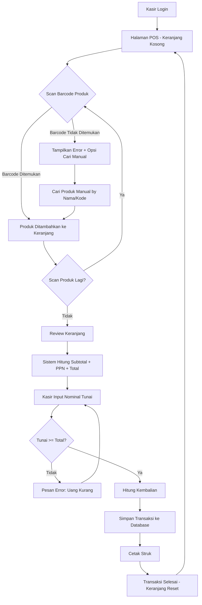
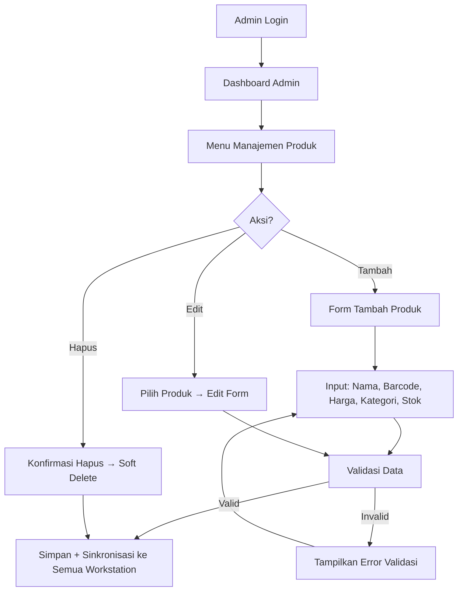

# PRODUCT REQUIREMENTS DOCUMENT (PRD)

---

| **Atribut**         | **Detail**                                              |
|---------------------|---------------------------------------------------------|
| **Nama Produk**     | Sistem Point of Sale (POS) MikoMart                     |
| **Versi Dokumen**   | 1.0                                                     |
| **Tanggal**         | 28 Maret 2026                                           |
| **Klien/Lembaga**   | MikoMart (Supermarket)                                  |
| **Disiapkan oleh**  | Tim Pengembang Sistem                                   |
| **Status**          | Draft — Menunggu Persetujuan Klien                      |

---

## Daftar Isi

1. [Visi Produk](#1-visi-produk)
2. [Persona Pengguna](#2-persona-pengguna)
3. [User Stories](#3-user-stories)
4. [Kebutuhan Fungsional](#4-kebutuhan-fungsional)
5. [Kebutuhan Non-Fungsional](#5-kebutuhan-non-fungsional)
6. [Alur Kerja Utama (User Flow)](#6-alur-kerja-utama-user-flow)
7. [Wireframe Konseptual](#7-wireframe-konseptual)
8. [Acceptance Criteria](#8-acceptance-criteria)
9. [Prioritas Fitur (MoSCoW)](#9-prioritas-fitur-moscow)
10. [Asumsi & Dependensi](#10-asumsi--dependensi)

---

## Riwayat Revisi

| Versi | Tanggal        | Perubahan                  | Penulis             |
|-------|----------------|----------------------------|---------------------|
| 1.0   | 28 Maret 2026  | Dokumen awal (draft)       | Tim Pengembang      |

---

## 1. Visi Produk

### 1.1 Pernyataan Visi

> **Untuk** kasir MikoMart **yang** memproses transaksi penjualan harian dalam volume tinggi, **Sistem POS MikoMart** adalah **aplikasi point of sale berbasis web** yang **mengeliminasi kesalahan input harga melalui otomatisasi barcode scanning dan kalkulasi harga dari database terpusat**. Berbeda dengan proses manual yang rentan error, **produk kami** menjamin akurasi harga 100%, kecepatan transaksi ≤8 detik, dan pencatatan pajak otomatis dalam satu sistem terintegrasi yang berjalan secara offline.

### 1.2 Rumusan Masalah

| Aspek              | Detail                                                                 |
|--------------------|------------------------------------------------------------------------|
| **Masalah**        | Kesalahan input harga manual saat volume pelanggan tinggi              |
| **Siapa terdampak**| Kasir (operasional), Pemilik Toko (finansial), Pelanggan (kepercayaan) |
| **Dampak**         | Kerugian finansial, waktu transaksi lama, antrean panjang              |
| **Solusi**         | Sistem POS dengan barcode scanning + database harga otomatis           |

---

## 2. Persona Pengguna

### 2.1 Kasir — Pengguna Utama

| Atribut              | Detail                                                               |
|----------------------|----------------------------------------------------------------------|
| **Profil**           | Karyawan MikoMart, usia 20-40 tahun, pendidikan SMA/D3              |
| **Kemampuan IT**     | Dasar — familiar dengan penggunaan komputer sederhana                |
| **Tugas utama**      | Memproses transaksi penjualan: scan barcode → terima pembayaran tunai → cetak struk |
| **Pain point**       | Input harga manual lambat dan rawan salah, terutama saat ramai       |
| **Kebutuhan**        | Antarmuka simpel, font besar, tombol jelas, respons cepat            |
| **Jumlah**           | 4 orang aktif bersamaan (masing-masing 1 workstation)                |

### 2.2 Supervisor

| Atribut              | Detail                                                               |
|----------------------|----------------------------------------------------------------------|
| **Profil**           | Penanggung jawab operasional toko, usia 28-50 tahun                  |
| **Kemampuan IT**     | Menengah — terbiasa dengan aplikasi office & web                     |
| **Tugas utama**      | Memantau penjualan, melihat laporan harian/bulanan, mengawasi kasir  |
| **Pain point**       | Tidak ada data penjualan real-time untuk pengambilan keputusan       |
| **Kebutuhan**        | Dashboard laporan yang informatif, ringkas, dan exportable           |

### 2.3 Admin

| Atribut              | Detail                                                               |
|----------------------|----------------------------------------------------------------------|
| **Profil**           | Pengelola teknis sistem dan data master, usia 25-45 tahun            |
| **Kemampuan IT**     | Menengah-Tinggi — mampu mengelola sistem back-office                 |
| **Tugas utama**      | Mengelola data produk, harga, kategori, akun pengguna                |
| **Pain point**       | Perubahan harga harus cepat terefleksi di semua workstation          |
| **Kebutuhan**        | Panel manajemen produk yang lengkap dan efisien                      |

---

## 3. User Stories

### 3.1 Modul Transaksi POS (Kasir)

| ID     | User Story                                                                                          | Prioritas |
|--------|------------------------------------------------------------------------------------------------------|-----------|
| US-01  | Sebagai **Kasir**, saya ingin **memindai barcode produk** sehingga harga otomatis muncul di layar tanpa input manual | Must      |
| US-02  | Sebagai **Kasir**, saya ingin **melihat daftar produk yang dipindai** beserta subtotal dan total agar saya tahu jumlah yang harus ditagihkan | Must      |
| US-03  | Sebagai **Kasir**, saya ingin **menginput jumlah uang tunai yang diterima** dan melihat kembalian secara otomatis | Must      |
| US-04  | Sebagai **Kasir**, saya ingin **mencetak struk transaksi** yang mencantumkan detail produk, PPN, dan total bayar | Must      |
| US-05  | Sebagai **Kasir**, saya ingin **menghapus item dari daftar belanja** jika pelanggan membatalkan suatu produk | Must      |
| US-06  | Sebagai **Kasir**, saya ingin **mengubah kuantitas item** yang sudah dipindai tanpa harus scan ulang | Should    |
| US-07  | Sebagai **Kasir**, saya ingin **mencari produk secara manual** (by nama/kode) jika barcode rusak atau tidak terbaca | Must      |

### 3.2 Modul Manajemen Produk (Admin)

| ID     | User Story                                                                                          | Prioritas |
|--------|------------------------------------------------------------------------------------------------------|-----------|
| US-08  | Sebagai **Admin**, saya ingin **menambahkan produk baru** dengan nama, barcode, harga, dan kategori  | Must      |
| US-09  | Sebagai **Admin**, saya ingin **mengubah harga produk** dan perubahan langsung berlaku di semua kasir | Must      |
| US-10  | Sebagai **Admin**, saya ingin **menghapus atau menonaktifkan produk** yang sudah tidak dijual         | Must      |
| US-11  | Sebagai **Admin**, saya ingin **mengimpor data produk secara massal** dari file CSV/Excel             | Should    |
| US-12  | Sebagai **Admin**, saya ingin **mengelola kategori produk** untuk pengorganisasian data               | Should    |

### 3.3 Modul Manajemen Pengguna (Admin)

| ID     | User Story                                                                                          | Prioritas |
|--------|------------------------------------------------------------------------------------------------------|-----------|
| US-13  | Sebagai **Admin**, saya ingin **membuat akun pengguna baru** dengan peran (Kasir/Supervisor/Admin)    | Must      |
| US-14  | Sebagai **Admin**, saya ingin **menonaktifkan akun pengguna** yang sudah tidak bekerja               | Must      |
| US-15  | Sebagai **Admin**, saya ingin **mereset password pengguna** jika mereka lupa                         | Should    |

### 3.4 Modul Laporan (Supervisor)

| ID     | User Story                                                                                          | Prioritas |
|--------|------------------------------------------------------------------------------------------------------|-----------|
| US-16  | Sebagai **Supervisor**, saya ingin **melihat laporan penjualan harian** berisi total transaksi, total pendapatan, dan jumlah item terjual | Must      |
| US-17  | Sebagai **Supervisor**, saya ingin **melihat laporan penjualan bulanan** dengan grafik tren           | Should    |
| US-18  | Sebagai **Supervisor**, saya ingin **melihat laporan per kasir** untuk evaluasi kinerja               | Should    |
| US-19  | Sebagai **Supervisor**, saya ingin **melihat produk terlaris** dalam periode tertentu                 | Could     |
| US-20  | Sebagai **Supervisor**, saya ingin **mengekspor laporan ke PDF/Excel**                                | Should    |

### 3.5 Modul Pajak & Struk

| ID     | User Story                                                                                          | Prioritas |
|--------|------------------------------------------------------------------------------------------------------|-----------|
| US-21  | Sebagai **Pemilik**, saya ingin **PPN 11% dihitung otomatis** pada setiap transaksi                  | Must      |
| US-22  | Sebagai **Pemilik**, saya ingin **struk menyertakan NPWP toko dan rincian PPN**                      | Must      |
| US-23  | Sebagai **Pemilik**, saya ingin **laporan pajak bulanan** yang meringkas total PPN terkumpul          | Should    |

---

## 4. Kebutuhan Fungsional

### 4.1 Modul Manajemen Produk (FR-PM)

| ID       | Kebutuhan                                                    | Detail                                                                     |
|----------|--------------------------------------------------------------|----------------------------------------------------------------------------|
| FR-PM-01 | Tambah produk baru                                           | Field: nama, barcode (EAN-13), harga jual, kategori, stok awal, satuan    |
| FR-PM-02 | Edit data produk                                             | Semua field dapat diedit; perubahan harga berlaku real-time                |
| FR-PM-03 | Hapus/nonaktifkan produk                                     | Soft delete — produk dinonaktifkan, tidak muncul di POS                   |
| FR-PM-04 | Pencarian & filter produk                                    | Cari berdasarkan nama, barcode, atau kategori                              |
| FR-PM-05 | Import massal produk                                         | Upload CSV dengan format template yang disediakan                          |
| FR-PM-06 | Manajemen kategori produk                                    | CRUD kategori: Makanan, Minuman, Peralatan, Toiletries, dll              |
| FR-PM-07 | Tracking stok dasar                                          | Stok berkurang otomatis saat transaksi; alert jika stok rendah (< threshold) |

### 4.2 Modul Transaksi POS (FR-POS)

| ID        | Kebutuhan                                                   | Detail                                                                     |
|-----------|-------------------------------------------------------------|----------------------------------------------------------------------------|
| FR-POS-01 | Scan barcode produk                                         | Input via barcode scanner (keyboard mode); cari di DB & tampilkan info     |
| FR-POS-02 | Tambah item ke keranjang                                    | Auto-add setelah scan; jika produk sudah ada → increment kuantitas         |
| FR-POS-03 | Edit kuantitas item                                         | Kasir dapat mengubah qty langsung di keranjang                             |
| FR-POS-04 | Hapus item dari keranjang                                   | Hapus satu item atau kosongkan seluruh keranjang                           |
| FR-POS-05 | Hitung subtotal, PPN, dan grand total                       | Subtotal = Σ(harga × qty); PPN = 11% × subtotal; Total = subtotal + PPN   |
| FR-POS-06 | Input pembayaran tunai                                      | Kasir input nominal tunai; sistem hitung kembalian otomatis                |
| FR-POS-07 | Validasi pembayaran                                         | Tolak jika nominal tunai < total; tampilkan pesan error yang jelas         |
| FR-POS-08 | Simpan transaksi                                            | Record: nomor transaksi, tanggal/waktu, kasir, daftar item, total, PPN    |
| FR-POS-09 | Cetak struk                                                 | Output ke thermal printer; format: header toko → item → subtotal → PPN → total → kembalian → footer |
| FR-POS-10 | Pencarian produk manual                                     | Fallback jika barcode tidak terbaca; cari by nama atau kode produk         |
| FR-POS-11 | Hold & recall transaksi                                     | Tahan transaksi aktif, layani pelanggan lain, recall transaksi yang ditahan |

### 4.3 Modul Manajemen Pengguna (FR-UM)

| ID       | Kebutuhan                                                    | Detail                                                                     |
|----------|--------------------------------------------------------------|----------------------------------------------------------------------------|
| FR-UM-01 | Login dengan username & password                             | Autentikasi sebelum mengakses sistem; session timeout setelah idle         |
| FR-UM-02 | Manajemen peran (Role-Based Access Control)                  | 3 peran: Admin, Supervisor, Kasir                                          |
| FR-UM-03 | CRUD akun pengguna                                           | Field: nama, username, password, peran, status (aktif/nonaktif)            |
| FR-UM-04 | Reset password                                               | Admin dapat mereset password pengguna lain                                 |
| FR-UM-05 | Log aktivitas pengguna                                       | Catat login, logout, transaksi yang diproses                               |

**Matriks Hak Akses:**

| Fitur                    | Admin | Supervisor | Kasir |
|--------------------------|:-----:|:----------:|:-----:|
| Kelola produk            |  ✅   |     ❌     |  ❌   |
| Kelola pengguna          |  ✅   |     ❌     |  ❌   |
| Proses transaksi POS     |  ❌   |     ❌     |  ✅   |
| Void/batal transaksi     |  ✅   |     ✅     |  ❌   |
| Lihat laporan penjualan  |  ✅   |     ✅     |  ❌   |
| Ekspor laporan           |  ✅   |     ✅     |  ❌   |
| Konfigurasi sistem       |  ✅   |     ❌     |  ❌   |

### 4.4 Modul Laporan Penjualan (FR-RPT)

| ID        | Kebutuhan                                                   | Detail                                                                     |
|-----------|-------------------------------------------------------------|----------------------------------------------------------------------------|
| FR-RPT-01 | Laporan penjualan harian                                    | Total transaksi, total pendapatan, jumlah item, breakdown per kasir        |
| FR-RPT-02 | Laporan penjualan bulanan                                   | Agregasi harian selama 1 bulan; grafik tren penjualan                      |
| FR-RPT-03 | Laporan per kasir                                           | Jumlah transaksi & total penjualan per kasir dalam periode tertentu        |
| FR-RPT-04 | Laporan produk terlaris                                     | Ranking produk berdasarkan volume penjualan; filter per periode            |
| FR-RPT-05 | Laporan pajak (PPN) bulanan                                 | Total PPN terkumpul, jumlah transaksi kena pajak                           |
| FR-RPT-06 | Ekspor laporan                                              | Format: PDF dan Excel (XLSX)                                               |

### 4.5 Modul Perpajakan (FR-TAX)

| ID        | Kebutuhan                                                   | Detail                                                                     |
|-----------|-------------------------------------------------------------|----------------------------------------------------------------------------|
| FR-TAX-01 | Kalkulasi PPN otomatis                                      | PPN 11% dihitung otomatis dari subtotal setiap transaksi                   |
| FR-TAX-02 | Tampilkan PPN pada struk                                    | Baris terpisah menunjukkan: Subtotal, PPN (11%), Total                     |
| FR-TAX-03 | Informasi PKP pada struk                                    | Header struk mencantumkan nama usaha, alamat, NPWP                         |
| FR-TAX-04 | Konfigurasi tarif pajak                                     | Admin dapat mengubah tarif PPN jika ada perubahan regulasi                 |
| FR-TAX-05 | Laporan ringkasan PPN                                       | Rekapitulasi PPN harian/bulanan untuk pelaporan pajak                      |

### 4.6 Modul Offline & Sinkronisasi (FR-OFF)

| ID        | Kebutuhan                                                   | Detail                                                                     |
|-----------|-------------------------------------------------------------|----------------------------------------------------------------------------|
| FR-OFF-01 | Operasi offline penuh                                       | Semua fitur POS berjalan tanpa koneksi internet                            |
| FR-OFF-02 | Database lokal per workstation                              | SQLite sebagai DB lokal; menyimpan data produk & transaksi                 |
| FR-OFF-03 | Sinkronisasi data produk via LAN                            | Perubahan produk oleh Admin tersinkron ke semua workstation                 |
| FR-OFF-04 | Sinkronisasi transaksi via LAN                              | Data transaksi dari tiap kasir tersinkron ke server pusat (LAN)            |
| FR-OFF-05 | Conflict resolution                                         | Strategi: last-write-wins untuk data produk; append-only untuk transaksi   |

---

## 5. Kebutuhan Non-Fungsional

### 5.1 Performa (NFR-PERF)

| ID          | Kebutuhan                                                 | Target                     |
|-------------|-----------------------------------------------------------|----------------------------|
| NFR-PERF-01 | Waktu respons scan barcode → tampil produk                | ≤ 500 ms                  |
| NFR-PERF-02 | Waktu proses transaksi lengkap (scan → cetak struk)       | ≤ 8 detik                 |
| NFR-PERF-03 | Concurrent users tanpa degradasi performa                 | 4 kasir simultan           |
| NFR-PERF-04 | Waktu load dashboard laporan                              | ≤ 5 detik                 |

### 5.2 Ketersediaan (NFR-AVAIL)

| ID           | Kebutuhan                                                | Target                     |
|--------------|----------------------------------------------------------|----------------------------|
| NFR-AVAIL-01 | Uptime selama jam operasional (08:00-20:00 WIB)          | 99.5%                      |
| NFR-AVAIL-02 | Sistem berfungsi saat koneksi internet terputus           | 100% operasional offline   |
| NFR-AVAIL-03 | Recovery time setelah kegagalan sistem                    | ≤ 5 menit                 |

### 5.3 Keamanan (NFR-SEC)

| ID          | Kebutuhan                                                 | Detail                                          |
|-------------|-----------------------------------------------------------|-------------------------------------------------|
| NFR-SEC-01  | Autentikasi pengguna                                      | Username + password hash (bcrypt)               |
| NFR-SEC-02  | Otorisasi berbasis peran (RBAC)                           | 3 peran dengan hak akses terpisah               |
| NFR-SEC-03  | Session management                                        | Auto-logout setelah 15 menit idle               |
| NFR-SEC-04  | Enkripsi data sensitif                                    | Password di-hash; data transaksi terproteksi    |
| NFR-SEC-05  | Audit trail                                               | Log semua aktivitas login, transaksi, perubahan |

### 5.4 Usability (NFR-USE)

| ID          | Kebutuhan                                                 | Detail                                          |
|-------------|-----------------------------------------------------------|-------------------------------------------------|
| NFR-USE-01  | Antarmuka kasir simpel dan intuitif                       | Minimal klik; font besar; tombol jelas          |
| NFR-USE-02  | Pelatihan penggunaan                                      | Kasir mampu mengoperasikan setelah ≤ 2 jam training |
| NFR-USE-03  | Keyboard shortcut                                         | Shortcut untuk fungsi utama (bayar, hapus, cari)|
| NFR-USE-04  | Notifikasi error yang informatif                          | Pesan error dalam Bahasa Indonesia, jelas & actionable |

### 5.5 Maintainability (NFR-MAINT)

| ID           | Kebutuhan                                                | Detail                                          |
|--------------|----------------------------------------------------------|-------------------------------------------------|
| NFR-MAINT-01 | Arsitektur modular                                       | Separation of concerns; API-driven              |
| NFR-MAINT-02 | Dokumentasi kode                                         | Inline comments + API documentation             |
| NFR-MAINT-03 | Konfigurasi tarif pajak tanpa ubah kode                  | Configurable via admin panel                    |

---

## 6. Alur Kerja Utama (User Flow)

### 6.1 Alur Transaksi POS (Primary Flow)



### 6.2 Alur Manajemen Produk (Admin)



---

## 7. Wireframe Konseptual

### 7.1 Layout Halaman POS (Kasir)

```
┌─────────────────────────────────────────────────────────────────┐
│  🏪 MikoMart POS           Kasir: Budi    [Shift: Pagi]  [⏻]  │
├───────────────────────────────────┬──────────────────────────────┤
│                                   │                              │
│  📦 DAFTAR BELANJA               │  💰 RINGKASAN                │
│  ┌────┬──────────┬───┬──────────┐ │                              │
│  │ No │ Produk   │Qty│ Subtotal │ │  Subtotal : Rp  125.000     │
│  ├────┼──────────┼───┼──────────┤ │  PPN (11%): Rp   13.750     │
│  │ 1  │ Indomie  │ 3 │  Rp9.000 │ │  ─────────────────────      │
│  │ 2  │ Aqua 1L  │ 2 │  Rp8.000 │ │  TOTAL    : Rp  138.750    │
│  │ 3  │ Beras 5kg│ 1 │ Rp70.000 │ │                              │
│  │ 4  │ Minyak 2L│ 1 │ Rp38.000 │ │  ┌───────────────────────┐  │
│  │    │          │   │          │ │  │ Bayar : Rp [150.000  ]│  │
│  │    │          │   │          │ │  │ Kembali: Rp  11.250   │  │
│  │    │          │   │          │ │  └───────────────────────┘  │
│  └────┴──────────┴───┴──────────┘ │                              │
│                                   │  ┌──────────┐ ┌──────────┐  │
│  ┌────────────────────────────┐   │  │  BAYAR   │ │  BATAL   │  │
│  │ 🔍 Scan/Cari Produk...    │   │  │  [F12]   │ │  [ESC]   │  │
│  └────────────────────────────┘   │  └──────────┘ └──────────┘  │
│                                   │                              │
│  [F1]Cari  [F3]Hapus  [F5]Hold   │  [F8]Tahan  [F10]Cetak Ulang│
├───────────────────────────────────┴──────────────────────────────┤
│  Status: ● Online (LAN)  │  Transaksi #MKM-20260328-0042       │
└─────────────────────────────────────────────────────────────────┘
```

### 7.2 Layout Struk Transaksi

```
================================================
            M I K O M A R T
         Jl. Contoh No. 123, Kota
        NPWP: 01.234.567.8-901.000
================================================
No. Transaksi : MKM-20260328-0042
Tanggal       : 28-03-2026  14:35:22
Kasir         : Budi
------------------------------------------------
Produk              Qty   Harga      Subtotal
------------------------------------------------
Indomie Goreng        3   3.000        9.000
Aqua 1L               2   4.000        8.000
Beras Cap Jago 5kg    1  70.000       70.000
Minyak Bimoli 2L      1  38.000       38.000
------------------------------------------------
Subtotal                            125.000
PPN (11%)                           13.750
                                 ===========
TOTAL                              138.750

Tunai                              150.000
Kembalian                           11.250
================================================
    Terima kasih telah berbelanja
         di MikoMart! 🛒
================================================
```

---

## 8. Acceptance Criteria

### 8.1 Transaksi POS

| ID    | Kriteria                                                                          | Metode Verifikasi     |
|-------|-----------------------------------------------------------------------------------|-----------------------|
| AC-01 | Barcode yang valid menampilkan info produk dalam ≤500ms                           | Performance test      |
| AC-02 | Total harga dihitung otomatis dengan akurasi 100%                                 | Unit test + manual    |
| AC-03 | PPN 11% dihitung dan ditampilkan terpisah pada struk                              | Manual verification   |
| AC-04 | Transaksi lengkap diselesaikan dalam ≤8 detik                                     | Performance test      |
| AC-05 | Struk berhasil dicetak dengan format yang benar                                   | UAT                   |
| AC-06 | Sistem menolak pembayaran jika nominal tunai kurang dari total                    | Functional test       |
| AC-07 | Kembalian dihitung dengan benar                                                   | Unit test             |

### 8.2 Manajemen Produk

| ID    | Kriteria                                                                          | Metode Verifikasi     |
|-------|-----------------------------------------------------------------------------------|-----------------------|
| AC-08 | Admin berhasil menambah produk baru dengan semua field wajib                      | Functional test       |
| AC-09 | Perubahan harga oleh Admin langsung berlaku di semua workstation kasir             | Integration test      |
| AC-10 | Produk yang dinonaktifkan tidak muncul di pencarian POS                            | Functional test       |

### 8.3 Offline & Sinkronisasi

| ID    | Kriteria                                                                          | Metode Verifikasi     |
|-------|-----------------------------------------------------------------------------------|-----------------------|
| AC-11 | Semua fitur POS berfungsi tanpa koneksi internet                                  | Isolation test        |
| AC-12 | Data transaksi tersinkronisasi ke server pusat via LAN                            | Integration test      |
| AC-13 | 4 kasir dapat bertransaksi bersamaan tanpa konflik data                           | Concurrency test      |

---

## 9. Prioritas Fitur (MoSCoW)

| Prioritas      | Fitur                                                                |
|----------------|----------------------------------------------------------------------|
| **Must Have**  | Scan barcode, keranjang belanja, hitung total + PPN, bayar tunai, cetak struk, login, RBAC, manajemen produk dasar, operasi offline |
| **Should Have**| Edit kuantitas, pencarian manual, import CSV, laporan harian/bulanan, ekspor PDF/Excel, laporan per kasir, laporan pajak, reset password |
| **Could Have** | Hold/recall transaksi, produk terlaris, grafik tren penjualan, keyboard shortcut lengkap |
| **Won't Have** | Pembayaran non-tunai, e-commerce, mobile app, membership/loyalty, integrasi e-Faktur (fase 2) |

---

## 10. Asumsi & Dependensi

### 10.1 Asumsi

1. Seluruh produk MikoMart memiliki barcode standar yang tertempel pada kemasan
2. Infrastruktur jaringan LAN sudah tersedia atau akan disiapkan sebelum deployment
3. Perangkat keras (PC, barcode scanner USB, thermal printer) disediakan oleh klien
4. Admin akan menginput seluruh data produk sebelum sistem go-live
5. Tarif PPN yang berlaku saat ini adalah 11%

### 10.2 Dependensi

| Dependensi                        | Pihak Penanggung Jawab |
|-----------------------------------|------------------------|
| Penyediaan perangkat keras        | MikoMart               |
| Setup jaringan LAN                | MikoMart / vendor IT   |
| Data produk lengkap (nama, harga, barcode) | MikoMart (Admin) |
| Informasi NPWP & data PKP        | MikoMart               |
| Barcode scanner kompatibel USB    | MikoMart               |

---

## Glosarium

| Istilah         | Definisi                                                                    |
|-----------------|-----------------------------------------------------------------------------|
| **MoSCoW**      | Metode prioritasi: Must, Should, Could, Won't                              |
| **RBAC**        | Role-Based Access Control — kontrol akses berdasarkan peran pengguna        |
| **Soft Delete** | Penghapusan logis — data ditandai nonaktif tanpa dihapus dari database      |
| **Hold/Recall** | Menahan transaksi aktif dan memanggil kembali nanti                         |
| **Thermal Printer** | Printer struk dengan teknologi cetak termal (tanpa tinta)              |

---

## Referensi

1. IEEE Std 830-1998 — IEEE Recommended Practice for Software Requirements Specifications
2. ISO/IEC 25010:2011 — Systems and Software Quality Requirements and Evaluation
3. Cohn, M. (2004). *User Stories Applied: For Agile Software Development*. Addison-Wesley.
4. Undang-Undang No. 42 Tahun 2009 tentang Pajak Pertambahan Nilai
