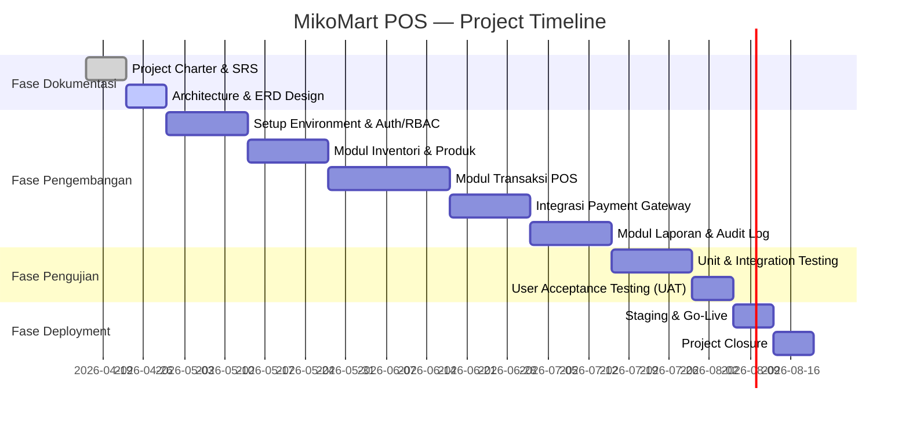

# PROJECT CHARTER
## MikoMart Point of Sale (POS) System

---

| Field | Detail |
|---|---|
| **Nama Proyek** | MikoMart Point of Sale (POS) System |
| **Versi Dokumen** | 1.0 |
| **Tanggal** | 16 April 2026 |
| **Status** | Draft — Menunggu Persetujuan |
| **Nomor Dokumen** | MikoMart-PC-2026-001 |

---

## 1. RINGKASAN EKSEKUTIF

MikoMart POS adalah sistem kasir berbasis web (offline-first) yang dirancang untuk mendukung operasional ritel MikoMart secara menyeluruh. Sistem ini menggantikan proses manual dan menyatukan transaksi penjualan, manajemen inventori, manajemen pengguna berbasis peran (RBAC), integrasi pembayaran digital, serta pelaporan bisnis dalam satu platform terpadu.

Sistem ini dikembangkan menggunakan stack: **PHP Laravel** (backend API), **Node.js** (layanan real-time/event), **React** (frontend SPA), dan **SQLite** (penyimpanan lokal offline), dengan desain arsitektur yang mendukung sinkronisasi data ketika koneksi internet kembali tersedia.

---

## 2. LATAR BELAKANG & TUJUAN BISNIS

| Tujuan Bisnis | Indikator Keberhasilan |
|---|---|
| Mempercepat proses transaksi kasir | Transaksi tuntas ≤ 10 detik |
| Mengurangi kesalahan pencatatan stok | Akurasi stok ≥ 99% |
| Meningkatkan visibilitas laporan ke pemilik | Owner dapat melihat rekap harian/mingguan/bulanan |
| Kepatuhan terhadap regulasi pajak | Ekspor data transaksi untuk audit pajak tersedia |
| Keamanan data pengguna & transaksi | Zero data breach; audit log 100% tercatat |

---

## 3. RUANG LINGKUP PROYEK

### 3.1 Dalam Lingkup (In-Scope)

- **Modul Autentikasi & RBAC**: Login, session management, 4 role (Admin, Supervisor, Kasir, Owner)
- **Modul Transaksi POS**:
  - Multiple metode pembayaran per transaksi (tunai, QRIS, transfer, kombinasi)
  - Fitur split bill
  - Diskon manual & override harga (max 30%, semua tercatat di audit log)
  - Void & retur transaksi oleh kasir secara mandiri
- **Modul Inventori**:
  - Pengurangan stok real-time saat transaksi
  - Notifikasi stok minimum
  - Modul pembelian & restock
- **Modul Pembayaran**:
  - Integrasi langsung payment gateway (QRIS/Midtrans/Xendit)
- **Modul Struk**:
  - Cetak struk fisik via thermal printer
  - Ekspor struk digital format PDF
- **Modul Laporan & Audit**:
  - Rekap transaksi harian/mingguan/bulanan (Owner)
  - Activity log lengkap (siapa, apa, kapan)
  - Ekspor data untuk audit pajak (PPN)
- **Arsitektur Offline-First**:
  - Transaksi tetap berjalan tanpa koneksi internet
  - Auto-sinkronisasi data saat koneksi kembali
  - Kasir memiliki otoritas merge jika terjadi konflik data

### 3.2 Di Luar Lingkup (Out-of-Scope)

- Aplikasi mobile (Android/iOS) native
- Modul penggajian/payroll karyawan
- Integrasi dengan sistem akuntansi eksternal (e.g., Accurate, Jurnal.id) — bisa jadi fase berikutnya
- E-commerce / penjualan online
- Fitur loyalty points / program membership pelanggan
- Customer Relationship Management (CRM)

---

## 4. STAKEHOLDER

| Peran | Nama / Jabatan | Kepentingan |
|---|---|---|
| **Project Sponsor** | Pemilik MikoMart | Pembiayaan & persetujuan akhir |
| **Product Owner** | Owner (Role sistem) | Visibilitas laporan & kepatuhan pajak |
| **System Admin** | Admin MikoMart | Konfigurasi sistem, harga, diskon |
| **End User — Kasir** | Kasir aktif (4 orang) | Kemudahan & kecepatan transaksi |
| **End User — Supervisor** | Supervisor toko | Pengawasan transaksi & stok |
| **Developer Team** | Tim Pengembang | Pembangunan & pemeliharaan sistem |
| **QA Engineer** | Tim SQA | Pengujian & validasi sistem |

---

## 5. DELIVERABLES PROYEK

| No | Deliverable | Format | Target Fase |
|---|---|---|---|
| D-01 | Software Requirements Specification (SRS) | Markdown / PDF | Fase 2B |
| D-02 | System Architecture Document (SAD) | SVG + Markdown | Fase 3 |
| D-03 | Entity Relationship Diagram (ERD) | Mermaid | Fase 3 |
| D-04 | Database Schema (DDL) | SQL | Fase 3 |
| D-05 | Source Code Aplikasi | GitHub Repository | Fase 4–6 |
| D-06 | REST API Documentation | OpenAPI 3.0 | Fase 4 |
| D-07 | Test Plan & Test Cases (IEEE 829) | Markdown | Fase 7 |
| D-08 | Test Report & Bug Report | Markdown | Fase 7 |
| D-09 | Deployment Guide | Markdown | Fase 8 |
| D-10 | Project Closure Report | Markdown / PDF | Fase 8 |

---

## 6. MILESTONE & JADWAL

| Milestone | Deskripsi | Target Tanggal |
|---|---|---|
| **M0** | Dokumen Dasar Selesai (Charter, SRS, SLA) | 16 Apr 2026 |
| **M1** | Arsitektur & ERD Final | 30 Apr 2026 |
| **M2** | Modul Auth & RBAC Selesai | 14 Mei 2026 |
| **M3** | Modul Inventori & Produk Selesai | 28 Mei 2026 |
| **M4** | Modul Transaksi POS Selesai | 18 Jun 2026 |
| **M5** | Integrasi Payment Gateway Selesai | 02 Jul 2026 |
| **M6** | Modul Laporan & Audit Selesai | 16 Jul 2026 |
| **M7** | UAT & Sign-Off | 06 Ags 2026 |
| **M8** | Go-Live & Project Closure | 13 Ags 2026 |

---

## 7. REGISTER RISIKO

| ID | Risiko | Probabilitas | Dampak | Skor | Mitigasi |
|---|---|---|---|---|---|
| R-01 | Konflik data sinkronisasi offline di multi-kasir | Tinggi | Tinggi | 🔴 Kritis | Implementasi timestamp-based merge + log konflik; kasir diedukasi prosedur merge |
| R-02 | Kegagalan integrasi payment gateway (Midtrans/Xendit) | Sedang | Tinggi | 🟠 Tinggi | Gunakan SDK resmi, testing di sandbox dulu, failover ke mode manual |
| R-03 | Kompatibilitas thermal printer dengan browser/React | Sedang | Sedang | 🟡 Sedang | Uji di hardware nyata (EPSON/Star) di awal sprint; gunakan WebUSB/ESC-POS library |
| R-04 | Overrun jadwal pengembangan | Sedang | Sedang | 🟡 Sedang | Agile sprint 2 minggu, daily standup, buffer 1 sprint |
| R-05 | Kerentanan keamanan pada endpoint API | Rendah | Sangat Tinggi | 🟠 Tinggi | OWASP Top 10 checklist wajib, penetration testing sebelum go-live |
| R-06 | Performa lambat saat peak 500 transaksi/hari | Rendah | Sedang | 🟢 Rendah | Load testing dengan k6; indexing database; caching query laporan |
| R-07 | Kehilangan data saat perangkat kasir mati mendadak | Sedang | Tinggi | 🟠 Tinggi | SQLite WAL mode; auto-save setiap langkah transaksi; backup lokal |

---

## 8. ASUMSI & KETERGANTUNGAN

### 8.1 Asumsi
- Setiap kasir menggunakan tablet touchscreen dengan browser modern (Chrome/Edge terbaru)
- Jaringan LAN/WLAN tersedia di toko namun tidak dijamin stabil 100%
- Thermal printer sudah tersedia dan kompatibel dengan standar ESC/POS
- Tidak ada regulasi pajak yang mengharuskan integrasi langsung ke sistem DJP (e-Faktur) pada versi ini
- NPWP toko telah tersedia dan valid untuk keperluan struk PPN

### 8.2 Ketergantungan
- API payment gateway aktif (Midtrans atau Xendit) — membutuhkan akun merchant yang terdaftar
- Koneksi internet untuk proses transaksi digital (QRIS, transfer)
- Server/hosting yang mendukung PHP 8.x, Node.js ≥ 18.x

---

## 9. KRITERIA KEBERHASILAN PROYEK

| Kriteria | Target |
|---|---|
| Semua Functional Requirements (FR) terpenuhi | 100% FR Pass di UAT |
| Tidak ada Critical/High bug saat go-live | 0 bug Critical, ≤ 3 bug High |
| Performa transaksi | ≤ 10 detik end-to-end di peak load |
| Uptime sistem | ≥ 99.5% per bulan |
| Audit log lengkap | 100% override & void tercatat |

---

## 10. PERSETUJUAN DOKUMEN

| Peran | Nama | Tanda Tangan | Tanggal |
|---|---|---|---|
| Project Sponsor | __________________ | __________________ | __________ |
| Product Owner | __________________ | __________________ | __________ |
| Lead Developer | __________________ | __________________ | __________ |
| QA Lead | __________________ | __________________ | __________ |

---

*Dokumen ini merupakan landasan resmi proyek MikoMart POS. Setiap perubahan ruang lingkup harus melalui proses Change Request (CR) formal dan mendapat persetujuan Project Sponsor.*

**Nomor Dokumen:** MikoMart-PC-2026-001 | **Versi:** 1.0 | **Klasifikasi:** INTERNAL — CONFIDENTIAL
