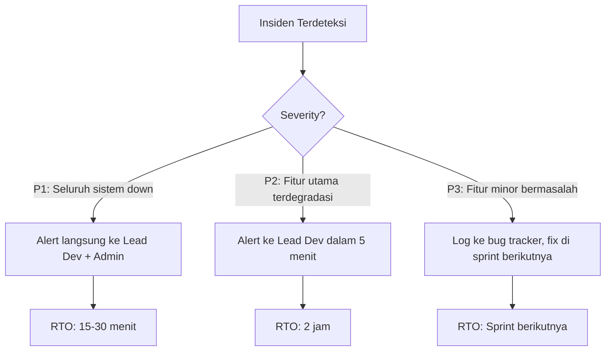

# SERVICE LEVEL AGREEMENT / SERVICE LEVEL OBJECTIVES BASELINE
## MikoMart Point of Sale (POS) System

---

| Field | Detail |
|---|---|
| **Nama Sistem** | MikoMart Point of Sale (POS) System |
| **Nomor Dokumen** | MikoMart-SLA-2026-001 |
| **Versi** | 1.0 |
| **Tanggal Efektif** | 16 April 2026 |
| **Periode Review** | Setiap 3 bulan sekali |
| **Klasifikasi** | INTERNAL — CONFIDENTIAL |

---

## 1. TUJUAN DOKUMEN

Dokumen ini menetapkan **Service Level Objectives (SLO)** dan **Service Level Agreements (SLA)** sebagai baseline terukur untuk sistem MikoMart POS. Dokumen ini menjadi acuan antara tim teknis dan stakeholder bisnis dalam mengevaluasi kualitas layanan sistem secara objektif.

---

## 2. DEFINISI LAYANAN

| Komponen | Deskripsi |
|---|---|
| **Layanan Utama** | Pemrosesan transaksi POS (online & offline mode) |
| **Layanan Pendukung** | Sinkronisasi data, laporan, payment gateway, cetak struk |
| **Pengguna Layanan** | 4 kasir aktif bersamaan; Admin, Supervisor, Owner |
| **Jam Operasional** | Disesuaikan jam buka toko (diasumsikan 08.00–22.00 WIB, 7 hari/minggu) |
| **Lingkungan Target** | Produksi (toko MikoMart) |

---

## 3. SERVICE LEVEL OBJECTIVES (SLO)

### 3.1 Performa Response Time

| ID | Metrik | Kondisi | Target (P95) | Target (P99) | Catatan |
|---|---|---|---|---|---|
| **SLO-P-01** | Waktu pemrosesan transaksi end-to-end | Peak (500 trx/hari) | ≤ 10 detik | ≤ 15 detik | Dari klik "Bayar" hingga struk tampil |
| **SLO-P-02** | Waktu cetak struk thermal | Normal & Peak | ≤ 5 detik | ≤ 8 detik | Dari konfirmasi transaksi hingga printer mulai mencetak |
| **SLO-P-03** | Waktu load halaman POS utama | LAN normal | ≤ 3 detik | ≤ 5 detik | First meaningful paint |
| **SLO-P-04** | Waktu autocomplete pencarian produk | Normal | ≤ 1 detik | ≤ 2 detik | Setelah input ≥2 karakter |
| **SLO-P-05** | Waktu generate PDF struk | Normal | ≤ 3 detik | ≤ 5 detik | Server-side rendering |
| **SLO-P-06** | Waktu konfirmasi pembayaran QRIS | Bergantung gateway | ≤ 30 detik | ≤ 60 detik | Batas timeout payment gateway |
| **SLO-P-07** | Waktu load laporan harian | Normal | ≤ 5 detik | ≤ 10 detik | Aggregasi data 1 hari |
| **SLO-P-08** | Waktu auto-sinkronisasi data offline | Saat koneksi kembali | ≤ 30 detik | ≤ 60 detik | Untuk backlog ≤ 100 transaksi |

> **Definisi P95**: 95% dari seluruh request dalam jendela waktu 1 jam harus memenuhi target ini.
> **Definisi P99**: 99% dari seluruh request harus memenuhi target ini.

---

### 3.2 Availability (Ketersediaan)

| ID | Metrik | Target | Perhitungan |
|---|---|---|---|
| **SLO-A-01** | Uptime server/backend | **≥ 99.5%** per bulan | Maksimum downtime: ~3.65 jam/bulan |
| **SLO-A-02** | Availability mode offline (transaksi tunai) | **100%** | Tidak bergantung pada konektivitas server |
| **SLO-A-03** | Scheduled maintenance window | Max. **2 jam/bulan** | Di luar jam operasional toko (22.00–08.00 WIB) |

```
Kalkulasi Uptime Budget per Bulan (30 hari):

  Total waktu: 30 × 24 = 720 jam
  Uptime 99.5% = 720 × 0.995 = 716.4 jam uptime
  Downtime budget = 720 - 716.4 = 3.6 jam (~216 menit/bulan)
  Maintenance terjadwal: 2 jam (dipotong dari budget)
  Sisa budget insiden tak terduga: ~96 menit/bulan
```

| Kualifikasi Downtime | Contoh | Hitungan ke Downtime? |
|---|---|---|
| Scheduled maintenance (diumumkan 24 jam sebelumnya) | Upgrade server malam hari | ❌ Tidak dihitung |
| Gangguan payment gateway (force majeure) | Midtrans down nasional | ❌ Tidak dihitung (diluar kontrol) |
| Bug aplikasi menyebabkan layanan tidak bisa diakses | Server error 500 massal | ✅ Dihitung |
| Database corruption | Stok tidak terbaca | ✅ Dihitung |

---

### 3.3 Error Rate

| ID | Metrik | Target | Definisi Error |
|---|---|---|---|
| **SLO-E-01** | Error rate transaksi POS | **< 0.5%** dari total transaksi | Transaksi gagal bukan karena kesalahan pengguna |
| **SLO-E-02** | Error rate API (HTTP 5xx) | **< 0.1%** dari total API call | Server-side error di luar timeout gateway |
| **SLO-E-03** | Kegagalan sinkronisasi offline | **< 0.1%** dari total sync attempt | Data pending yang akhirnya gagal tersinkronisasi |
| **SLO-E-04** | Kegagalan cetak thermal printer | **< 1%** dari total transaksi | Kegagalan komunikasi ke printer |

---

### 3.4 Throughput

| ID | Metrik | Target |
|---|---|---|
| **SLO-T-01** | Kapasitas transaksi bersamaan | ≥ 4 transaksi simultan (4 kasir aktif) |
| **SLO-T-02** | Peak throughput harian | 500 transaksi/hari tanpa degradasi performa |
| **SLO-T-03** | Sesi aktif bersamaan | ≥ 6 sesi (4 kasir + Admin + Supervisor) |

---

## 4. RECOVERY OBJECTIVES (RTO & RPO)

### 4.1 Definisi

| Term | Definisi |
|---|---|
| **RTO** (Recovery Time Objective) | Waktu maksimum sistem boleh tidak berfungsi setelah insiden sebelum layanan dipulihkan |
| **RPO** (Recovery Point Objective) | Jumlah data maksimum yang boleh hilang setelah insiden (diukur dalam waktu) |

### 4.2 Target RTO & RPO per Skenario

| Skenario | RTO | RPO | Strategi Pemulihan |
|---|---|---|---|
| **Server backend down** (crash/restart) | ≤ 15 menit | 0 (transaksi offline tetap berjalan) | Auto-restart; kasir lanjut offline mode |
| **Database server corrupt** | ≤ 2 jam | ≤ 5 menit | Restore dari backup otomatis terbaru; SQLite WAL mode |
| **Kegagalan sinkronisasi massal** | ≤ 30 menit | 0 (data tersimpan lokal) | Retry mekanisme otomatis; manual trigger sync |
| **Kegagalan seluruh server (force restart)** | ≤ 30 menit | ≤ 15 menit | Backup terjadwal setiap 15 menit (incremental) |
| **Perangkat kasir mati mendadak** | ≤ 5 menit | ≤ 1 transaksi terakhir | SQLite WAL mode; data tersimpan pre-commit |
| **Kegagalan payment gateway** | N/A (fallback tunai) | 0 | Fallback ke pembayaran tunai; retry setelah gateway pulih |

### 4.3 Strategi Backup

| Jenis Backup | Frekuensi | Retensi | Lokasi |
|---|---|---|---|
| Backup database lokal SQLite (tiap kasir) | Setiap 15 menit (incremental) | 7 hari terakhir | Lokal perangkat + NAS toko |
| Backup database server | Setiap malam pukul 00.00 WIB | 30 hari terakhir | Server + external storage |
| Backup audit log | Setiap hari | 30 hari terakhir | Server (append-only) |
| Backup konfigurasi sistem | Setiap kali ada perubahan | Unlimited (version-controlled) | Git repository |

---

## 5. MONITORING & ALERTING

### 5.1 Metrik yang Dimonitor

| Metrik | Alat (Tools) | Threshold Alert |
|---|---|---|
| Response time API | Laravel Telescope / custom middleware | > 10 detik → alert |
| Error rate HTTP 5xx | Server log aggregator | > 0.1% dalam 5 menit → alert |
| Status sinkronisasi | Custom dashboard admin | Pending sync > 50 item → alert |
| Stok minimum | Inventory service | Stok ≤ threshold → notifikasi in-app |
| Status koneksi server | Health check endpoint `/api/health` | Downtime > 2 menit → alert |
| Disk usage database | OS monitoring | > 80% kapasitas → alert |

### 5.2 Health Check Endpoint

```
GET /api/v1/health
Response 200 OK:
{
  "status": "healthy",
  "timestamp": "2026-04-16T15:00:00Z",
  "database": "connected",
  "payment_gateway": "reachable",
  "version": "1.0.0"
}
```

### 5.3 Eskalasi Insiden



| Severity | Definisi | Contoh | Target Respons | Target Resolusi |
|---|---|---|---|---|
| **P1 — Kritis** | Seluruh sistem tidak bisa diakses | Server down, login tidak bisa | ≤ 5 menit | ≤ 30 menit |
| **P2 — Tinggi** | Fitur utama tidak berfungsi | Transaksi gagal, payment error | ≤ 15 menit | ≤ 2 jam |
| **P3 — Sedang** | Fitur pendukung terganggu | Laporan lambat, PDF gagal | ≤ 1 jam | ≤ 1 hari kerja |
| **P4 — Rendah** | Kosmetik / UX minor | Tombol posisi kurang ideal | ≤ 1 hari | Sprint berikutnya |

---

## 6. PENGUKURAN & PELAPORAN SLO

### 6.1 Frekuensi Pelaporan

| Laporan | Frekuensi | Penerima | Format |
|---|---|---|---|
| SLO Dashboard real-time | Selalu tersedia (live) | Admin, Lead Dev | Web dashboard |
| Laporan SLO mingguan | Setiap Senin | Lead Dev | Ringkasan teks |
| Laporan SLO bulanan | Awal bulan | Admin, Owner, Lead Dev | PDF report |
| Post-incident review | Setelah setiap insiden P1/P2 | Seluruh tim | Dokumen RCA |

### 6.2 Definisi Pelanggaran SLO

SLO dianggap **dilanggar** (SLO breach) jika:
- Uptime server < 99.5% dalam bulan kalender berjalan
- Error rate transaksi ≥ 0.5% dalam jendela 24 jam
- P95 response time transaksi > 10 detik selama ≥ 1 jam berturut-turut
- RTO tidak terpenuhi setelah insiden P1/P2

### 6.3 Konsekuensi Pelanggaran SLO (Internal)

| Tingkat Pelanggaran | Konsekuensi |
|---|---|
| Pertama | Post-mortem wajib; action plan dalam 48 jam |
| Kedua dalam 1 bulan | Review arsitektur; alokasi sprint khusus perbaikan |
| Ketiga atau lebih | Eskalasi ke Project Sponsor; possible hotfix release |

---

## 7. RINGKASAN EKSEKUTIF SLO BASELINE

```
╔══════════════════════════════════════════════════════════════╗
║              MIKOMART POS — SLO BASELINE SUMMARY             ║
╠══════════════════════════════════════════════════════════════╣
║  PERFORMA                                                    ║
║  ├─ Transaksi end-to-end (P95)    : ≤ 10 detik              ║
║  ├─ Cetak struk thermal (P95)     : ≤ 5 detik               ║
║  └─ Konfirmasi QRIS (P95)         : ≤ 30 detik              ║
║                                                              ║
║  AVAILABILITY                                                ║
║  ├─ Server uptime                 : ≥ 99.5% / bulan         ║
║  └─ Mode offline (transaksi tunai): 100%                     ║
║                                                              ║
║  ERROR RATE                                                  ║
║  ├─ Error transaksi               : < 0.5%                  ║
║  └─ Error API (5xx)               : < 0.1%                  ║
║                                                              ║
║  KAPASITAS                                                   ║
║  ├─ Normal                        : 300 trx/hari            ║
║  └─ Peak                          : 500 trx/hari            ║
║                                                              ║
║  RECOVERY                                                    ║
║  ├─ RTO (server down)             : ≤ 15 menit              ║
║  ├─ RTO (database corrupt)        : ≤ 2 jam                 ║
║  └─ RPO (data loss maksimal)      : ≤ 1 transaksi / 15 mnt  ║
╚══════════════════════════════════════════════════════════════╝
```

---

## 8. PERSETUJUAN DOKUMEN

| Peran | Nama | Tanda Tangan | Tanggal |
|---|---|---|---|
| Project Sponsor | __________________ | __________________ | __________ |
| Lead Developer | __________________ | __________________ | __________ |
| QA Lead | __________________ | __________________ | __________ |

---

*Dokumen ini akan direvisi setiap 3 bulan atau setelah insiden major. Target SLO dapat disesuaikan berdasarkan data observasi aktual setelah sistem berjalan selama 1 bulan pertama di produksi.*

**Nomor Dokumen:** MikoMart-SLA-2026-001 | **Versi:** 1.0 | **Klasifikasi:** INTERNAL — CONFIDENTIAL
