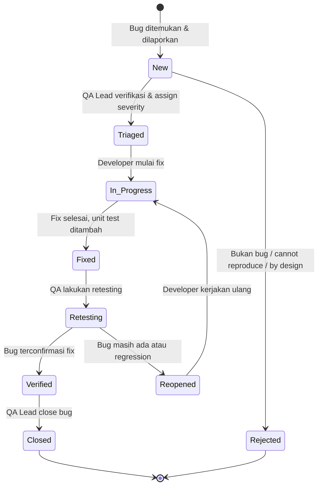

# SOFTWARE QUALITY ASSURANCE PLAN (SQAP)
## MikoMart Point of Sale (POS) System — Fase 3E-A
### Berdasarkan Standar IEEE 730-2014

---

| Field | Detail |
|---|---|
| **Nama Sistem** | MikoMart Point of Sale (POS) System |
| **Nomor Dokumen** | MikoMart-SQAP-2026-001 |
| **Standar** | IEEE Std 730-2014 (Software Quality Assurance Processes) |
| **Versi** | 1.0 |
| **Tanggal** | 16 April 2026 |
| **Klasifikasi** | INTERNAL — CONFIDENTIAL |

---

## 1. PENDAHULUAN

### 1.1 Tujuan

Dokumen ini mendefinisikan proses, standar, prosedur, dan alat yang digunakan tim MikoMart POS untuk memastikan kualitas perangkat lunak memenuhi standar yang ditetapkan dalam SRS, SLA/SLO Baseline, dan Use Case Specification. SQA Plan ini menerapkan filosofi **Shift-Left** — kualitas dibangun dari awal requirements, bukan ditambahkan di akhir.

### 1.2 Prinsip Utama SQA

| Prinsip | Implementasi |
|---|---|
| **Shift-Left Testing** | Gate 0 dimulai saat requirements dibuat, bukan setelah coding selesai |
| **Quality Built-In** | Developer menulis unit test sebelum atau bersamaan dengan kode (TDD encouraged) |
| **Fail Fast** | CI pipeline wajib gagal jika ada test failure atau coverage turun di bawah threshold |
| **Security by Default** | Security testing bukan fase terpisah, tapi terintegrasi di setiap gate |
| **Zero-Tolerance Critical** | Tidak ada bug Critical yang masuk ke production |
| **Traceable Quality** | Setiap defect dapat dilacak ke FR, UC, dan migration yang terkait |

### 1.3 Referensi

- IEEE Std 730-2014: Software Quality Assurance Processes
- MikoMart-SRS-2026-001 v1.1
- MikoMart-MTP-2026-001 (Master Test Plan)
- MikoMart-SLA-2026-001 (SLA/SLO Baseline)
- ISO/IEC 25010:2011 (Software Quality Model)
- OWASP Testing Guide v4.2

---

## 2. ORGANIZATIONAL QUALITY GOALS

| ID | Quality Goal | Basis Standar | Target Terukur |
|---|---|---|---|
| QG-01 | Functional Completeness | ISO 25010 | 100% FR P1 pass di UAT |
| QG-02 | Reliability | SLO-E-01 | Error rate transaksi < 0.5% |
| QG-03 | Performance Efficiency | SLO-P-01 | P95 response time ≤ 10 detik |
| QG-04 | Security | OWASP Top 10 | Zero Critical security vulnerability di release |
| QG-05 | Maintainability | IEEE 730 | Test coverage ≥ 80% untuk business logic |
| QG-06 | Availability | SLO-A-01 | Uptime ≥ 99.5% per bulan setelah go-live |

---

## 3. QUALITY GATES — SHIFT-LEFT FRAMEWORK

> **Definisi Blocking:** Gate tidak dapat dilalui jika ada item Blocking yang belum terpenuhi. Gate dapat dilalui dengan catatan jika item Non-Blocking belum selesai (wajib diselesaikan di gate berikutnya).

---

### GATE 0 — Requirements Quality

**Tujuan:** Memastikan setiap requirement dapat diuji, jelas, dan tidak ambigu sebelum sprint dimulai.

**Responsible:** QA Lead + Business Analyst (bersama team)

**Definition of Done (DoD) Gate 0:**

| # | Checklist | Blocking? |
|---|---|---|
| G0-01 | Setiap FR memiliki test case yang dapat mengverifikasi pemenuhan FR tersebut (testability check) | ✅ Blocking |
| G0-02 | Setiap FR memiliki acceptance criteria yang jelas (given-when-then atau format tertulis) | ✅ Blocking |
| G0-03 | Tidak ada FR P1 yang ambigu atau bertentangan satu sama lain | ✅ Blocking |
| G0-04 | RBAC matrix telah diverifikasi oleh seluruh stakeholder (Admin, Supervisor, Kasir, Owner) | ✅ Blocking |
| G0-05 | Security requirements (SEC-01 s/d SEC-06) telah di-review oleh tim teknis | ✅ Blocking |
| G0-06 | RTM (Requirement Traceability Matrix) telah diisi dan setiap FR memiliki TC ID | ⚠️ Non-Blocking |
| G0-07 | Risiko teknis untuk setiap FR P1 telah diidentifikasi | ⚠️ Non-Blocking |

**Artefak:** SRS Review Report, RTM draft, Acceptance Criteria document

---

### GATE 1 — Unit Testing (TDD / Code-Level Quality)

**Tujuan:** Memastikan setiap unit kode (function, method, class) berfungsi sesuai spesifikasi dan memiliki coverage yang memadai.

**Responsible:** Developer (Self-QA) + Peer Review

**Standar Unit Test — AAA Pattern:**
```
ARRANGE: Siapkan data input, mock dependencies, dan kondisi awal
ACT:     Eksekusi satu unit yang diuji
ASSERT:  Verifikasi output, state perubahan, dan side effects
```

**Minimal Skenario per Function/Endpoint:**
1. **Happy Path** — input valid, output sesuai ekspektasi
2. **Invalid Input** — input tidak valid, validasi menolak dengan benar
3. **Error Handling** — dependency gagal (DB down, gateway timeout), ditangani dengan benar
4. **Boundary Value** — nilai di batas bawah dan batas atas (misal: diskon 0% dan 30%)
5. **Edge Case** — kondisi tidak biasa (stok = 0, transaksi kosong, karakter khusus)
6. **Authorization** — aksi yang memerlukan role tertentu diuji dengan role yang salah dan benar

**Definition of Done (DoD) Gate 1:**

| # | Checklist | Blocking? |
|---|---|---|
| G1-01 | Test coverage ≥ 80% untuk semua Service class dan Controller | ✅ Blocking |
| G1-02 | Tidak ada unit test yang failing (`php artisan test` atau `pest` = 100% pass) | ✅ Blocking |
| G1-03 | Setiap function public memiliki minimal 1 test happy path + 1 error/boundary | ✅ Blocking |
| G1-04 | Tidak ada magic number atau hardcoded secret di kode yang di-push | ✅ Blocking |
| G1-05 | Code review oleh minimal 1 developer lain (PR approval) | ✅ Blocking |
| G1-06 | Static analysis (PHP-CS-Fixer / ESLint) tidak menghasilkan error | ✅ Blocking |
| G1-07 | PHPDoc / JSDoc tersedia untuk semua public function | ⚠️ Non-Blocking |
| G1-08 | Tidak ada `console.log`, `dd()`, `dump()` yang tertinggal di kode | ✅ Blocking |

**Contoh Unit Test Lengkap (AAA — Discount Validation):**
```php
describe('TransactionService::applyDiscount', function () {

    it('applies valid discount correctly', function () {
        // === ARRANGE ===
        $service = new TransactionService();
        $item = TransactionItem::factory()->make([
            'price_original' => 100000,
            'quantity' => 2,
        ]);

        // === ACT ===
        $result = $service->applyDiscount($item, discountPercent: 20);

        // === ASSERT ===
        expect($result->discount_percent)->toBe(20)
            ->and($result->discount_amount)->toBe(20000.0)  // 20% dari 100.000
            ->and($result->price_final)->toBe(80000.0)
            ->and($result->subtotal)->toBe(160000.0);       // 80.000 × 2
    });

    it('rejects discount above 30% (boundary: 31%)', function () {
        // === ARRANGE ===
        $service = new TransactionService();
        $item = TransactionItem::factory()->make(['price_original' => 100000]);

        // === ACT & ASSERT ===
        expect(fn() => $service->applyDiscount($item, discountPercent: 31))
            ->toThrow(ValidationException::class, 'diskon tidak boleh melebihi 30%');
    });

    it('accepts discount exactly at boundary (30%)', function () {
        // === ARRANGE ===
        $service = new TransactionService();
        $item = TransactionItem::factory()->make(['price_original' => 100000]);

        // === ACT ===
        $result = $service->applyDiscount($item, discountPercent: 30);

        // === ASSERT ===
        expect($result->discount_percent)->toBe(30)
            ->and($result->price_final)->toBe(70000.0);
    });

    it('accepts zero discount (boundary: 0%)', function () {
        // === ARRANGE ===
        $service = new TransactionService();
        $item = TransactionItem::factory()->make(['price_original' => 100000]);

        // === ACT ===
        $result = $service->applyDiscount($item, discountPercent: 0);

        // === ASSERT ===
        expect($result->discount_amount)->toBe(0.0)
            ->and($result->price_final)->toBe(100000.0);
    });

    it('always records discount override in audit log', function () {
        // === ARRANGE ===
        $kasir = User::factory()->cashier()->create();
        $this->actingAs($kasir);
        $service = new TransactionService();
        $item = TransactionItem::factory()->make(['price_original' => 100000]);

        // === ACT ===
        $service->applyDiscount($item, discountPercent: 15);

        // === ASSERT ===
        $this->assertAuditLogContains('DISCOUNT_APPLIED', [
            'user_id' => $kasir->id,
            'value_before' => ['discount_percent' => 0],
            'value_after' => ['discount_percent' => 15],
        ]);
    });
});
```

**Contoh Unit Test (AAA — Authorization):**
```php
it('rejects price override below floor price', function () {
    // === ARRANGE ===
    $kasir = User::factory()->cashier()->create();
    $product = Product::factory()->create([
        'price_sell' => 50000,
        'price_buy'  => 30000, // Floor price
    ]);
    $service = new TransactionService();

    // === ACT & ASSERT ===
    expect(fn() => $service->overridePrice(
        product: $product,
        newPrice: 25000, // Di bawah floor price
        actor: $kasir
    ))->toThrow(ValidationException::class, 'harga tidak boleh di bawah HPP');
});

it('prevents unauthorized role from overriding price', function () {
    // === ARRANGE ===
    $supervisor = User::factory()->supervisor()->create();
    $product = Product::factory()->create(['price_sell' => 50000, 'price_buy' => 30000]);
    $service = new TransactionService();

    // === ACT & ASSERT ===
    expect(fn() => $service->overridePrice(
        product: $product,
        newPrice: 40000,
        actor: $supervisor // Supervisor tidak punya akses override
    ))->toThrow(UnauthorizedException::class);
});
```

**Artefak:** Test report HTML (Pest Coverage), Code review comments yang diresolve

---

### GATE 2 — Integration Testing

**Tujuan:** Memastikan komunikasi antar komponen (API endpoint, database, payment gateway) berfungsi sesuai kontrak OpenAPI.

**Responsible:** Developer + QA Engineer

**Definition of Done (DoD) Gate 2:**

| # | Checklist | Blocking? |
|---|---|---|
| G2-01 | Semua endpoint API P1 telah diuji dengan Postman Collection / Pest HTTP test | ✅ Blocking |
| G2-02 | Response body setiap endpoint sesuai OpenAPI 3.0 spec | ✅ Blocking |
| G2-03 | Database state setelah setiap operasi sesuai ekspektasi (assertDatabaseHas) | ✅ Blocking |
| G2-04 | RBAC diuji di level API: setiap endpoint diuji dengan role yang berwenang DAN tidak berwenang | ✅ Blocking |
| G2-05 | Integrasi payment gateway (sandbox) berfungsi: success, expired, failed, webhook | ✅ Blocking |
| G2-06 | Audit log tercatat untuk semua aksi sensitif yang didefinisikan di FR-09 | ✅ Blocking |
| G2-07 | Tidak ada regression dari Gate 1 (semua unit test tetap pass) | ✅ Blocking |
| G2-08 | Postman Collection di-export dan disimpan di repository `/tests/api/` | ⚠️ Non-Blocking |

**Artefak:** Postman Collection, API Integration Test Report, Regression Report

---

### GATE 3 — System Testing + Security Testing

**Tujuan:** Memvalidasi sistem secara end-to-end (termasuk mode offline), dan memastikan tidak ada kerentanan keamanan kritial.

**Responsible:** QA Lead

**Definition of Done (DoD) Gate 3:**

| # | Checklist | Blocking? |
|---|---|---|
| G3-01 | Semua Use Case P1 (UC-F01 s/d UC-A05) dieksekusi di environment staging dan PASS | ✅ Blocking |
| G3-02 | Alur offline-online (TC-SYNC-01 s/d TC-SYNC-05) PASS | ✅ Blocking |
| G3-03 | Two-step void approval (TC-VR-01 s/d TC-VR-08) PASS | ✅ Blocking |
| G3-04 | SQL Injection test (TC-SEC-01, TC-SEC-02) PASS | ✅ Blocking |
| G3-05 | XSS test (TC-SEC-03, TC-SEC-04) PASS | ✅ Blocking |
| G3-06 | JWT Tampering test (TC-SEC-05, TC-SEC-06) PASS | ✅ Blocking |
| G3-07 | Broken Access Control / IDOR test (TC-SEC-07) PASS | ✅ Blocking |
| G3-08 | Webhook HMAC verification (TC-SEC-08) PASS | ✅ Blocking |
| G3-09 | Credential tidak hardcoded (TC-SEC-09) PASS | ✅ Blocking |
| G3-10 | Rate limiting aktif (TC-SEC-11) PASS | ✅ Blocking |
| G3-11 | OWASP ZAP automated scan: 0 High/Critical findings | ✅ Blocking |
| G3-12 | Struk PDF memuat semua field wajib (TC-REC-01, TC-REC-02) PASS | ✅ Blocking |
| G3-13 | Laporan pajak ekspor valid (TC-REP-01, TC-REP-02) PASS | ✅ Blocking |
| G3-14 | Tidak ada Critical atau High bug yang terbuka | ✅ Blocking |
| G3-15 | OWASP ZAP scan: Medium findings terdokumentasi (max 3, dengan risk acceptance) | ⚠️ Non-Blocking |

**Security Testing Standards:**

#### SQL Injection Testing
```bash
# Manual test menggunakan sqlmap (staging only)
sqlmap -u "https://mikomart.staging.local/api/v1/products?search=test" \
  --headers="Authorization: Bearer ${TOKEN}" \
  --dbs --batch --risk=2 --level=3

# Expected: No injection point found
# Acceptable result: sqlmap reports "no injectable parameters"
```

#### XSS Testing — Payload Library

| Payload | Target Field | Expected |
|---|---|---|
| `<script>alert(document.cookie)</script>` | Nama produk, alasan void | Di-escape di output |
| `">` | Search query | Di-escape |
| `javascript:alert(1)` | URL field | Ditolak validasi |
| `<svg onload=alert(1)>` | Text field | Di-escape |

#### Broken Access Control (IDOR) Testing
```
Test Matrix:
- Kasir A akses transaksi Kasir B: HARUS 403
- Kasir akses void approval: HARUS 403
- Owner akses CREATE produk: HARUS 403
- Supervisor akses /users (CRUD): HARUS 403
```

#### JWT Tampering Testing
```javascript
// TC-SEC-05: Ubah role dalam payload tanpa resign
const [header, payload, signature] = token.split('.');
const decodedPayload = JSON.parse(atob(payload));
decodedPayload.role = 'admin'; // Manipulate role
const tamperedToken = header + '.' + btoa(JSON.stringify(decodedPayload)) + '.' + signature;
// → Server HARUS menolak: HTTP 401 "Invalid signature"

// TC-SEC-06: Ubah expiry ke masa depan
decodedPayload.exp = Math.floor(Date.now()/1000) + 86400; // +1 hari
// → Server HARUS menolak: HTTP 401 "Invalid signature"
```

**Artefak:** System Test Report, OWASP ZAP Report, Security Test Evidence (screenshots), Bug Report

---

### GATE 4 — Performance Testing

**Tujuan:** Memvalidasi sistem memenuhi semua target SLO performa sebelum UAT dan go-live.

**Responsible:** QA Lead + DevOps

**Definition of Done (DoD) Gate 4:**

| # | Checklist | Blocking? |
|---|---|---|
| G4-01 | k6 Baseline Test (P-01): semua threshold PASS | ✅ Blocking |
| G4-02 | k6 Stress Test (P-02): P95 ≤ 10 detik pada peak 500 trx/hari | ✅ Blocking |
| G4-03 | k6 Soak Test (P-03): tidak ada memory leak selama 4 jam | ✅ Blocking |
| G4-04 | k6 Spike Test (P-04): sistem tidak crash saat VU naik 5x dalam 30 detik | ✅ Blocking |
| G4-05 | Error rate transaksi selama load test < 0.5% (SLO-E-01) | ✅ Blocking |
| G4-06 | Waktu sinkronisasi ≤ 30 detik untuk 100 transaksi (SLO-P-08) | ✅ Blocking |
| G4-07 | Database query slowlog direview; tidak ada query > 1 detik yang tidak ter-index | ✅ Blocking |
| G4-08 | Laporan Grafana tersedia untuk review | ⚠️ Non-Blocking |

**Artefak:** k6 HTML Report, Grafana dashboard screenshot, Query profiling results

---

### GATE 5 — UAT & Production Ready

**Tujuan:** Stakeholder (Owner, Admin, Supervisor, Kasir representatif) memvalidasi sistem sesuai kebutuhan bisnis dalam kondisi nyata.

**Responsible:** QA Lead (fasilitator), Stakeholder (executor)

**Definition of Done (DoD) Gate 5:**

| # | Checklist | Blocking? |
|---|---|---|
| G5-01 | UAT sign-off diterima dari minimal: Owner, Admin, 1 Kasir representatif | ✅ Blocking |
| G5-02 | Semua feedback UAT yang dikategorikan Critical/High telah diselesaikan | ✅ Blocking |
| G5-03 | 0 bug Critical terbuka; ≤ 3 bug High dengan workaround yang terdokumentasi | ✅ Blocking |
| G5-04 | Semua tes Gate 1–4 dilakukan ulang (regression) dan PASS | ✅ Blocking |
| G5-05 | Deployment guide telah diuji (fresh install di staging dari zero) | ✅ Blocking |
| G5-06 | Data backup sebelum go-live dikonfirmasi ada | ✅ Blocking |
| G5-07 | Monitoring dan alerting aktif di production | ✅ Blocking |
| G5-08 | Rollback plan tersedia dan telah diuji | ✅ Blocking |
| G5-09 | Semua akun production dibuat dengan password yang kuat (bukan default) | ✅ Blocking |
| G5-10 | `.env` production tidak memuat `APP_DEBUG=true` | ✅ Blocking |
| G5-11 | Training kasir dilakukan (minimal 30 menit per kasir) | ⚠️ Non-Blocking |
| G5-12 | Project Closure Report draft tersedia | ⚠️ Non-Blocking |

**Artefak:** UAT Sign-off Document, Go/No-Go Checklist, Post-deployment Verification Report

---

## 4. DEFINITION OF DONE — GLOBAL

### 4.1 DoD per User Story

```
✅ Kode ditulis mengikuti standar kode yang ditetapkan (Bagian 5)
✅ Unit test ditulis (AAA pattern) dengan coverage ≥ 80%
✅ Semua existing test masih PASS (tidak ada regression)
✅ Code review dilakukan oleh minimal 1 developer lain
✅ Acceptance criteria user story terpenuhi
✅ PR description mencantumkan: FR yang diimplementasikan, test yang ditulis, screenshot (jika ada UI)
✅ Tidak ada TODO yang belum diresolve di kode yang di-merge
✅ API endpoint terdokumentasi di OpenAPI spec
```

### 4.2 DoD per Sprint

```
✅ Semua user story yang dikomit ke sprint memenuhi DoD per story
✅ Sprint demo telah dilakukan kepada stakeholder
✅ Semua bug yang ditemukan di sprint ini dicatat di bug tracker
✅ Bug Critical/High dari sprint sebelumnya diselesaikan
✅ Test coverage total tidak turun dari sprint sebelumnya
✅ Integration test untuk fitur sprint ini PASS
✅ Knowledge transfer antar developer (jika ada modul baru)
```

### 4.3 DoD per Release

```
✅ Semua Gate 1–5 telah dilalui (atau didokumentasikan pengecualiannya)
✅ CHANGELOG.md diperbarui
✅ Version tag dibuat di Git (vX.Y.Z)
✅ Migration dijalankan di staging dan berhasil
✅ Deployment guide diperbarui
✅ Backup database produksi diverifikasi ada
✅ Post-deployment health check PASS
```

### 4.4 DoD Hotfix

```
✅ Root cause analysis (RCA) dilakukan
✅ Fix hanya menyentuh scope bug (tidak ada perubahan lain)
✅ Unit test untuk case yang menyebabkan bug ditambahkan
✅ Merge ke main DAN develop
✅ Version bump: patch (X.Y.Z+1)
✅ Stakeholder diberitahu melalui changelog/email
```

---

## 5. STANDAR KODE

### 5.1 PHP / Laravel — Coding Standards

#### Naming Convention

| Elemen | Konvensi | Contoh |
|---|---|---|
| Class | PascalCase | `TransactionService`, `AuditLogObserver` |
| Method/Function | camelCase | `processPayment()`, `validateDiscount()` |
| Variable | camelCase | `$grandTotal`, `$kasirId` |
| Constant | SCREAMING_SNAKE_CASE | `MAX_DISCOUNT_PERCENT = 30` |
| Database column | snake_case | `price_sell`, `created_at` |
| Route name | kebab-case | `transactions.void-request` |
| Environment variable | SCREAMING_SNAKE_CASE | `MIDTRANS_SERVER_KEY` |

#### Struktur Wajib per Function

```php
/**
 * Proses pembayaran QRIS ke payment gateway.
 *
 * Alur: Buat order → Ambil QR code → Tunggu webhook
 * Security: API key dari .env; HMAC diverifikasi di PaymentWebhookController
 *
 * @param  Transaction  $transaction  Transaksi yang akan dibayar
 * @param  string       $method       Metode pembayaran: 'qris' | 'transfer'
 * @return PaymentRecord              Record pembayaran dengan gateway_order_id
 *
 * @throws PaymentGatewayException  Jika gateway tidak dapat dihubungi
 * @throws ValidationException      Jika grand_total <= 0
 */
public function processDigitalPayment(Transaction $transaction, string $method): PaymentRecord
{
    // Validasi input
    if ($transaction->grand_total <= 0) {
        throw new ValidationException('Grand total harus lebih dari 0');
    }

    try {
        // Buat order di payment gateway
        $gatewayOrder = $this->gateway->createOrder([
            'order_id' => $transaction->transaction_number,
            'gross_amount' => $transaction->grand_total,
            'payment_type' => $method,
        ]);

        // Simpan payment record dengan status pending
        return PaymentRecord::create([
            'transaction_id' => $transaction->id,
            'method' => $method,
            'amount' => $transaction->grand_total,
            'gateway_order_id' => $gatewayOrder['order_id'],
            'gateway_status' => 'pending',
        ]);

    } catch (GatewayConnectionException $e) {
        // Structured logging — JANGAN log API key atau data sensitif
        Log::error('Payment gateway connection failed', [
            'transaction_number' => $transaction->transaction_number,
            'method' => $method,
            'error' => $e->getMessage(),
            // TIDAK log: API key, customer PII, nomor kartu
        ]);

        throw new PaymentGatewayException(
            'Gagal terhubung ke payment gateway. Silakan coba lagi.',
            previous: $e
        );
    }
}
```

#### Larangan Absolut (Akan Ditolak di Code Review)

```php
// ❌ LARANGAN 1: Hardcoded credential
$apiKey = 'midtrans-server-key-123abc'; // DITOLAK

// ❌ LARANGAN 2: Raw SQL query
DB::select("SELECT * FROM users WHERE username = '" . $username . "'"); // SQL Injection!

// ❌ LARANGAN 3: Silent fail / empty catch
try {
    $this->processPayment($transaction);
} catch (Exception $e) {
    // ← DITOLAK: Tidak ada logging, tidak ada re-throw
}

// ❌ LARANGAN 4: dump() / dd() di production code
dd($transaction); // DITOLAK

// ❌ LARANGAN 5: Akses langsung ke $_POST / $_GET
$price = $_POST['price']; // DITOLAK — gunakan FormRequest

// ✅ BENAR: Semua dari ini
$apiKey = config('services.midtrans.server_key'); // Dari .env via config()
DB::table('users')->where('username', $username)->first(); // ORM
```

### 5.2 JavaScript / React — Coding Standards

#### Naming Convention

| Elemen | Konvensi | Contoh |
|---|---|---|
| Component | PascalCase | `TransactionCart`, `PaymentModal` |
| Hook | camelCase, prefix `use` | `useTransaction()`, `useSyncStatus()` |
| Function | camelCase | `calculateTotal()`, `handlePayment()` |
| Constant | SCREAMING_SNAKE_CASE | `MAX_DISCOUNT_PERCENT` |
| File | PascalCase untuk komponen | `TransactionPage.tsx` |
| CSS class | kebab-case | `pos-screen`, `payment-modal` |

#### Struktur Wajib per Component

```typescript
/**
 * PaymentModal — Modal pemilihan metode pembayaran dan split bill.
 *
 * Mendukung: tunai, QRIS, transfer bank, dan kombinasi (split bill)
 * Security: tidak menyimpan info pembayaran di state setelah transaksi selesai
 *
 * @param {PaymentModalProps} props
 * @param {number} props.grandTotal - Total yang harus dibayar
 * @param {function} props.onSuccess - Callback saat pembayaran dikonfirmasi
 * @param {function} props.onClose - Callback saat modal ditutup
 */
interface PaymentModalProps {
  grandTotal: number;
  onSuccess: (paymentSummary: PaymentSummary) => void;
  onClose: () => void;
}

const PaymentModal: React.FC<PaymentModalProps> = ({
  grandTotal,
  onSuccess,
  onClose,
}) => {
  const [selectedMethods, setSelectedMethods] = useState<PaymentMethod[]>([]);
  const [isLoading, setIsLoading] = useState(false);
  const [error, setError] = useState<string | null>(null);

  // Validasi: total pembayaran harus sama dengan grandTotal
  const totalPaid = selectedMethods.reduce((sum, m) => sum + m.amount, 0);
  const isValid = Math.abs(totalPaid - grandTotal) < 0.01; // toleransi floating point

  const handleConfirm = async () => {
    if (!isValid) {
      setError('Total pembayaran tidak sesuai dengan grand total');
      return;
    }

    setIsLoading(true);
    setError(null);

    try {
      const result = await paymentService.processPayment(selectedMethods);
      onSuccess(result);
    } catch (err) {
      // User-friendly error — jangan tampilkan detail teknis
      setError('Gagal memproses pembayaran. Silakan coba lagi.');
      console.error('[PaymentModal] Payment error:', err); // Hanya di dev
    } finally {
      setIsLoading(false);
    }
  };

  // ... render
};

export default PaymentModal;
```

#### Larangan Absolut JavaScript

```typescript
// ❌ LARANGAN 1: Simpan token di localStorage tanpa enkripsi
localStorage.setItem('auth_token', token); // GANTI ke HttpOnly cookie

// ❌ LARANGAN 2: dangerouslySetInnerHTML tanpa sanitasi
<div dangerouslySetInnerHTML={{ __html: userInput }} /> // XSS!

// ❌ LARANGAN 3: console.log di production build
console.log('Debug:', sensitiveData); // Gunakan logger yang di-strip saat build

// ❌ LARANGAN 4: Simpan data sensitif di state yang di-persist
const [creditCard, setCreditCard] = useState(''); // JANGAN persist
```

---

## 6. MANAJEMEN DEFECT

### 6.1 Defect Lifecycle



### 6.2 Klasifikasi Severity & SLA Perbaikan

| Severity | Definisi | Contoh | SLA Respons | SLA Perbaikan | Blocking Release? |
|---|---|---|---|---|---|
| **🔴 Critical (S1)** | Sistem tidak dapat digunakan; data loss; security breach | Login tidak bisa untuk semua user; transaksi tidak tersimpan; SQL injection berhasil | ≤ 1 jam | ≤ 4 jam (hotfix) | ✅ Ya — wajib fix sebelum release |
| **🟠 High (S2)** | Fitur utama tidak berfungsi; salah kalkulasi; data corrupt | Stok tidak berkurang setelah transaksi; void tidak disetujui meski approve berhasil | ≤ 4 jam | ≤ 1 hari kerja | ✅ Ya — kecuali ada workaround dokumen |
| **🟡 Medium (S3)** | Fitur pendukung bermasalah; UX terganggu; performa suboptimal | Laporan loading di atas 10 detik; PDF struk memiliki typo field | ≤ 1 hari kerja | ≤ Sprint berikutnya | ⚠️ Tidak — tapi harus ada di backlog |
| **🟢 Low (S4)** | Kosmetik; UI minor; non-critical | Button alignment salah; warna tidak sesuai mockup | ≤ 3 hari kerja | Sprint berikutnya atau backlog | ❌ Tidak |

### 6.3 Defect Priority Matrix

| | Impact Tinggi | Impact Rendah |
|---|---|---|
| **Kemungkinan Tinggi** | 🔴 Critical — Fix Immediately | 🟠 High — Fix This Sprint |
| **Kemungkinan Rendah** | 🟠 High — Fix This Sprint | 🟡 Medium / 🟢 Low |

### 6.4 Template Bug Report

```markdown
## Bug Report — [BUG-XXX]

**Judul:** [Deskripsi singkat bug, maks 80 karakter]
**Severity:** Critical | High | Medium | Low
**Priority:** P1 | P2 | P3 | P4
**Dilaporkan oleh:** [QA Engineer / Developer / Stakeholder]
**Tanggal Ditemukan:** YYYY-MM-DD
**Environment:** Development | Staging | Production
**Versi Build:** [hash commit / tag versi]

---

### Deskripsi Bug
[Jelaskan bug secara singkat dan jelas]

### Langkah Reproduksi
1. Login sebagai [role]
2. Navigasi ke [halaman]
3. Lakukan [aksi]
4. Observe: [apa yang terjadi]

### Expected Result
[Apa yang seharusnya terjadi]

### Actual Result
[Apa yang sebenarnya terjadi]

### Bukti (Screenshot/Video/Log)
[Lampirkan bukti]

### Related Requirements
- FR: [FR-XX.X]
- TC: [TC-XXX-XX]
- UC: [UC-XXX]

### Root Cause (diisi Developer)
[Penjelasan akar penyebab bug]

### Fix Description (diisi Developer)
[Penjelasan solusi yang diimplementasikan]

### Regression Risk
[Komponen lain yang mungkin terdampak oleh fix ini]
```

### 6.5 Defect Metrics Target

| Metrik | Definisi | Target |
|---|---|---|
| **Defect Density** | Jumlah bug per 1000 baris kode (KLOC) | ≤ 5 bug/KLOC |
| **Defect Detection Rate** | % bug yang ditemukan sebelum produksi | ≥ 95% |
| **Defect Escape Rate** | % bug yang ditemukan di produksi | ≤ 5% |
| **Defect Fix Rate** | % bug Critical/High yang diselesaikan dalam SLA | ≥ 100% |
| **Defect Reopen Rate** | % bug yang dibuka kembali setelah di-Close | ≤ 5% |
| **Mean Time to Detect (MTTD)** | Rata-rata waktu untuk mendeteksi bug | ≤ 1 sprint |
| **Mean Time to Resolve (MTTR)** | Rata-rata waktu untuk menyelesaikan bug | S1: ≤ 4 jam; S2: ≤ 1 hari |

---

## 7. SQA METRICS & DASHBOARD

### 7.1 Core SQA Metrics

| Metrik | Formula | Target | Alert Threshold |
|---|---|---|---|
| **Test Coverage** | (Lines Covered / Total Lines) × 100 | ≥ 80% | < 75% → Alert |
| **Test Pass Rate** | (Tests Passed / Total Tests) × 100 | 100% di CI | < 100% → Block Merge |
| **Build Success Rate** | (Successful Builds / Total Builds) × 100 | ≥ 95% | < 90% → Investigate |
| **Code Review Coverage** | PRs dengan Approval / Total PRs | 100% | < 100% → Block Merge |
| **Defect Density** | Bugs / KLOC | ≤ 5/KLOC | > 8/KLOC → Sprint Review |
| **Defect Escape Rate** | Bugs in Prod / Total Bugs | ≤ 5% | > 10% → QA Process Review |
| **SLO Compliance** | % SLO yang terpenuhi minggu ini | 100% | < 100% → Root Cause |
| **Security Scan Score** | OWASP ZAP: 0 Critical/High | 0 Critical/High | ≥ 1 Critical → Block Release |

### 7.2 SQA Dashboard — Metrik Mingguan

```
╔════════════════════════════════════════════════════════════╗
║           MIKOMART POS — SQA METRICS DASHBOARD             ║
╠═══════════════════════╦════════════════════════════════════╣
║ Metrik                ║ Target   │ Aktual   │ Status       ║
╠═══════════════════════╬══════════╪══════════╪══════════════╣
║ Test Coverage         ║ ≥ 80%    │ __.__%   │ 🟢/🟡/🔴    ║
║ Test Pass Rate        ║ 100%     │ __%      │ 🟢/🔴        ║
║ Build Success Rate    ║ ≥ 95%    │ __%      │ 🟢/🟡/🔴    ║
║ Open Bugs (Critical)  ║ 0        │ __       │ 🟢/🔴        ║
║ Open Bugs (High)      ║ ≤ 3      │ __       │ 🟢/🟡/🔴    ║
║ Defect Escape Rate    ║ ≤ 5%     │ __%      │ 🟢/🟡/🔴    ║
║ SLO Compliance        ║ 100%     │ __%      │ 🟢/🔴        ║
║ OWASP Scan Score      ║ 0 Crit   │ __ Crit  │ 🟢/🔴        ║
╚═══════════════════════╩══════════╧══════════╧══════════════╝
Reviewed: [Tanggal] | Reviewer: [QA Lead] | Sprint: [Sprint #]
```

---

## 8. TOOLS & INFRASTRUKTUR SQA

| Kategori | Alat | Penggunaan |
|---|---|---|
| **Unit Test** | [PHPUnit](https://phpunit.de/) / [Pest](https://pestphp.com/) | Test backend Laravel; AAA pattern |
| **Integration Test** | Pest HTTP, Postman | API contract testing |
| **E2E Test** | [Cypress](https://www.cypress.io/) | Browser automation; alur kasir |
| **Coverage** | Xdebug + Pest Coverage | HTML coverage report |
| **Static Analysis** | [PHP-CS-Fixer](https://cs.symfony.com/), [PHPStan](https://phpstan.org/) (level 6) | Code style + type analysis |
| **Frontend Lint** | [ESLint](https://eslint.org/) + [TypeScript](https://www.typescriptlang.org/) | JS/TS code quality |
| **Security Scan** | [OWASP ZAP](https://www.zaproxy.org/) | Automated vulnerability scan |
| **Performance** | [k6](https://k6.io/) + [Grafana](https://grafana.com/) | Load & stress testing |
| **CI/CD** | GitHub Actions / GitLab CI | Automated pipeline |
| **Bug Tracking** | GitHub Issues / Jira | Defect lifecycle management |
| **Coverage Report** | Codecov / SonarQube | Coverage trend & quality gate |

### 8.1 CI Pipeline yang Wajib Pass Sebelum Merge

```yaml
# .github/workflows/ci.yml (simplified)
jobs:
  quality-check:
    steps:
      - name: PHP Code Style (CS-Fixer)
        run: vendor/bin/php-cs-fixer fix --dry-run --diff

      - name: Static Analysis (PHPStan Level 6)
        run: vendor/bin/phpstan analyse

      - name: Unit & Integration Tests
        run: vendor/bin/pest --coverage --min=80

      - name: Security Audit (Composer)
        run: composer audit

      - name: Frontend Lint
        run: npm run lint

      - name: Frontend Tests
        run: npm run test:ci
```

---

## 9. SQA REVIEW CADENCE

| Review | Frekuensi | Peserta | Output |
|---|---|---|---|
| **Sprint SQA Review** | Setiap sprint (2 minggu) | QA Lead, Lead Dev, Scrum Master | Sprint Quality Report |
| **Security Review** | Setiap milestone (4 sprint) | QA Lead, Security Champion, Lead Dev | Security Findings Report |
| **SQA Plan Review** | Setiap 3 bulan | QA Lead, Project Manager | Updated SQAP |
| **Post-Incident Review** | Setelah setiap insiden P1/P2 | Seluruh tim | RCA Report + Action Plan |

---

## 10. ROLES & RESPONSIBILITIES SQA

| Peran | Tanggung Jawab SQA |
|---|---|
| **QA Lead** | Penyusun dan pemelihara SQAP; fasilitasi semua gate; laporan SQA mingguan |
| **Developer** | Menulis unit test (AAA); menjalankan self-QA Gate 1 sebelum PR; mengikuti coding standards |
| **Lead Developer** | Code review; penegakan coding standards; architectural quality decisions |
| **DevOps** | Memelihara CI pipeline; performance testing infrastructure; deployment gate G4 |
| **Project Manager** | Memastikan quality gates tidak di-skip; resource allocation untuk bug fixing |
| **Stakeholder (Owner/Admin)** | Partisipasi UAT Gate 5; sign-off pada acceptance criteria |

---

*Dokumen ini adalah bagian dari Fase 3E-A — SQA Plan MikoMart POS System.*

**Nomor Dokumen:** MikoMart-SQAP-2026-001 | **Versi:** 1.0 | **Klasifikasi:** INTERNAL — CONFIDENTIAL
