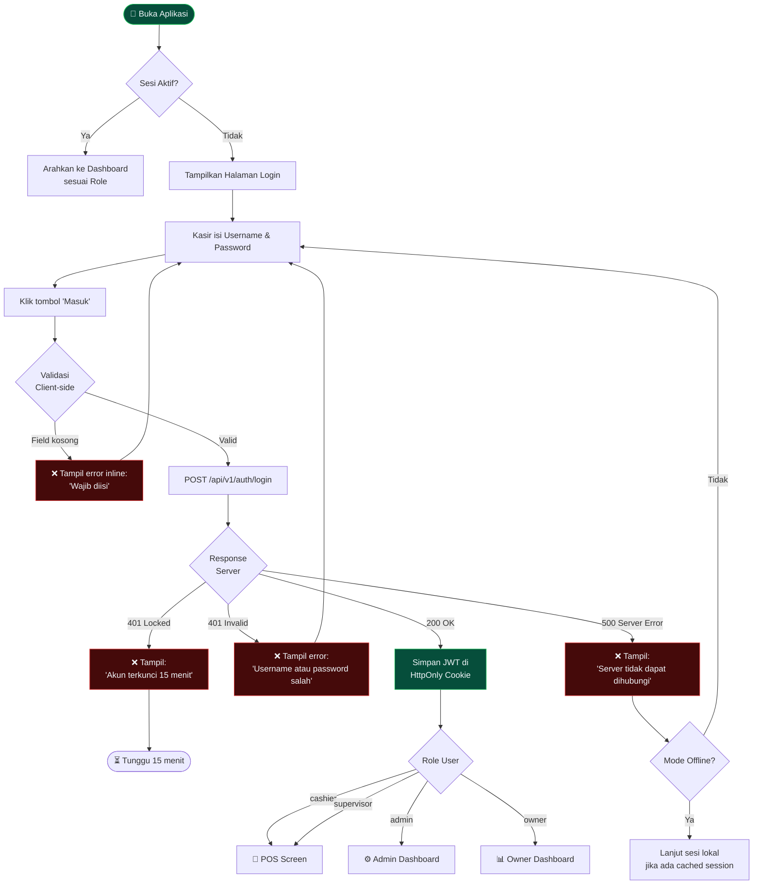
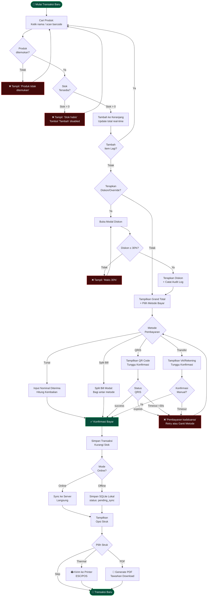

# UI/UX DESIGN DOCUMENT
## MikoMart Point of Sale (POS) System — Fase 4A
### Standar: WCAG 2.1 AA | @ui-design.md

---

| Field | Detail |
|---|---|
| **Nama Sistem** | MikoMart Point of Sale (POS) System |
| **Nomor Dokumen** | MikoMart-UI-2026-001 |
| **Versi** | 1.0 |
| **Tanggal** | 17 April 2026 |
| **Standar Aksesibilitas** | WCAG 2.1 AA |
| **Target Device** | Tablet Touchscreen (768×1024 px minimum) |
| **Klasifikasi** | INTERNAL — CONFIDENTIAL |

---

## 1. DESIGN SYSTEM (WCAG 2.1 AA)

### 1.1 Color Palette & Contrast Ratios

| Token | Hex | RGB | Penggunaan | Contrast vs Bg (#0f172a) |
|---|---|---|---|---|
| `--clr-primary` | `#38bdf8` | 56,189,248 | Aksi utama, link, highlight aktif | **8.4:1** ✅ AAA |
| `--clr-primary-dark` | `#0284c7` | 2,132,199 | Primary hover state | **4.7:1** ✅ AA |
| `--clr-success` | `#22c55e` | 34,197,94 | Transaksi sukses, stok ok | **5.8:1** ✅ AA |
| `--clr-warning` | `#f59e0b` | 245,158,11 | Stok minimum, pending | **6.2:1** ✅ AA |
| `--clr-danger` | `#ef4444` | 239,68,68 | Error, void, stok habis | **4.6:1** ✅ AA |
| `--clr-neutral-100` | `#f1f5f9` | 241,245,249 | Teks utama | **14.7:1** ✅ AAA |
| `--clr-neutral-400` | `#94a3b8` | 148,163,184 | Teks sekunder, placeholder | **4.6:1** ✅ AA |
| `--clr-neutral-700` | `#334155` | 51,65,85 | Border, divider | — |
| `--clr-bg-base` | `#0f172a` | 15,23,42 | Background utama | — |
| `--clr-bg-card` | `#1e293b` | 30,41,59 | Card, panel, modal | — |
| `--clr-bg-elevated` | `#334155` | 51,65,85 | Elevated surface, hover | — |

### 1.2 Tipografi

| Level | Element | Font | Size | Weight | Line Height |
|---|---|---|---|---|---|
| **H1** | Judul halaman | Inter | 28px | 700 | 1.3 |
| **H2** | Judul section/card | Inter | 20px | 600 | 1.4 |
| **H3** | Sub-section | Inter | 16px | 600 | 1.5 |
| **Body** | Konten umum | Inter | 14px | 400 | 1.6 |
| **Label** | Form label, badge | Inter | 12px | 500 | 1.4 |
| **Mono** | Harga, kode SKU | 'JetBrains Mono', monospace | 14px | 500 | 1.4 |

**Google Fonts Import:** `Inter` (400,500,600,700) + `JetBrains Mono` (500)

### 1.3 Spacing & Grid

| Token | Value | Penggunaan |
|---|---|---|
| `--sp-1` | 4px | Micro spacing (icon gap) |
| `--sp-2` | 8px | Base unit, padding kecil |
| `--sp-3` | 12px | Gap antar elemen |
| `--sp-4` | 16px | Padding card |
| `--sp-6` | 24px | Section spacing |
| `--sp-8` | 32px | Major section gap |
| `--sp-12` | 48px | Layout padding |

Grid: **8px base grid** — semua nilai spacing kelipatan 4 atau 8.
Touch target minimum: **44×44px** (WCAG 2.5.5 AAA).

### 1.4 Border Radius & Shadow

```css
--radius-sm:  6px;   /* Input, badge kecil */
--radius-md:  10px;  /* Card, panel */
--radius-lg:  16px;  /* Modal, drawer */
--radius-xl:  24px;  /* Button besar touchscreen */
--radius-full: 9999px; /* Pill badge */

--shadow-sm:  0 1px 3px rgba(0,0,0,0.4);
--shadow-md:  0 4px 16px rgba(0,0,0,0.5);
--shadow-lg:  0 8px 32px rgba(0,0,0,0.6);
--shadow-glow-primary: 0 0 20px rgba(56,189,248,0.25);
```

### 1.5 Komponen Atoms

#### Button Variants
```
[PRIMARY]  bg:#38bdf8   text:#0f172a  border:none    → Aksi utama (Bayar, Simpan)
[DANGER]   bg:#ef4444   text:#fff     border:none    → Void, hapus
[OUTLINE]  bg:transp.   text:#38bdf8  border:1px #38bdf8 → Aksi sekunder
[GHOST]    bg:transp.   text:#94a3b8  border:none    → Navigasi, batal
```

Ukuran minimum touchscreen: **height: 52px; min-width: 120px; font-size: 15px; font-weight: 600**

#### Badge / Status Chip
```
[SUCCESS]  bg:#064e3b  text:#22c55e  "Selesai", "Stok OK"
[WARNING]  bg:#451a03  text:#f59e0b  "Pending", "Stok Rendah"
[DANGER]   bg:#450a0a  text:#ef4444  "Void", "Stok Habis"
[INFO]     bg:#0c1a3b  text:#38bdf8  "Offline", "Sinkronisasi"
```

---

## 2. SITEMAP

```mermaid
graph TD
    ROOT["🏠 MikoMart POS"] --> LOGIN["🔐 Login"]
    LOGIN --> POS["🧾 POS Screen\n(Kasir/Admin/Supervisor)"]
    LOGIN --> ADMIN["⚙ Admin Dashboard"]
    LOGIN --> OWNER["📊 Owner Dashboard"]

    POS --> TRX_SCREEN["Layar Transaksi"]
    POS --> TRX_HISTORY["Riwayat Transaksi"]
    POS --> VOID_REQUEST["Ajukan Void/Retur"]
    POS --> SYNC_STATUS["Status Sinkronisasi"]

    TRX_SCREEN --> PAYMENT_MODAL["💳 Modal Pembayaran"]
    PAYMENT_MODAL --> RECEIPT["🖨 Struk (PDF/Thermal)"]
    TRX_HISTORY --> REPRINT["Cetak Ulang Struk"]

    ADMIN --> PRODUCT_MGMT["📦 Manajemen Produk"]
    ADMIN --> INVENTORY_MGMT["📋 Manajemen Inventori"]
    ADMIN --> PURCHASE_ORDER["🚚 Purchase Order"]
    ADMIN --> USER_MGMT["👥 Manajemen Pengguna"]
    ADMIN --> VOID_APPROVE["✅ Approval Void/Retur"]
    ADMIN --> AUDIT_LOG["📜 Audit Log"]
    ADMIN --> REPORTS_ADMIN["📈 Laporan (Admin view)"]

    PRODUCT_MGMT --> PRODUCT_ADD["Tambah Produk"]
    PRODUCT_MGMT --> PRODUCT_EDIT["Edit Produk / Harga"]
    INVENTORY_MGMT --> STOCK_VIEW["Lihat Stok"]
    INVENTORY_MGMT --> STOCK_ALERT["Notifikasi Stok Min."]
    PURCHASE_ORDER --> PO_CREATE["Buat Purchase Order"]
    PURCHASE_ORDER --> PO_RECEIVE["Konfirmasi Penerimaan"]

    OWNER --> REPORTS_OWNER["📊 Dashboard Laporan"]
    REPORTS_OWNER --> DAILY_RPT["Laporan Harian"]
    REPORTS_OWNER --> MONTHLY_RPT["Laporan Bulanan"]
    REPORTS_OWNER --> TAX_EXPORT["📥 Ekspor Pajak CSV/XLS"]

    style ROOT fill:#1e293b,stroke:#38bdf8,color:#f1f5f9
    style LOGIN fill:#134e4a,stroke:#0d9488,color:#f1f5f9
    style POS fill:#2e1065,stroke:#7c3aed,color:#f1f5f9
    style ADMIN fill:#4c0519,stroke:#e11d48,color:#f1f5f9
    style OWNER fill:#451a03,stroke:#d97706,color:#f1f5f9
```



---

## 3. UX FLOW

### 3.1 UX Flow: Login & Session



### 3.2 UX Flow: Transaksi POS + Pembayaran



### 3.3 UX Flow: Void Request (Two-Step Approval)

```mermaid
flowchart TD
    A([📋 Kasir buka Riwayat\nTransaksi]) --> B[Pilih Transaksi]
    B --> C{Status\nTransaksi?}
    C -->|voided/returned| D[❌ 'Tidak dapat di-void lagi']
    C -->|completed| E[Klik 'Ajukan Void']

    E --> F[Isi Form:\nAlasan Void (wajib)]
    F --> G{Alasan\nDiisi?}
    G -->|Tidak| H[❌ 'Alasan wajib diisi']
    H --> F
    G -->|Ya| I[POST /api/v1/voids\nstatus → void_pending]

    I --> J[Notifikasi dikirim ke\nSupervisor/Admin online]
    J --> K([⏳ Kasir menunggu\nkeputusan])

    subgraph SUPERVISOR ["👤 Supervisor / Admin"]
        L[Terima notifikasi\nvoid request]
        L --> M[Buka Antrian Approval]
        M --> N[Tinjau detail transaksi\n& alasan kasir]
        N --> O{Keputusan}
        O -->|Setujui| P[POST /voids/id/approve\n+ Isi catatan approval]
        O -->|Tolak| Q[POST /voids/id/reject\n+ Isi alasan penolakan]
    end

    P --> R[✅ Stok dikembalikan\nStatus: voided\nAudit Log: 2 entri]
    Q --> S[❌ Status kembali: completed\nKasir dapat notifikasi penolakan]

    R --> T([📋 Kasir dapat\nnotifikasi disetujui])
    S --> U([📋 Kasir dapat\nnotifikasi ditolak])

    style D fill:#450a0a,stroke:#ef4444,color:#f1f5f9
    style H fill:#450a0a,stroke:#ef4444,color:#f1f5f9
    style R fill:#064e3b,stroke:#22c55e,color:#f1f5f9
    style S fill:#450a0a,stroke:#ef4444,color:#f1f5f9
    style SUPERVISOR fill:#1a0b3b,stroke:#7c3aed,color:#f1f5f9
```

---

## 4. WIREFRAME UI (HTML + Inline CSS)

> **Instruksi Render:** Buka setiap blok `<html>...</html>` sebagai file `.html` di browser untuk melihat wireframe interaktif.

---

### 4.1 Wireframe: Login Page

```html
<!DOCTYPE html>
<html lang="id">
<head>
  <meta charset="UTF-8">
  <meta name="viewport" content="width=device-width, initial-scale=1.0">
  <title>MikoMart POS — Login</title>
  <link rel="preconnect" href="https://fonts.googleapis.com">
  <link href="https://fonts.googleapis.com/css2?family=Inter:wght@400;500;600;700&display=swap" rel="stylesheet">
  <style>
    *, *::before, *::after { box-sizing: border-box; margin: 0; padding: 0; }
    :root {
      --clr-primary: #38bdf8;
      --clr-danger: #ef4444;
      --clr-success: #22c55e;
      --clr-bg: #0f172a;
      --clr-card: #1e293b;
      --clr-border: #334155;
      --clr-text: #f1f5f9;
      --clr-muted: #94a3b8;
    }
    body {
      font-family: 'Inter', sans-serif;
      background: var(--clr-bg);
      min-height: 100vh;
      display: flex;
      align-items: center;
      justify-content: center;
      padding: 24px;
    }
    .login-wrapper {
      width: 100%;
      max-width: 420px;
      display: flex;
      flex-direction: column;
      gap: 24px;
    }
    .brand {
      text-align: center;
    }
    .brand-logo {
      font-size: 36px;
      font-weight: 800;
      color: var(--clr-primary);
      letter-spacing: -1px;
    }
    .brand-sub {
      font-size: 13px;
      color: var(--clr-muted);
      margin-top: 4px;
    }
    .card {
      background: var(--clr-card);
      border: 1px solid var(--clr-border);
      border-radius: 16px;
      padding: 32px;
    }
    .card-title {
      font-size: 20px;
      font-weight: 700;
      color: var(--clr-text);
      margin-bottom: 24px;
    }
    .form-group {
      display: flex;
      flex-direction: column;
      gap: 6px;
      margin-bottom: 16px;
    }
    label {
      font-size: 13px;
      font-weight: 600;
      color: var(--clr-muted);
      text-transform: uppercase;
      letter-spacing: 0.5px;
    }
    input {
      background: #0f172a;
      border: 1.5px solid var(--clr-border);
      border-radius: 10px;
      color: var(--clr-text);
      font-family: 'Inter', sans-serif;
      font-size: 15px;
      height: 52px;
      padding: 0 16px;
      outline: none;
      transition: border-color 0.2s;
    }
    input:focus { border-color: var(--clr-primary); }
    input.error { border-color: var(--clr-danger); }
    .field-error {
      font-size: 12px;
      color: var(--clr-danger);
      display: flex;
      align-items: center;
      gap: 4px;
    }
    /* === ERROR ALERT STATE === */
    .alert {
      border-radius: 10px;
      padding: 14px 16px;
      font-size: 14px;
      display: flex;
      align-items: flex-start;
      gap: 12px;
    }
    .alert-danger {
      background: #450a0a;
      border: 1px solid #b91c1c;
      color: #fca5a5;
    }
    .alert-icon { font-size: 18px; flex-shrink: 0; }
    .alert-text { line-height: 1.5; }
    .alert-title { font-weight: 700; font-size: 14px; margin-bottom: 2px; }
    /* Locked state */
    .alert-warning {
      background: #451a03;
      border: 1px solid #d97706;
      color: #fde68a;
    }
    .btn-primary {
      width: 100%;
      height: 52px;
      background: var(--clr-primary);
      color: #0f172a;
      border: none;
      border-radius: 10px;
      font-size: 15px;
      font-weight: 700;
      cursor: pointer;
      margin-top: 8px;
      transition: opacity 0.2s;
    }
    .btn-primary:hover { opacity: 0.9; }
    .btn-primary:disabled {
      background: var(--clr-border);
      color: var(--clr-muted);
      cursor: not-allowed;
    }
    .lockout-timer {
      text-align: center;
      font-size: 24px;
      font-weight: 800;
      color: var(--clr-danger);
      margin: 4px 0;
    }
    .footer-note {
      text-align: center;
      font-size: 12px;
      color: var(--clr-muted);
    }
    /* State toggle demo */
    .demo-states {
      display: flex;
      gap: 8px;
      flex-wrap: wrap;
      margin-bottom: 16px;
    }
    .demo-btn {
      padding: 6px 12px;
      border-radius: 6px;
      border: 1px solid var(--clr-border);
      background: var(--clr-card);
      color: var(--clr-muted);
      font-size: 11px;
      cursor: pointer;
      font-family: 'Inter', sans-serif;
    }
    .demo-btn:hover { border-color: var(--clr-primary); color: var(--clr-primary); }
    .hidden { display: none !important; }
    .conn-badge {
      display: inline-flex;
      align-items: center;
      gap: 6px;
      font-size: 12px;
      color: var(--clr-success);
      background: #064e3b;
      border: 1px solid #166534;
      border-radius: 99px;
      padding: 4px 10px;
    }
    .dot { width: 7px; height: 7px; border-radius: 50%; background: currentColor; }
  </style>
</head>
<body>
  <div class="login-wrapper">
    <!-- Brand Header -->
    <div class="brand">
      <div class="brand-logo">🛒 MikoMart</div>
      <div class="brand-sub">Point of Sale System v1.0</div>
      <div style="margin-top:8px; display:flex; justify-content:center;">
        <span class="conn-badge"><span class="dot"></span> Online</span>
      </div>
    </div>

    <!-- Demo State Switcher (Wireframe only) -->
    <div style="background:#1e293b;border:1px solid #334155;border-radius:10px;padding:12px;">
      <div style="font-size:11px; color:#64748b; margin-bottom:8px; text-transform:uppercase; letter-spacing:0.5px;">🎨 Wireframe State Preview</div>
      <div class="demo-states">
        <button class="demo-btn" onclick="showState('normal')">Normal</button>
        <button class="demo-btn" onclick="showState('field-error')">Field Error</button>
        <button class="demo-btn" onclick="showState('wrong-cred')">Wrong Credential</button>
        <button class="demo-btn" onclick="showState('locked')">Account Locked</button>
        <button class="demo-btn" onclick="showState('server-error')">Server Error</button>
      </div>
    </div>

    <!-- Login Card -->
    <div class="card">
      <div class="card-title">Masuk ke Sistem</div>

      <!-- === ERROR STATE: Wrong credential === -->
      <div class="alert alert-danger hidden" id="alert-wrong-cred">
        <span class="alert-icon">⚠️</span>
        <div class="alert-text">
          <div class="alert-title">Login Gagal</div>
          Username atau password salah. Sisa percobaan: <strong>3×</strong>
        </div>
      </div>

      <!-- === ERROR STATE: Account locked === -->
      <div class="alert alert-warning hidden" id="alert-locked">
        <span class="alert-icon">🔒</span>
        <div class="alert-text">
          <div class="alert-title">Akun Terkunci</div>
          Terlalu banyak percobaan gagal. Akun dikunci selama:
          <div class="lockout-timer">14:32</div>
          Hubungi Admin jika perlu bantuan.
        </div>
      </div>

      <!-- === ERROR STATE: Server error === -->
      <div class="alert alert-danger hidden" id="alert-server-error">
        <span class="alert-icon">🔴</span>
        <div class="alert-text">
          <div class="alert-title">Server Tidak Dapat Dihubungi</div>
          Periksa koneksi jaringan. Transaksi tunai masih dapat dilakukan dalam mode offline.
        </div>
      </div>

      <form onsubmit="return false;" style="margin-top:4px;">
        <!-- Username Field -->
        <div class="form-group">
          <label for="username">Username</label>
          <input type="text" id="username" placeholder="Masukkan username" autocomplete="username">
          <span class="field-error hidden" id="err-username">⚠ Username wajib diisi</span>
        </div>

        <!-- Password Field -->
        <div class="form-group">
          <label for="password">Password</label>
          <input type="password" id="password" placeholder="Masukkan password" autocomplete="current-password">
          <span class="field-error hidden" id="err-password">⚠ Password wajib diisi</span>
        </div>

        <button class="btn-primary" id="login-btn" type="submit">Masuk</button>
      </form>
    </div>

    <div class="footer-note">MikoMart POS © 2026 · Mode: Online · Terminal: Kasir-01</div>
  </div>

  <script>
    function showState(state) {
      // Reset semua
      document.querySelectorAll('.alert').forEach(e => e.classList.add('hidden'));
      document.querySelectorAll('input').forEach(e => e.classList.remove('error'));
      document.querySelectorAll('.field-error').forEach(e => e.classList.add('hidden'));
      document.getElementById('login-btn').disabled = false;

      if (state === 'field-error') {
        document.getElementById('username').classList.add('error');
        document.getElementById('password').classList.add('error');
        document.getElementById('err-username').classList.remove('hidden');
        document.getElementById('err-password').classList.remove('hidden');
      } else if (state === 'wrong-cred') {
        document.getElementById('alert-wrong-cred').classList.remove('hidden');
        document.getElementById('password').classList.add('error');
      } else if (state === 'locked') {
        document.getElementById('alert-locked').classList.remove('hidden');
        document.getElementById('login-btn').disabled = true;
      } else if (state === 'server-error') {
        document.getElementById('alert-server-error').classList.remove('hidden');
      }
    }
  </script>
</body>
</html>
```

---

### 4.2 Wireframe: POS Transaction Screen

```html
<!DOCTYPE html>
<html lang="id">
<head>
  <meta charset="UTF-8">
  <meta name="viewport" content="width=1024">
  <title>MikoMart POS — Layar Transaksi</title>
  <link href="https://fonts.googleapis.com/css2?family=Inter:wght@400;500;600;700;800&family=JetBrains+Mono:wght@500&display=swap" rel="stylesheet">
  <style>
    *, *::before, *::after { box-sizing: border-box; margin: 0; padding: 0; }
    :root {
      --bg: #0f172a; --card: #1e293b; --elevated: #334155;
      --primary: #38bdf8; --success: #22c55e; --warning: #f59e0b;
      --danger: #ef4444; --text: #f1f5f9; --muted: #94a3b8; --border: #334155;
    }
    body { font-family: 'Inter', sans-serif; background: var(--bg); color: var(--text); height: 100vh; overflow: hidden; }
    .layout { display: grid; grid-template-columns: 1fr 380px; grid-template-rows: 56px 1fr; height: 100vh; gap: 0; }

    /* === TOP BAR === */
    .topbar {
      grid-column: 1 / -1;
      background: var(--card);
      border-bottom: 1px solid var(--border);
      display: flex;
      align-items: center;
      justify-content: space-between;
      padding: 0 20px;
    }
    .topbar-brand { font-size: 16px; font-weight: 800; color: var(--primary); }
    .topbar-center { display: flex; gap: 8px; align-items: center; }
    .topbar-right { display: flex; gap: 12px; align-items: center; }
    .status-badge {
      display: inline-flex; align-items: center; gap: 5px;
      font-size: 11px; font-weight: 600; border-radius: 99px; padding: 3px 10px;
    }
    .badge-online { background: #064e3b; color: #22c55e; border: 1px solid #166534; }
    .badge-offline { background: #450a0a; color: #ef4444; border: 1px solid #b91c1c; }
    .badge-syncing { background: #1e3a8a; color: #60a5fa; border: 1px solid #1d4ed8; animation: pulse 1.5s infinite; }
    @keyframes pulse { 0%,100%{opacity:1} 50%{opacity:.6} }
    .dot { width: 6px; height: 6px; border-radius: 50%; background: currentColor; }
    .user-info { font-size: 13px; color: var(--muted); }
    .btn-sm { padding: 6px 14px; border-radius: 8px; border: 1px solid var(--border); background: transparent; color: var(--muted); font-size: 12px; font-family: 'Inter', sans-serif; cursor: pointer; }
    .btn-sm:hover { border-color: var(--primary); color: var(--primary); }

    /* === LEFT PANEL: Product Search + Cart === */
    .left-panel { background: var(--bg); display: flex; flex-direction: column; border-right: 1px solid var(--border); overflow: hidden; }
    .search-area { padding: 16px; border-bottom: 1px solid var(--border); }
    .search-box {
      display: flex; gap: 8px; align-items: center;
      background: var(--card); border: 1.5px solid var(--border); border-radius: 10px;
      padding: 0 16px; height: 52px;
    }
    .search-box:focus-within { border-color: var(--primary); }
    .search-box input { background: none; border: none; color: var(--text); font-size: 15px; flex: 1; outline: none; font-family: 'Inter', sans-serif; }
    .search-box input::placeholder { color: var(--muted); }
    .search-icon { color: var(--muted); font-size: 18px; }

    /* === Empty State === */
    .empty-state { flex: 1; display: flex; flex-direction: column; align-items: center; justify-content: center; color: var(--muted); gap: 12px; padding: 32px; text-align: center; }
    .empty-icon { font-size: 48px; opacity: 0.5; }
    .empty-title { font-size: 16px; font-weight: 600; color: var(--text); }
    .empty-sub { font-size: 13px; line-height: 1.6; }

    /* === Cart Items === */
    .cart-area { flex: 1; overflow-y: auto; padding: 12px 16px; display: flex; flex-direction: column; gap: 8px; }
    .cart-item {
      background: var(--card); border: 1px solid var(--border); border-radius: 10px;
      padding: 12px 14px; display: flex; align-items: center; gap: 12px;
    }
    .cart-item:hover { border-color: var(--primary); }
    .item-info { flex: 1; }
    .item-name { font-size: 14px; font-weight: 600; }
    .item-price { font-size: 12px; color: var(--muted); font-family: 'JetBrains Mono', monospace; }
    .item-discount { font-size: 11px; color: var(--warning); }
    .qty-control { display: flex; align-items: center; gap: 8px; }
    .qty-btn { width: 36px; height: 36px; border-radius: 8px; border: 1px solid var(--border); background: var(--elevated); color: var(--text); font-size: 18px; cursor: pointer; display: flex; align-items: center; justify-content: center; }
    .qty-btn:hover { border-color: var(--primary); color: var(--primary); }
    .qty-val { font-size: 16px; font-weight: 700; min-width: 28px; text-align: center; }
    .item-subtotal { font-family: 'JetBrains Mono', monospace; font-size: 14px; font-weight: 700; color: var(--primary); min-width: 90px; text-align: right; }
    .btn-del { width: 32px; height: 32px; border-radius: 8px; border: 1px solid #b91c1c; background: #450a0a; color: var(--danger); cursor: pointer; font-size: 14px; }

    /* === Error State: Stock 0 === */
    .cart-item.out-of-stock { border-color: var(--danger); opacity: 0.7; }
    .stock-error { font-size: 11px; color: var(--danger); display: flex; align-items: center; gap: 4px; margin-top: 3px; }

    /* === RIGHT PANEL: Summary & Actions === */
    .right-panel { background: var(--card); display: flex; flex-direction: column; }
    .summary-header { padding: 16px 20px; border-bottom: 1px solid var(--border); }
    .summary-title { font-size: 13px; font-weight: 700; color: var(--muted); text-transform: uppercase; letter-spacing: 0.5px; }
    .trx-number { font-size: 12px; color: var(--muted); font-family: 'JetBrains Mono', monospace; margin-top: 4px; }
    .summary-body { flex: 1; padding: 16px 20px; display: flex; flex-direction: column; gap: 10px; overflow-y: auto; }
    .summary-row { display: flex; justify-content: space-between; align-items: center; font-size: 14px; }
    .summary-row.total-row { font-size: 18px; font-weight: 800; color: var(--primary); padding-top: 12px; border-top: 1px solid var(--border); }
    .sum-label { color: var(--muted); }
    .sum-val { font-family: 'JetBrains Mono', monospace; font-weight: 600; }
    .sum-val.discount { color: var(--success); }
    .sum-val.tax { color: var(--warning); }
    .summary-footer { padding: 16px 20px; border-top: 1px solid var(--border); display: flex; flex-direction: column; gap: 10px; }
    .btn-pay { width: 100%; height: 60px; background: var(--primary); color: #0f172a; border: none; border-radius: 12px; font-size: 18px; font-weight: 800; cursor: pointer; display: flex; align-items: center; justify-content: center; gap: 8px; }
    .btn-pay:hover { opacity: 0.9; }
    .btn-pay:disabled { background: var(--border); color: var(--muted); cursor: not-allowed; }
    .action-row { display: flex; gap: 8px; }
    .btn-action { flex: 1; height: 44px; border-radius: 10px; border: 1px solid var(--border); background: transparent; color: var(--muted); font-size: 13px; cursor: pointer; font-family: 'Inter', sans-serif; }
    .btn-action:hover { border-color: var(--primary); color: var(--primary); }
    .btn-void { border-color: #b91c1c; color: var(--danger); }
    .btn-void:hover { background: #450a0a; }
    .pending-sync-bar {
      background: #1e3a8a; border: 1px solid #1d4ed8; border-radius: 8px;
      padding: 8px 12px; font-size: 12px; color: #93c5fd;
      display: flex; align-items: center; gap: 8px;
    }
  </style>
</head>
<body>
  <div class="layout">
    <!-- TOP BAR -->
    <div class="topbar">
      <div class="topbar-brand">🛒 MikoMart POS</div>
      <div class="topbar-center">
        <span class="status-badge badge-online"><span class="dot"></span> Online</span>
        <!-- Error State: Offline -->
        <!-- <span class="status-badge badge-offline"><span class="dot"></span> Offline — Hanya Tunai</span> -->
        <!-- Syncing State -->
        <!-- <span class="status-badge badge-syncing"><span class="dot"></span> Sinkronisasi... (12 transaksi)</span> -->
      </div>
      <div class="topbar-right">
        <span class="user-info">👤 kasir01 — Kasir</span>
        <button class="btn-sm">📋 Riwayat</button>
        <button class="btn-sm" style="border-color:#b91c1c;color:#ef4444;">🚪 Keluar</button>
      </div>
    </div>

    <!-- LEFT PANEL -->
    <div class="left-panel">
      <!-- Search -->
      <div class="search-area">
        <div class="search-box">
          <span class="search-icon">🔍</span>
          <input type="text" placeholder="Cari produk (nama / kode SKU / barcode)..." />
          <span style="color:#64748b;font-size:12px;">⌨ atau scan</span>
        </div>
      </div>

      <!-- STATE 1: Empty Cart (Tombol bayar disabled) -->
      <!--
      <div class="empty-state">
        <div class="empty-icon">🛒</div>
        <div class="empty-title">Keranjang Kosong</div>
        <div class="empty-sub">Cari produk di atas atau scan barcode<br>untuk memulai transaksi</div>
      </div>
      -->

      <!-- STATE 2: Cart dengan Items (tampil default) -->
      <div class="cart-area">

        <!-- Item normal -->
        <div class="cart-item">
          <div class="item-info">
            <div class="item-name">Mie Goreng Sedap</div>
            <div class="item-price">Rp 3.500 / pcs</div>
          </div>
          <div class="qty-control">
            <button class="qty-btn">−</button>
            <span class="qty-val">3</span>
            <button class="qty-btn">+</button>
          </div>
          <div class="item-subtotal">Rp 10.500</div>
          <button class="btn-del">✕</button>
        </div>

        <!-- Item dengan diskon -->
        <div class="cart-item" style="border-color:#f59e0b;">
          <div class="item-info">
            <div class="item-name">Susu Ultra Milk 200ml</div>
            <div class="item-price">Rp 5.500 / pcs</div>
            <div class="item-discount">🏷 Diskon 20% diterapkan</div>
          </div>
          <div class="qty-control">
            <button class="qty-btn">−</button>
            <span class="qty-val">2</span>
            <button class="qty-btn">+</button>
          </div>
          <div class="item-subtotal" style="color:#22c55e;">Rp 8.800</div>
          <button class="btn-del">✕</button>
        </div>

        <!-- ERROR STATE: Stok Habis -->
        <div class="cart-item out-of-stock">
          <div class="item-info">
            <div class="item-name">Aqua 600ml</div>
            <div class="item-price">Rp 4.000 / pcs</div>
            <div class="stock-error">⚠ Stok habis — tidak dapat diproses</div>
          </div>
          <div class="qty-control">
            <button class="qty-btn" disabled style="opacity:0.4">−</button>
            <span class="qty-val" style="color:#ef4444;">0</span>
            <button class="qty-btn" disabled style="opacity:0.4">+</button>
          </div>
          <div class="item-subtotal" style="color:#ef4444;">—</div>
          <button class="btn-del">✕</button>
        </div>

        <!-- Pending sync notification -->
        <div class="pending-sync-bar">
          🔄 <span>3 transaksi sebelumnya menunggu sinkronisasi ke server</span>
        </div>
      </div>
    </div>

    <!-- RIGHT PANEL: Summary -->
    <div class="right-panel">
      <div class="summary-header">
        <div class="summary-title">Ringkasan Transaksi</div>
        <div class="trx-number">TRX-20260417-0042</div>
      </div>
      <div class="summary-body">
        <div class="summary-row"><span class="sum-label">Subtotal</span><span class="sum-val">Rp 22.300</span></div>
        <div class="summary-row"><span class="sum-label">Diskon</span><span class="sum-val discount">− Rp 2.200</span></div>
        <div class="summary-row"><span class="sum-label">PPN (11%)</span><span class="sum-val tax">+ Rp 2.211</span></div>
        <div class="summary-row" style="height:1px;background:var(--border);margin:4px 0;"></div>
        <div class="summary-row total-row">
          <span>Total Bayar</span>
          <span>Rp 22.311</span>
        </div>
        <div style="margin-top:8px;">
          <div style="font-size:12px;color:var(--muted);margin-bottom:8px;text-transform:uppercase;letter-spacing:0.5px;">Metode Pembayaran</div>
          <div style="display:grid;grid-template-columns:1fr 1fr;gap:8px;">
            <button style="height:48px;border-radius:10px;border:2px solid var(--primary);background:#0c1a3b;color:var(--primary);font-size:13px;font-weight:700;cursor:pointer;">💵 Tunai</button>
            <button style="height:48px;border-radius:10px;border:1px solid var(--border);background:transparent;color:var(--muted);font-size:13px;cursor:pointer;">📱 QRIS</button>
            <button style="height:48px;border-radius:10px;border:1px solid var(--border);background:transparent;color:var(--muted);font-size:13px;cursor:pointer;">🏦 Transfer</button>
            <button style="height:48px;border-radius:10px;border:1px solid var(--border);background:transparent;color:var(--muted);font-size:13px;cursor:pointer;">✂ Split Bill</button>
          </div>
        </div>
        <div style="margin-top:8px;background:#0f172a;border:1px solid var(--border);border-radius:8px;padding:12px;">
          <div style="font-size:12px;color:var(--muted);margin-bottom:6px;">Uang Diterima</div>
          <input type="text" value="Rp 30.000" style="background:none;border:none;color:var(--primary);font-size:20px;font-weight:800;font-family:'JetBrains Mono',monospace;width:100%;outline:none;">
          <div style="margin-top:8px;display:flex;justify-content:space-between;font-size:13px;">
            <span style="color:var(--muted);">Kembalian</span>
            <span style="color:var(--success);font-weight:700;font-family:'JetBrains Mono',monospace;">Rp 7.689</span>
          </div>
        </div>
      </div>
      <div class="summary-footer">
        <!-- ERROR: ada item stok 0 = tombol bayar disabled -->
        <button class="btn-pay" disabled title="Hapus item stok habis terlebih dahulu">
          ⚠ Selesaikan Item Stok Habis
        </button>
        <!-- Normal STATE: -->
        <!-- <button class="btn-pay">💳 Proses Pembayaran</button> -->
        <div class="action-row">
          <button class="btn-action">🏷 Diskon</button>
          <button class="btn-action">💰 Override Harga</button>
          <button class="btn-action btn-void">🗑 Void</button>
        </div>
      </div>
    </div>
  </div>
</body>
</html>
```

---

### 4.3 Wireframe: Payment Modal (Split Bill + QRIS)

```html
<!DOCTYPE html>
<html lang="id">
<head>
  <meta charset="UTF-8">
  <title>MikoMart POS — Modal Pembayaran</title>
  <link href="https://fonts.googleapis.com/css2?family=Inter:wght@400;500;600;700;800&family=JetBrains+Mono:wght@500&display=swap" rel="stylesheet">
  <style>
    *, *::before, *::after { box-sizing: border-box; margin: 0; padding: 0; }
    body { font-family: 'Inter', sans-serif; background: #0f172a; color: #f1f5f9; min-height: 100vh; display: flex; align-items: center; justify-content: center; padding: 24px; }
    .overlay { background: rgba(0,0,0,0.7); position: fixed; inset: 0; display: flex; align-items: center; justify-content: center; }
    .modal { background: #1e293b; border: 1px solid #334155; border-radius: 20px; width: 100%; max-width: 560px; overflow: hidden; }
    .modal-header { padding: 20px 24px; border-bottom: 1px solid #334155; display: flex; align-items: center; justify-content: space-between; }
    .modal-title { font-size: 18px; font-weight: 700; }
    .modal-close { width: 36px; height: 36px; border-radius: 8px; border: 1px solid #334155; background: transparent; color: #94a3b8; font-size: 18px; cursor: pointer; }
    .modal-body { padding: 24px; display: flex; flex-direction: column; gap: 20px; }
    .grand-total-display { background: #0f172a; border: 2px solid #38bdf8; border-radius: 14px; padding: 16px 20px; display: flex; justify-content: space-between; align-items: center; }
    .gt-label { font-size: 13px; color: #94a3b8; }
    .gt-value { font-size: 28px; font-weight: 800; color: #38bdf8; font-family: 'JetBrains Mono', monospace; }
    .section-title { font-size: 12px; font-weight: 700; color: #64748b; text-transform: uppercase; letter-spacing: 0.5px; margin-bottom: 10px; }
    .split-rows { display: flex; flex-direction: column; gap: 10px; }
    .split-row { display: flex; gap: 10px; align-items: center; }
    .split-method { flex: 1; background: #0f172a; border: 1px solid #334155; border-radius: 10px; padding: 12px 14px; font-size: 14px; font-weight: 600; }
    .split-amount-input { width: 140px; background: #0f172a; border: 1.5px solid #334155; border-radius: 10px; padding: 12px 14px; color: #38bdf8; font-size: 15px; font-weight: 700; font-family: 'JetBrains Mono', monospace; outline: none; }
    .split-amount-input:focus { border-color: #38bdf8; }
    .split-amount-input.error { border-color: #ef4444; }
    .split-del { width: 40px; height: 40px; border-radius: 8px; border: 1px solid #b91c1c; background: #450a0a; color: #ef4444; cursor: pointer; font-size: 16px; }
    .btn-add-method { width: 100%; height: 44px; border-radius: 10px; border: 1px dashed #334155; background: transparent; color: #64748b; font-size: 13px; cursor: pointer; }
    .btn-add-method:hover { border-color: #38bdf8; color: #38bdf8; }
    .split-summary { background: #0f172a; border-radius: 10px; padding: 14px; display: flex; flex-direction: column; gap: 8px; }
    .split-sum-row { display: flex; justify-content: space-between; font-size: 13px; }
    .split-sum-row.deficit { color: #ef4444; font-weight: 700; }
    .split-sum-row.ok { color: #22c55e; font-weight: 700; }
    .alert-inline { background: #450a0a; border: 1px solid #b91c1c; border-radius: 8px; padding: 10px 14px; font-size: 13px; color: #fca5a5; display: flex; align-items: center; gap: 8px; }

    /* QRIS State */
    .qris-display { display: flex; flex-direction: column; align-items: center; gap: 16px; }
    .qris-box { width: 200px; height: 200px; background: #fff; border-radius: 12px; display: flex; align-items: center; justify-content: center; font-size: 80px; }
    .qris-timer { font-size: 32px; font-weight: 800; color: #f59e0b; font-family: 'JetBrains Mono', monospace; }
    .qris-expired { color: #ef4444; font-size: 14px; text-align: center; }

    .modal-footer { padding: 16px 24px; border-top: 1px solid #334155; display: flex; gap: 10px; }
    .btn-cancel { flex: 1; height: 52px; border-radius: 10px; border: 1px solid #334155; background: transparent; color: #94a3b8; font-size: 14px; cursor: pointer; font-family: 'Inter', sans-serif; }
    .btn-confirm { flex: 2; height: 52px; border-radius: 10px; border: none; background: #38bdf8; color: #0f172a; font-size: 15px; font-weight: 800; cursor: pointer; }
    .btn-confirm:disabled { background: #334155; color: #64748b; cursor: not-allowed; }
    .tab-bar { display: flex; gap: 4px; background: #0f172a; border-radius: 10px; padding: 4px; }
    .tab { flex: 1; height: 40px; border-radius: 8px; border: none; background: transparent; color: #94a3b8; font-size: 13px; cursor: pointer; font-family: 'Inter',sans-serif; font-weight: 500; }
    .tab.active { background: #1e293b; color: #f1f5f9; font-weight: 700; }
  </style>
</head>
<body>
  <div class="overlay">
    <div class="modal">
      <div class="modal-header">
        <div class="modal-title">💳 Pembayaran Transaksi</div>
        <button class="modal-close">✕</button>
      </div>
      <div class="modal-body">
        <!-- Grand Total -->
        <div class="grand-total-display">
          <span class="gt-label">Total yang Harus Dibayar</span>
          <span class="gt-value">Rp 22.311</span>
        </div>

        <!-- Tab Bar -->
        <div class="tab-bar">
          <button class="tab">💵 Tunai</button>
          <button class="tab">📱 QRIS</button>
          <button class="tab active">✂ Split</button>
          <button class="tab">🏦 Transfer</button>
        </div>

        <!-- SPLIT BILL TAB (active) -->
        <div>
          <div class="section-title">Rincian Pembayaran Split</div>
          <div class="split-rows">
            <div class="split-row">
              <div class="split-method">💵 Tunai</div>
              <input class="split-amount-input" type="text" value="Rp 10.000">
              <button class="split-del">✕</button>
            </div>
            <div class="split-row">
              <div class="split-method">📱 QRIS</div>
              <input class="split-amount-input" type="text" value="Rp 12.000">
              <button class="split-del">✕</button>
            </div>
            <!-- ERROR STATE: jumlah kurang -->
            <div class="split-row">
              <div class="split-method">🏦 Transfer</div>
              <input class="split-amount-input error" type="text" value="Rp 0">
              <button class="split-del">✕</button>
            </div>
          </div>
          <button class="btn-add-method" style="margin-top:10px;">+ Tambah Metode Bayar</button>
        </div>

        <!-- Error alert -->
        <div class="alert-inline">
          ⚠ <span>Total split <strong>Rp 22.000</strong> masih kurang <strong>Rp 311</strong> dari grand total.</span>
        </div>

        <!-- Split Summary -->
        <div class="split-summary">
          <div class="split-sum-row"><span style="color:#94a3b8;">Total Grand</span><span style="font-family:'JetBrains Mono',monospace;">Rp 22.311</span></div>
          <div class="split-sum-row"><span style="color:#94a3b8;">Total Split</span><span style="font-family:'JetBrains Mono',monospace;">Rp 22.000</span></div>
          <div class="split-sum-row deficit"><span>Kekurangan</span><span style="font-family:'JetBrains Mono',monospace;">− Rp 311</span></div>
          <!-- OK state: <div class="split-sum-row ok"><span>✓ Lunas</span><span>Rp 0</span></div> -->
        </div>
      </div>
      <div class="modal-footer">
        <button class="btn-cancel">Batal</button>
        <button class="btn-confirm" disabled>Konfirmasi Pembayaran</button>
      </div>
    </div>
  </div>
</body>
</html>
```

---

### 4.4 Wireframe: Void Request Form (Kasir)

```html
<!DOCTYPE html>
<html lang="id">
<head>
  <meta charset="UTF-8">
  <title>MikoMart POS — Ajukan Void</title>
  <link href="https://fonts.googleapis.com/css2?family=Inter:wght@400;500;600;700&family=JetBrains+Mono:wght@500&display=swap" rel="stylesheet">
  <style>
    *,*::before,*::after{box-sizing:border-box;margin:0;padding:0;}
    body{font-family:'Inter',sans-serif;background:#0f172a;color:#f1f5f9;min-height:100vh;display:flex;align-items:center;justify-content:center;padding:24px;}
    .modal{background:#1e293b;border:1px solid #334155;border-radius:20px;width:100%;max-width:500px;}
    .modal-header{padding:20px 24px;border-bottom:1px solid #334155;display:flex;align-items:center;gap:12px;}
    .modal-title{font-size:18px;font-weight:700;}
    .badge-warn{background:#451a03;color:#f59e0b;border:1px solid #d97706;border-radius:99px;padding:3px 10px;font-size:11px;font-weight:700;}
    .modal-body{padding:24px;display:flex;flex-direction:column;gap:16px;}
    .trx-card{background:#0f172a;border:1px solid #334155;border-radius:12px;padding:16px;}
    .trx-label{font-size:11px;color:#64748b;text-transform:uppercase;letter-spacing:0.5px;margin-bottom:4px;}
    .trx-num{font-family:'JetBrains Mono',monospace;font-size:16px;font-weight:700;color:#38bdf8;}
    .trx-meta{font-size:13px;color:#94a3b8;margin-top:4px;}
    .trx-amount{font-family:'JetBrains Mono',monospace;font-size:20px;font-weight:800;color:#f1f5f9;margin-top:8px;}
    .alert{border-radius:10px;padding:14px 16px;font-size:13px;display:flex;gap:12px;align-items:flex-start;margin-bottom:4px;}
    .alert-warning{background:#451a03;border:1px solid #d97706;color:#fde68a;}
    .form-group{display:flex;flex-direction:column;gap:6px;}
    label{font-size:12px;font-weight:700;color:#94a3b8;text-transform:uppercase;letter-spacing:0.5px;}
    textarea{background:#0f172a;border:1.5px solid #334155;border-radius:10px;color:#f1f5f9;font-family:'Inter',sans-serif;font-size:14px;padding:14px;resize:vertical;min-height:100px;outline:none;}
    textarea:focus{border-color:#38bdf8;}
    textarea.error{border-color:#ef4444;}
    .field-error{font-size:12px;color:#ef4444;display:flex;align-items:center;gap:4px;}
    .char-count{font-size:11px;color:#64748b;text-align:right;}
    .reason-chips{display:flex;flex-wrap:wrap;gap:8px;}
    .chip{padding:8px 14px;border-radius:99px;border:1px solid #334155;background:transparent;color:#94a3b8;font-size:12px;cursor:pointer;font-family:'Inter',sans-serif;}
    .chip:hover,.chip.active{border-color:#38bdf8;color:#38bdf8;background:#0c1a3b;}
    .modal-footer{padding:16px 24px;border-top:1px solid #334155;display:flex;gap:10px;}
    .btn-cancel{flex:1;height:52px;border-radius:10px;border:1px solid #334155;background:transparent;color:#94a3b8;font-size:14px;cursor:pointer;font-family:'Inter',sans-serif;}
    .btn-submit{flex:2;height:52px;border-radius:10px;border:none;background:#ef4444;color:#fff;font-size:15px;font-weight:700;cursor:pointer;}
    .btn-submit:disabled{background:#334155;color:#64748b;cursor:not-allowed;}
  </style>
</head>
<body>
  <div class="modal">
    <div class="modal-header">
      <div>
        <div class="modal-title">🗑 Ajukan Void Transaksi</div>
        <div style="font-size:12px;color:#94a3b8;margin-top:2px;">Permintaan akan dikirim ke Supervisor / Admin untuk disetujui</div>
      </div>
      <span class="badge-warn">Menunggu Approval</span>
    </div>
    <div class="modal-body">
      <!-- Transaction Info -->
      <div class="trx-card">
        <div class="trx-label">Transaksi yang akan di-void</div>
        <div class="trx-num">TRX-20260417-0039</div>
        <div class="trx-meta">Kasir: kasir01 · 17 Apr 2026 · 10:24 WIB · Tunai</div>
        <div class="trx-amount">Rp 22.311</div>
      </div>

      <!-- Warning -->
      <div class="alert alert-warning">
        <span style="font-size:18px;">⚠️</span>
        <div>
          <div style="font-weight:700;margin-bottom:2px;">Perhatian</div>
          Void yang disetujui akan mengembalikan stok semua item dan membatalkan transaksi secara permanen. Proses ini tidak bisa dibatalkan setelah disetujui.
        </div>
      </div>

      <!-- Quick Reason Chips -->
      <div class="form-group">
        <label>Pilih Alasan Cepat</label>
        <div class="reason-chips">
          <button class="chip active">Barang rusak/cacat</button>
          <button class="chip">Salah input item</button>
          <button class="chip">Pelanggan batal beli</button>
          <button class="chip">Transaksi ganda</button>
          <button class="chip">Lainnya</button>
        </div>
      </div>

      <!-- Reason Textarea -->
      <div class="form-group">
        <label>Alasan Detail <span style="color:#ef4444">*</span></label>
        <textarea placeholder="Jelaskan alasan void lebih detail...">Barang rusak/cacat</textarea>
        <!-- ERROR STATE: kosong -->
        <!-- <textarea class="error" placeholder="Wajib diisi..."></textarea>
        <span class="field-error">⚠ Alasan void wajib diisi sebelum mengajukan</span> -->
        <div class="char-count">17 / 500 karakter</div>
      </div>
    </div>
    <div class="modal-footer">
      <button class="btn-cancel">Batal</button>
      <button class="btn-submit">Ajukan Void →</button>
      <!-- Disabled state (alasan kosong): -->
      <!-- <button class="btn-submit" disabled>Ajukan Void →</button> -->
    </div>
  </div>
</body>
</html>
```

---

### 4.5 Wireframe: Admin Dashboard (Ringkasan)

```html
<!DOCTYPE html>
<html lang="id">
<head>
  <meta charset="UTF-8">
  <title>MikoMart POS — Admin Dashboard</title>
  <link href="https://fonts.googleapis.com/css2?family=Inter:wght@400;500;600;700;800&family=JetBrains+Mono:wght@500&display=swap" rel="stylesheet">
  <style>
    *,*::before,*::after{box-sizing:border-box;margin:0;padding:0;}
    body{font-family:'Inter',sans-serif;background:#0f172a;color:#f1f5f9;min-height:100vh;}
    .sidebar{position:fixed;top:0;left:0;bottom:0;width:220px;background:#1e293b;border-right:1px solid #334155;display:flex;flex-direction:column;padding:20px 12px;}
    .logo{font-size:18px;font-weight:800;color:#38bdf8;padding:8px;margin-bottom:20px;}
    .nav-item{display:flex;align-items:center;gap:10px;padding:10px 12px;border-radius:8px;font-size:13px;font-weight:500;color:#94a3b8;cursor:pointer;text-decoration:none;margin-bottom:2px;}
    .nav-item:hover,.nav-item.active{background:#334155;color:#f1f5f9;}
    .nav-item.active{color:#38bdf8;}
    .nav-section{font-size:10px;color:#475569;text-transform:uppercase;letter-spacing:0.8px;padding:8px 12px 4px;margin-top:8px;}
    .main{margin-left:220px;padding:24px;}
    .topbar{display:flex;justify-content:space-between;align-items:center;margin-bottom:24px;}
    .page-title{font-size:22px;font-weight:800;}
    .user-pill{display:flex;align-items:center;gap:8px;background:#1e293b;border:1px solid #334155;border-radius:99px;padding:6px 14px;font-size:13px;}
    .stat-grid{display:grid;grid-template-columns:repeat(4,1fr);gap:16px;margin-bottom:24px;}
    .stat-card{background:#1e293b;border:1px solid #334155;border-radius:12px;padding:20px;}
    .stat-label{font-size:12px;color:#94a3b8;text-transform:uppercase;letter-spacing:0.5px;margin-bottom:8px;}
    .stat-val{font-size:26px;font-weight:800;font-family:'JetBrains Mono',monospace;}
    .stat-trend{font-size:12px;margin-top:4px;}
    .trend-up{color:#22c55e;}
    .trend-down{color:#ef4444;}
    .card{background:#1e293b;border:1px solid #334155;border-radius:12px;padding:20px;}
    .card-title{font-size:15px;font-weight:700;margin-bottom:16px;display:flex;justify-content:space-between;align-items:center;}
    .table{width:100%;border-collapse:collapse;font-size:13px;}
    .table th{text-align:left;color:#64748b;font-size:11px;text-transform:uppercase;letter-spacing:0.5px;padding:0 0 10px;border-bottom:1px solid #334155;}
    .table td{padding:12px 0;border-bottom:1px solid #0f172a;vertical-align:middle;}
    .badge{display:inline-flex;align-items:center;gap:4px;border-radius:99px;padding:2px 10px;font-size:11px;font-weight:700;}
    .badge-warning{background:#451a03;color:#f59e0b;}
    .badge-danger{background:#450a0a;color:#ef4444;}
    .badge-success{background:#064e3b;color:#22c55e;}
    .badge-info{background:#0c1a3b;color:#38bdf8;}
    .void-row{display:flex;align-items:center;justify-content:space-between;padding:12px;border-radius:8px;background:#0f172a;margin-bottom:8px;}
    .btn-approve{padding:6px 14px;border-radius:8px;border:1px solid #22c55e;background:#064e3b;color:#22c55e;font-size:12px;font-weight:700;cursor:pointer;}
    .btn-reject{padding:6px 14px;border-radius:8px;border:1px solid #ef4444;background:#450a0a;color:#ef4444;font-size:12px;font-weight:700;cursor:pointer;}
    .grid2{display:grid;grid-template-columns:1fr 1fr;gap:16px;margin-top:16px;}
    /* Stok alert item */
    .stock-row{display:flex;align-items:center;justify-content:space-between;padding:10px;border-radius:8px;background:#0f172a;margin-bottom:6px;}
    .stock-bar-wrap{width:80px;height:6px;background:#334155;border-radius:3px;overflow:hidden;}
    .stock-bar{height:100%;border-radius:3px;}
    .bar-danger{background:#ef4444;width:15%;}
    .bar-warning{background:#f59e0b;width:35%;}
  </style>
</head>
<body>
  <!-- Sidebar -->
  <div class="sidebar">
    <div class="logo">🛒 MikoMart</div>
    <div class="nav-section">Transaksi</div>
    <a class="nav-item" href="#">🧾 POS Screen</a>
    <a class="nav-item" href="#">📋 Riwayat Transaksi</a>
    <div class="nav-section">Manajemen</div>
    <a class="nav-item active" href="#">📊 Dashboard</a>
    <a class="nav-item" href="#">📦 Produk</a>
    <a class="nav-item" href="#">📋 Inventori</a>
    <a class="nav-item" href="#">🚚 Purchase Order</a>
    <a class="nav-item" href="#">👥 Pengguna</a>
    <div class="nav-section">Pengawasan</div>
    <a class="nav-item" href="#">✅ Approval Void <span style="background:#ef4444;color:#fff;border-radius:99px;padding:1px 7px;font-size:10px;margin-left:auto;">2</span></a>
    <a class="nav-item" href="#">📜 Audit Log</a>
    <a class="nav-item" href="#">📈 Laporan</a>
    <div style="margin-top:auto;">
      <a class="nav-item" href="#" style="color:#ef4444;">🚪 Keluar</a>
    </div>
  </div>

  <!-- Main Content -->
  <div class="main">
    <div class="topbar">
      <div>
        <div class="page-title">Dashboard Admin</div>
        <div style="font-size:13px;color:#94a3b8;">Kamis, 17 April 2026 · Shift Pagi</div>
      </div>
      <div class="user-pill">⚙ admin01 <span class="badge badge-info">Admin</span></div>
    </div>

    <!-- Stats -->
    <div class="stat-grid">
      <div class="stat-card">
        <div class="stat-label">Transaksi Hari Ini</div>
        <div class="stat-val" style="color:#38bdf8;">42</div>
        <div class="stat-trend trend-up">↑ +12 dari kemarin</div>
      </div>
      <div class="stat-card">
        <div class="stat-label">Pendapatan Hari Ini</div>
        <div class="stat-val" style="color:#22c55e;">Rp 938K</div>
        <div class="stat-trend trend-up">↑ +8.2%</div>
      </div>
      <div class="stat-card">
        <div class="stat-label">Item Perlu Restock</div>
        <div class="stat-val" style="color:#f59e0b;">7</div>
        <div class="stat-trend" style="color:#f59e0b;">⚠ Stok di bawah minimum</div>
      </div>
      <div class="stat-card">
        <div class="stat-label">Void Menunggu</div>
        <div class="stat-val" style="color:#ef4444;">2</div>
        <div class="stat-trend trend-down">Perlu approval segera</div>
      </div>
    </div>

    <div class="grid2">
      <!-- Void Approval Queue -->
      <div class="card">
        <div class="card-title">
          ✅ Antrian Void/Retur
          <span class="badge badge-danger">2 pending</span>
        </div>
        <div class="void-row">
          <div>
            <div style="font-size:13px;font-weight:700;">TRX-20260417-0039</div>
            <div style="font-size:12px;color:#94a3b8;">kasir01 · Rp 22.311 · Barang rusak</div>
            <div style="font-size:11px;color:#64748b;margin-top:2px;">5 menit lalu</div>
          </div>
          <div style="display:flex;gap:6px;">
            <button class="btn-approve">✓ Setujui</button>
            <button class="btn-reject">✕ Tolak</button>
          </div>
        </div>
        <div class="void-row">
          <div>
            <div style="font-size:13px;font-weight:700;">TRX-20260417-0031</div>
            <div style="font-size:12px;color:#94a3b8;">kasir03 · Rp 5.500 · Salah input</div>
            <div style="font-size:11px;color:#64748b;margin-top:2px;">23 menit lalu</div>
          </div>
          <div style="display:flex;gap:6px;">
            <button class="btn-approve">✓ Setujui</button>
            <button class="btn-reject">✕ Tolak</button>
          </div>
        </div>
      </div>

      <!-- Stock Alerts -->
      <div class="card">
        <div class="card-title">
          📦 Alert Stok Minimum
          <span class="badge badge-warning">7 produk</span>
        </div>
        <div class="stock-row">
          <div>
            <div style="font-size:13px;font-weight:600;">Aqua 600ml</div>
            <div style="font-size:12px;color:#94a3b8;">Stok: <strong style="color:#ef4444;">3</strong> / min: 10</div>
          </div>
          <div style="display:flex;flex-direction:column;align-items:flex-end;gap:4px;">
            <div class="stock-bar-wrap"><div class="stock-bar bar-danger"></div></div>
            <button style="font-size:11px;padding:4px 10px;border-radius:6px;border:1px solid #334155;background:transparent;color:#94a3b8;cursor:pointer;">+ Buat PO</button>
          </div>
        </div>
        <div class="stock-row">
          <div>
            <div style="font-size:13px;font-weight:600;">Mie Goreng Sedap</div>
            <div style="font-size:12px;color:#94a3b8;">Stok: <strong style="color:#f59e0b;">7</strong> / min: 20</div>
          </div>
          <div style="display:flex;flex-direction:column;align-items:flex-end;gap:4px;">
            <div class="stock-bar-wrap"><div class="stock-bar bar-warning"></div></div>
            <button style="font-size:11px;padding:4px 10px;border-radius:6px;border:1px solid #334155;background:transparent;color:#94a3b8;cursor:pointer;">+ Buat PO</button>
          </div>
        </div>
      </div>
    </div>

    <!-- Recent Transactions -->
    <div class="card" style="margin-top:16px;">
      <div class="card-title">📋 Transaksi Terbaru Hari Ini</div>
      <table class="table">
        <thead>
          <tr>
            <th>Nomor</th><th>Kasir</th><th>Waktu</th><th>Metode</th><th>Total</th><th>Status</th>
          </tr>
        </thead>
        <tbody>
          <tr><td style="font-family:'JetBrains Mono',monospace;font-size:12px;color:#38bdf8;">TRX-20260417-0042</td><td style="color:#94a3b8;">kasir02</td><td style="color:#64748b;font-size:12px;">10:58</td><td><span class="badge badge-success">Tunai</span></td><td style="font-family:'JetBrains Mono',monospace;font-weight:700;">Rp 15.500</td><td><span class="badge badge-success">✓ Selesai</span></td></tr>
          <tr><td style="font-family:'JetBrains Mono',monospace;font-size:12px;color:#38bdf8;">TRX-20260417-0041</td><td style="color:#94a3b8;">kasir01</td><td style="color:#64748b;font-size:12px;">10:51</td><td><span class="badge badge-info">QRIS</span></td><td style="font-family:'JetBrains Mono',monospace;font-weight:700;">Rp 44.200</td><td><span class="badge badge-success">✓ Selesai</span></td></tr>
          <tr><td style="font-family:'JetBrains Mono',monospace;font-size:12px;color:#38bdf8;">TRX-20260417-0039</td><td style="color:#94a3b8;">kasir01</td><td style="color:#64748b;font-size:12px;">10:44</td><td><span class="badge badge-success">Tunai</span></td><td style="font-family:'JetBrains Mono',monospace;font-weight:700;">Rp 22.311</td><td><span class="badge badge-warning">⏳ Menunggu Void</span></td></tr>
        </tbody>
      </table>
    </div>
  </div>
</body>
</html>
```

---

*Dokumen ini adalah bagian dari Fase 4A — UI/UX Design MikoMart POS System.*

**Nomor Dokumen:** MikoMart-UI-2026-001 | **Versi:** 1.0 | **Klasifikasi:** INTERNAL — CONFIDENTIAL
